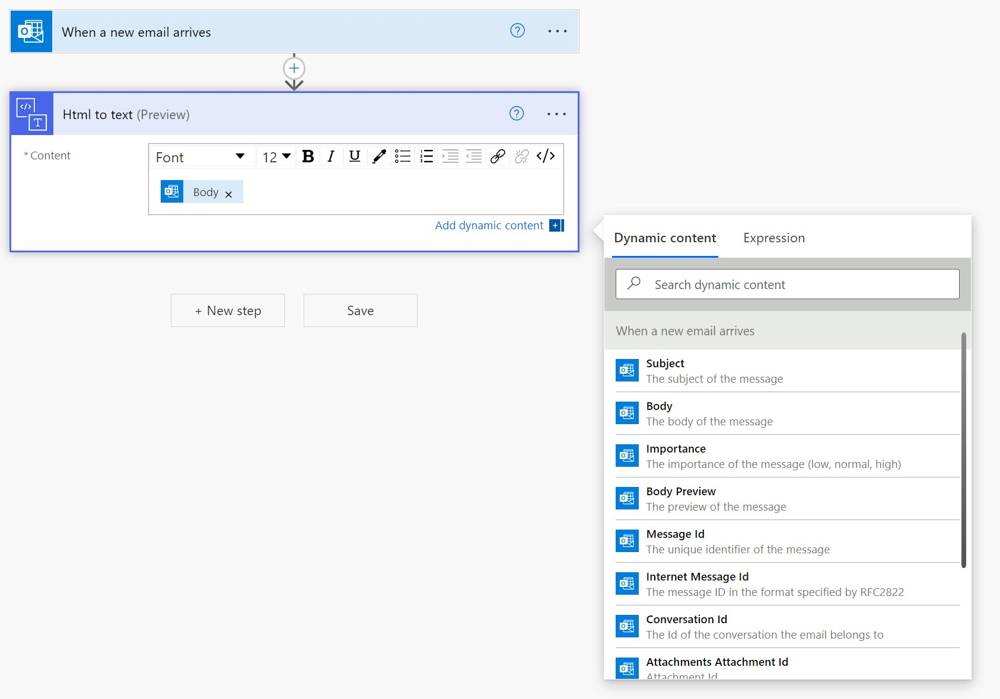
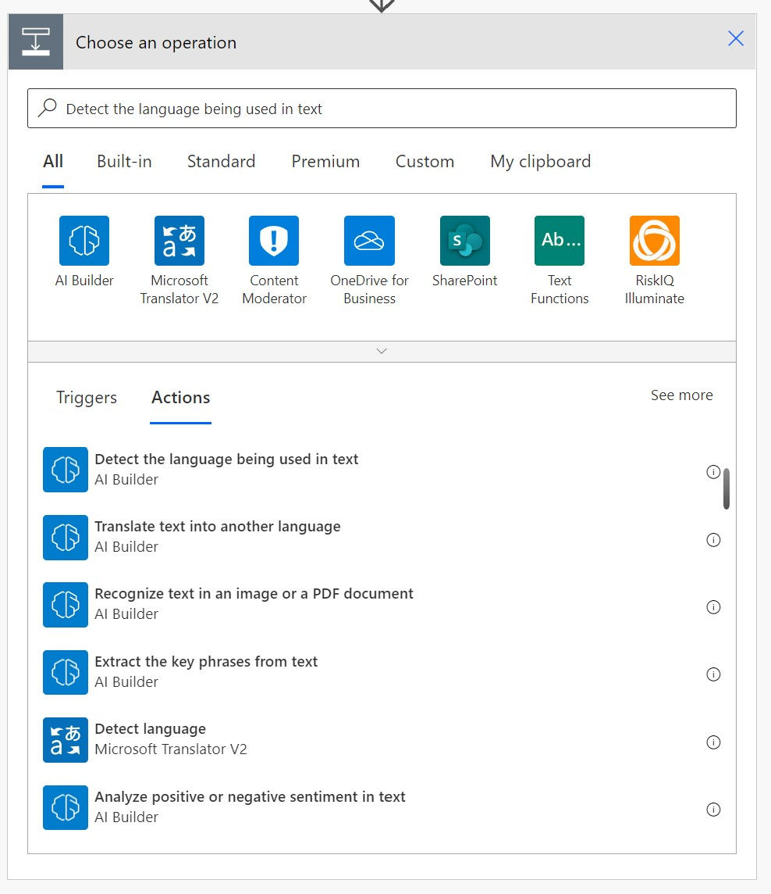
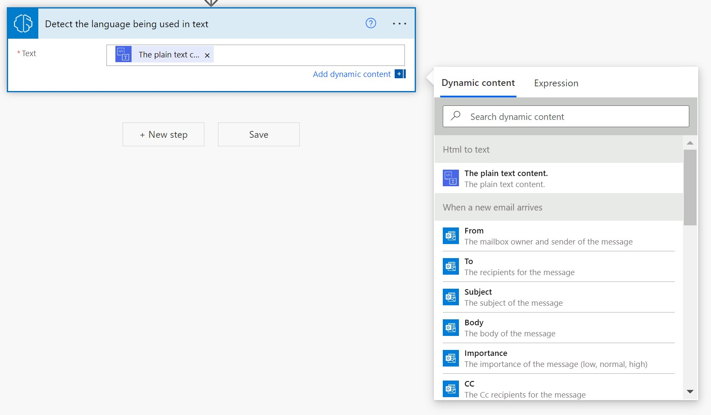
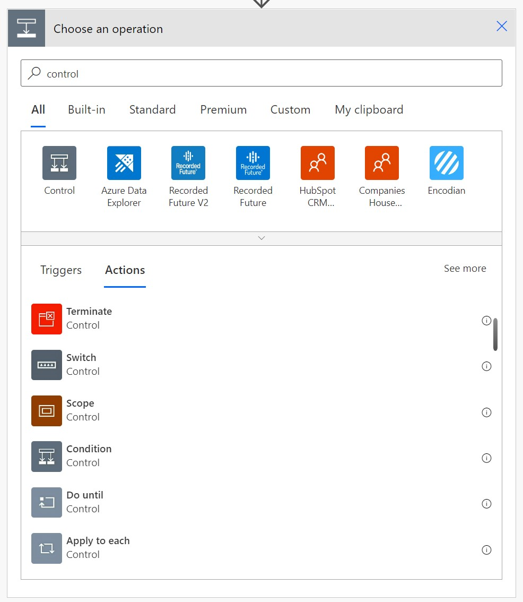
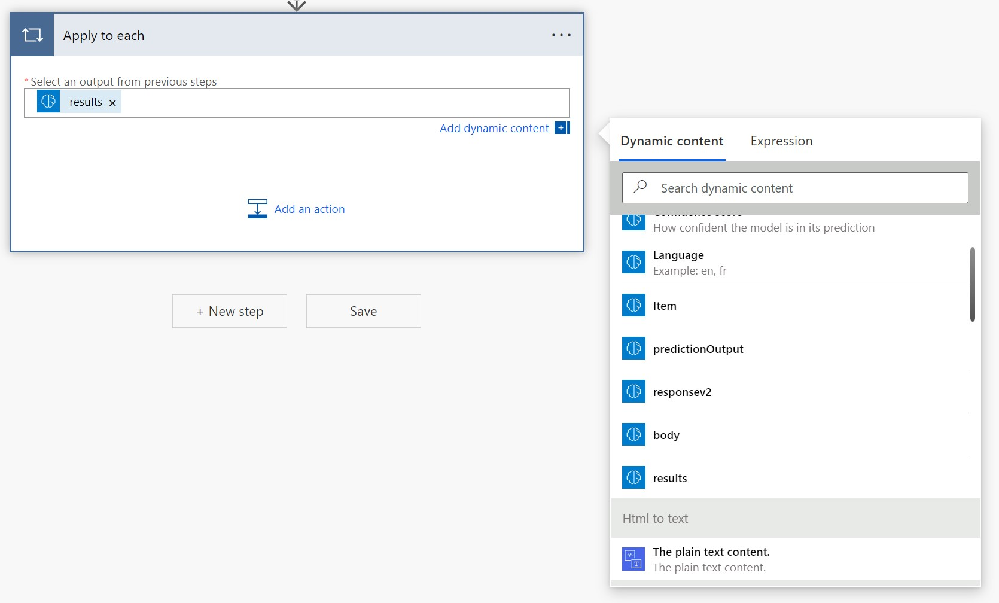
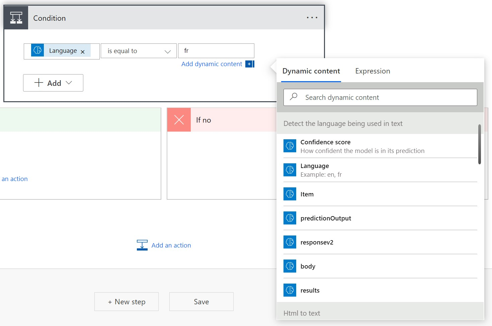
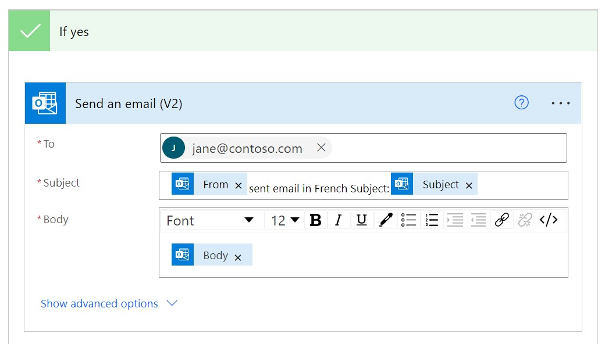

In this exercise, you will build a Power Automate flow that checks for the language of an email and then routes it to a specific email inbox. For more information, see [Create a flow](/power-automate/desktop-flows/create-flow?azure-portal=true) in Power Automate documentation.

The prerequisite for this exercise is to have Microsoft Dataverse in the environment where you are building your flow.

## Create a flow that detects language and routes to a specific inbox

To create a flow that detects language of an email and then routes it to a specific email inbox, follow these steps:

1. Sign in to Power Automate.

2. Select **Create** from the left navigation bar and then select **Automated flow**.

3. Pick a name for your flow and then select **When a new email arrives** as your flow's trigger.

    

4. Select **Create** and then **New Step**.

5. Search for the connector content conversion, select **HTML to text** and select **Body** from the dynamic content tab.

    

6. Select **New Step** and search for **Detect the language being used in text** then select it.

    

7. Select **The plain text content** from the dynamic content.

    

8. Select **New Step** and search for **Control** then select **Apply to each**.

    

9. Select **Result** from the dynamic content in the **Select output** from previous steps field.

    

10. Select **Condition** and add language from the dynamic content then enter fr (for French), en (for English), de (for German), and so on, to select what language you want to route to a particular email.

    

11. Scroll down the page and, under the **If yes** condition, add the **Send an email** action. Select a trigger according to your preferred email provider.

    

12. Customize the **To**, **Subject**, and **Body** fields by using dynamic content, such as the content shown in the following image.

    

13. Select **Save** and test the flow with a sample email.

14. To change the flow, select **Edit flow**.

Now, when emails arrive in a specified language, they will be sent to the email that is specified in your flow.

You have successfully completed this lesson on how to use AI Builder Language detection in Power Automate.
