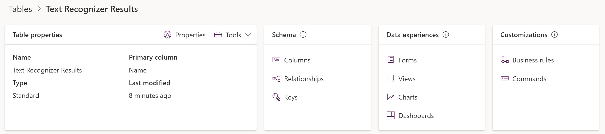
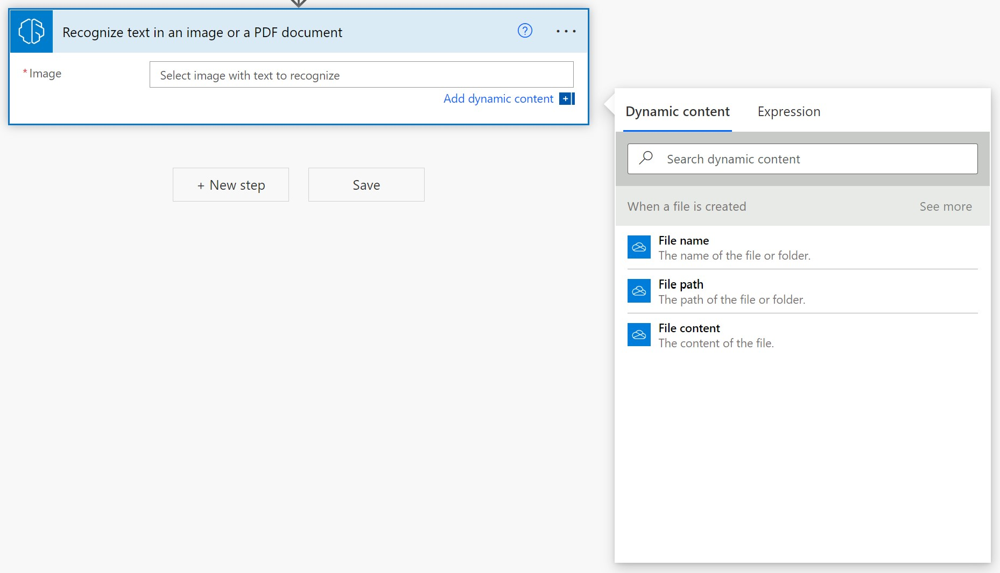
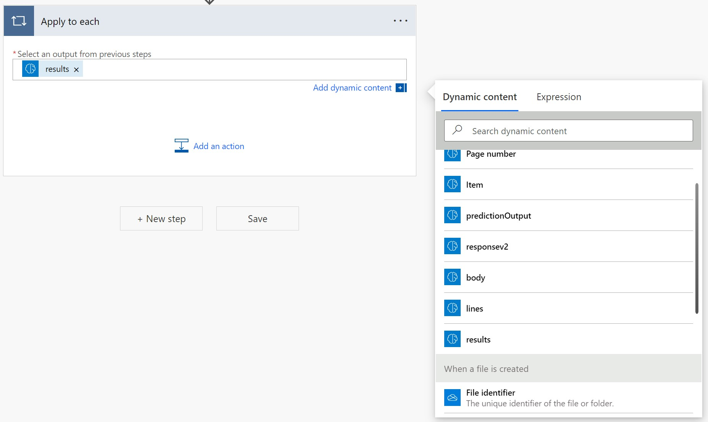
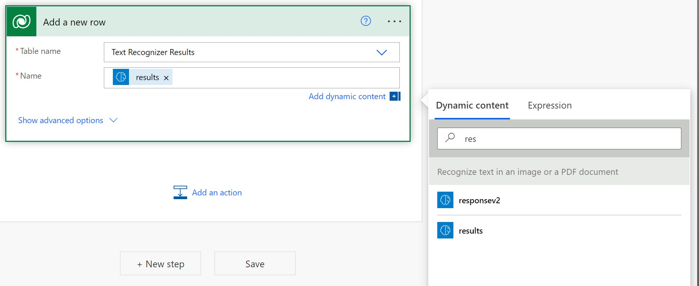
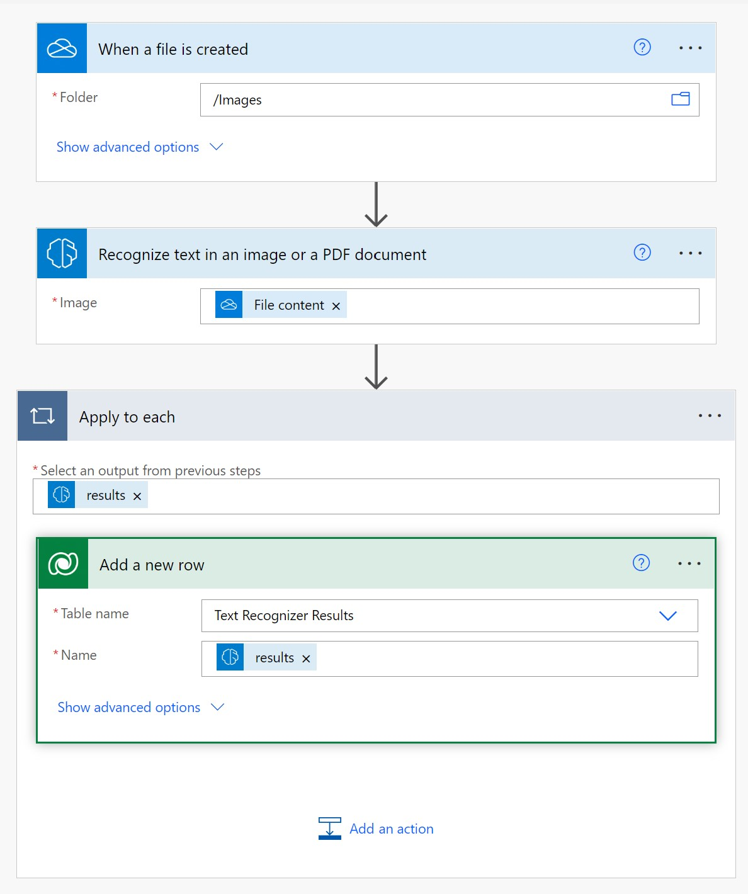
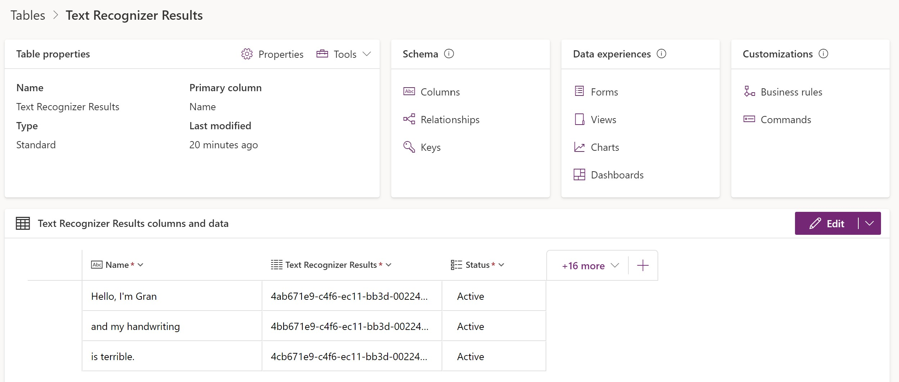

Your task for this exercise is to build a Power Automate flow, check when an image is added to a folder, and trigger AI Builder Text recognition. Then, you will save recognized text in Microsoft Dataverse. This process can be useful when automating digitalization of paper forms. For more information, see Create a flow in Power Automate.

### Create a Dataverse table to store recognized text

To create a Dataverse table to store the recognized text, follow these steps:

1. Go to [Power Apps](https://make.powerapps.com).
2. Open the **Dataverse** menu and then the **Tables** sub-menu.
3. Select the **+New table** button, which opens a side panel where you can enter information about the table. For this example, use **Text Recognizer Results** as the display name.
4. When you are finished, select **Create**. A **Name** field is automatically created, which you will use to store the recognized text.

The following figure shows an example of the table structure.

You can now create a flow in Power Automate that manages the triggering of AI Builder Text recognition when an image is added to your OneDrive for Business. You can save the result in the table that you have created.

1. Go to [Power Automate](https://flow.microsoft.com/).
2. Open the **Create** menu.
3. In the **Start from blank** section, select **Automated cloud flow**.
4. Enter **Contoso Text Recognition** as the name.
5. Enter **When a file is created - OneDrive for Business** as the trigger.
6. When you are finished, select **Create**.

> [!NOTE]
> You can use any kind of trigger, such as: **When an email arrives in Outlook**, **When a record is created in Dataverse**, **When an item is created in SharePoint**, and more.

### Set the folder that Power Automate will monitor for new incoming images

In this example, you will set the **Folder** property to the **Images** folder.

### Call AI Builder Text recognition

1. Select **New step**.
2. Select **Recognize text in an image or a PDF document**
4. Select **File Content** in the **Image file** drop-down menu.

### Save the result in the table that you previously created

Follow these steps to save the result in the table that you previously created by first iterating on text that was extracted by AI Builder Text recognition:

1. Select **New step**.
2. Select **Apply to each**.
3. In the **Select an output from previous steps** field, select lines that will automatically add another loop, “Apply to each”, and then select results, which will iterate over the various texts that are detected in the image.

### Save the results to the table

To save the results to the table, follow these steps:

1.	Select **Add an action**.
2.	Select **Add a new row - Dataverse**.
3.	On the **Table Name** property, enter **Text Recognizer Results**.
4.	On the **Name** property, select **Response result line detected text**.

> [!NOTE]
> You can also send the results by email, create a file in SharePoint, and more.

The following image shows what your resulting flow should look like.

Select **Save**, and your flow is now ready to process images.

The following image is an example of a file that you can drop in the **Images** folder of your OneDrive for Business.

Power Automate will automatically process this file, trigger AI Builder Text recognition, and store each line of recognized text in the table.

