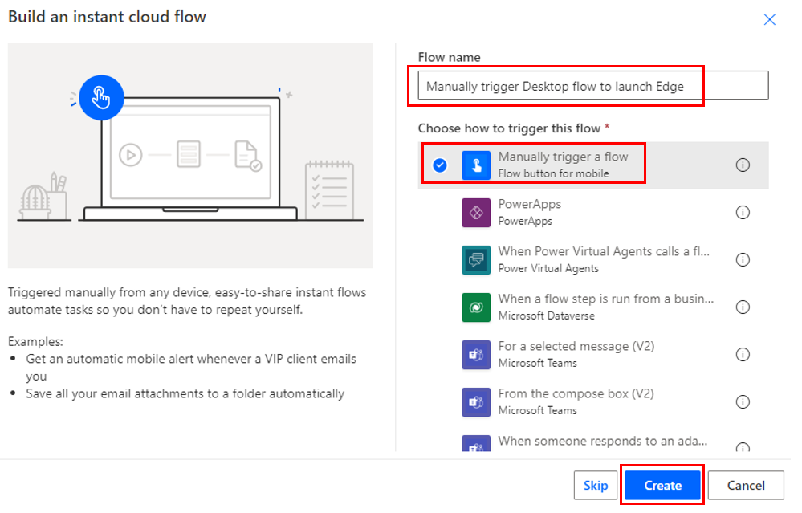
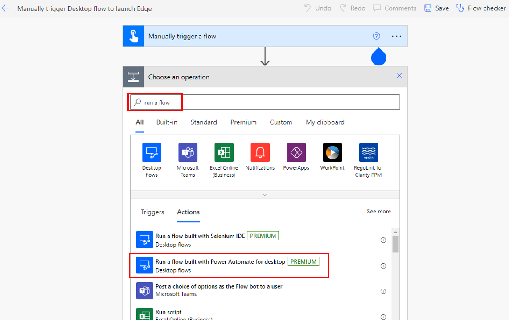
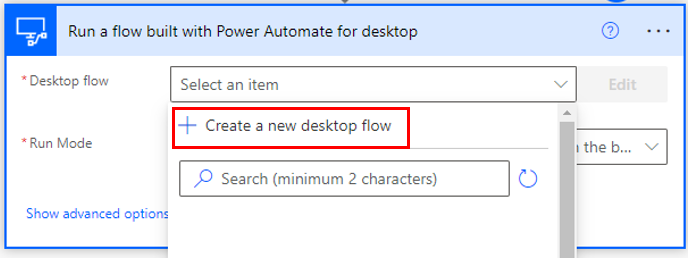
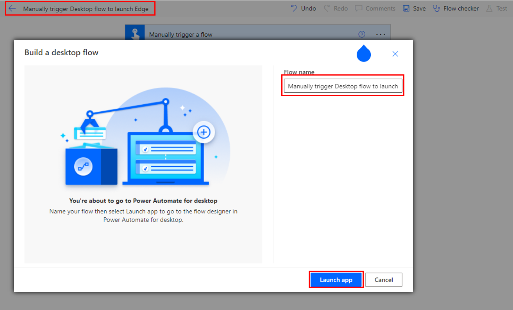
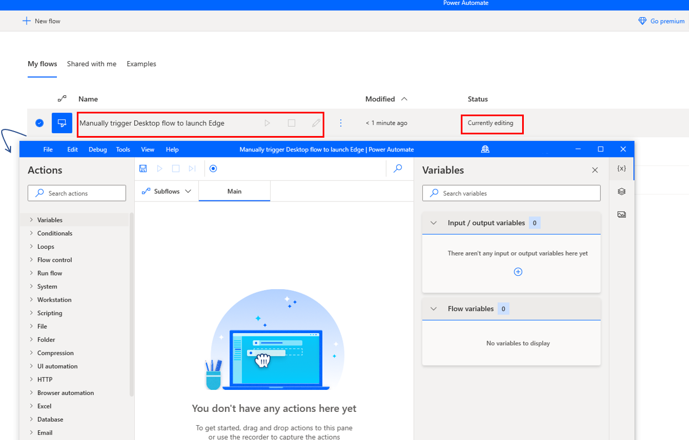
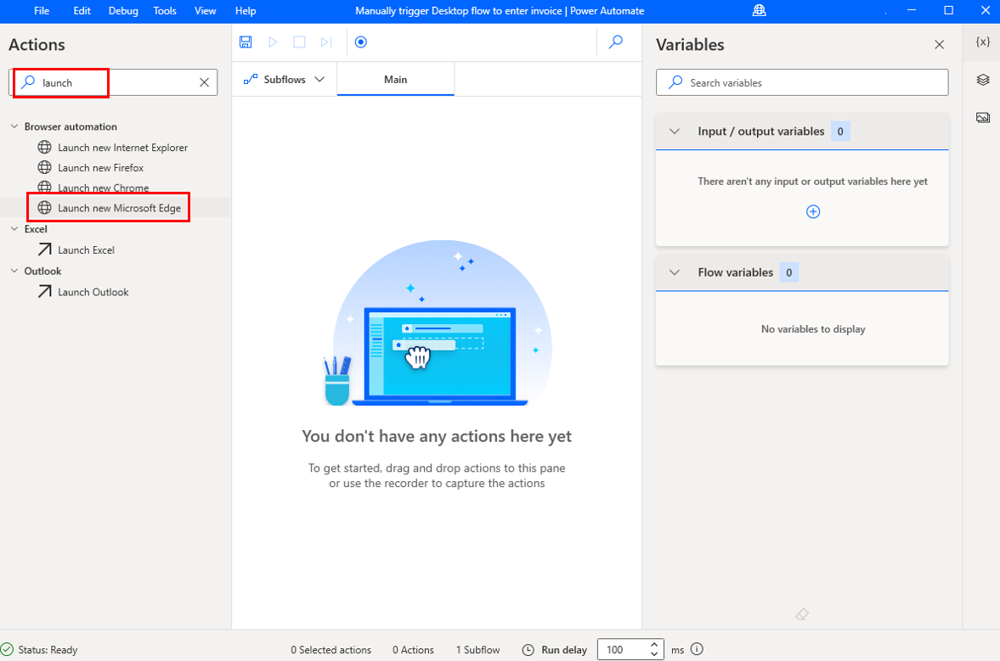
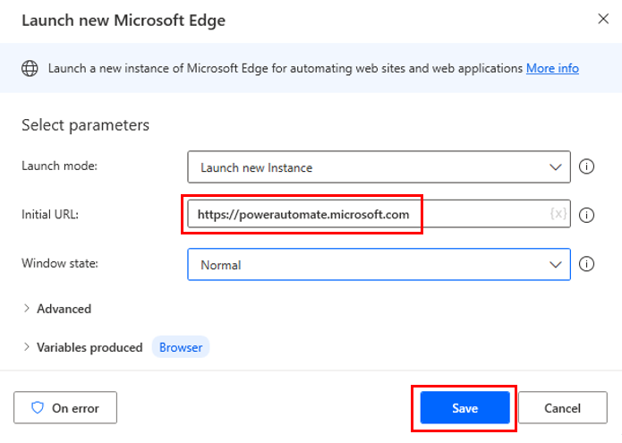
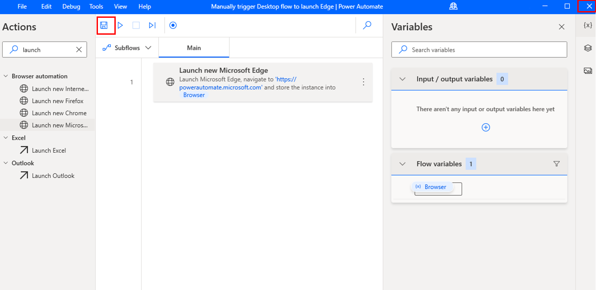

Now that you've established a gateway connection and built a desktop flow, it's time to build a cloud flow with which to connect. Cloud flows are stored and run on the cloud, as opposed to desktop flows, which are stored and run on a desktop. Cloud flows have the advantage of hundreds of predefined connections with thousands of triggers and actions at your disposal. However, desktop flows can work in desktop programs without a predefined connection or existing actions. Both flows have their benefits. By combining these two types of flows, you'll gain the benefits of both.

To begin creating your cloud flow, open [Power Automate](https://flow.microsoft.com/?azure-portal=true) and select **My flows > Cloud flows**.

> [!div class="mx-imgBorder"]
> 

Next, select **New flow > Instant cloud flow**.

> [!div class="mx-imgBorder"]
> 

Name your flow. The following screenshot shows the name as "Manual trigger Desktop flow to enter invoice." Select the **Manually trigger a flow** option and then select **Create**.

> [!div class="mx-imgBorder"]
> 

When the screen changes to the flow builder, select **New step** and then search for and select **Run a flow built with Power Automate for desktop**.

> [!div class="mx-imgBorder"]
> 

In the ***Desktop flow** drop-down menu, select **+ Create a new desktop flow**.

> [!div class="mx-imgBorder"]
> 

In the **Build a desktop flow**, add the same flow name and then click on **Launch app**.

> [!div class="mx-imgBorder"]
> 

This will automatically add the new flow in Power Automate Desktop and will open another window with the flow which is currently editing.

> 

Under Actions, search for **launch** and click on **Launch new Microsoft Edge**.

> 

In **Initial URL** add **https://powerautomate.microsoft.com** and then click on **Save**.

> 

Finally, click on the **Save** button and then close the window.

> [!div class="mx-imgBorder"]
> 