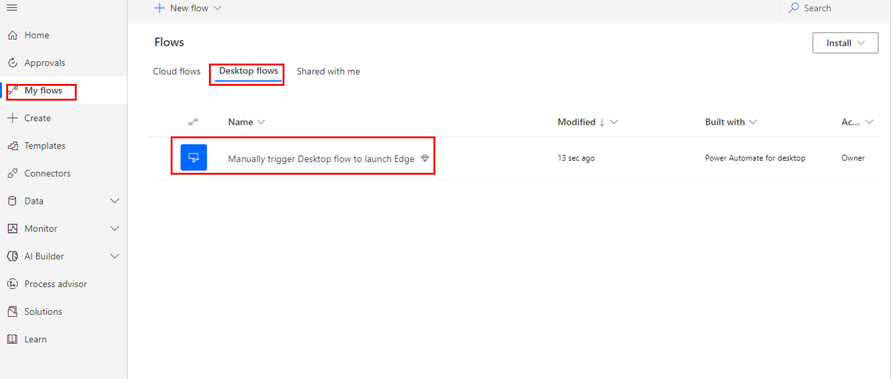
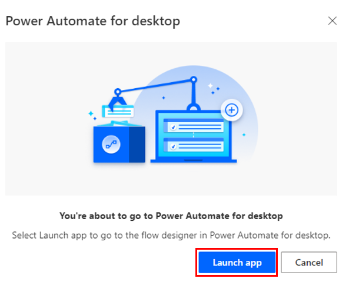
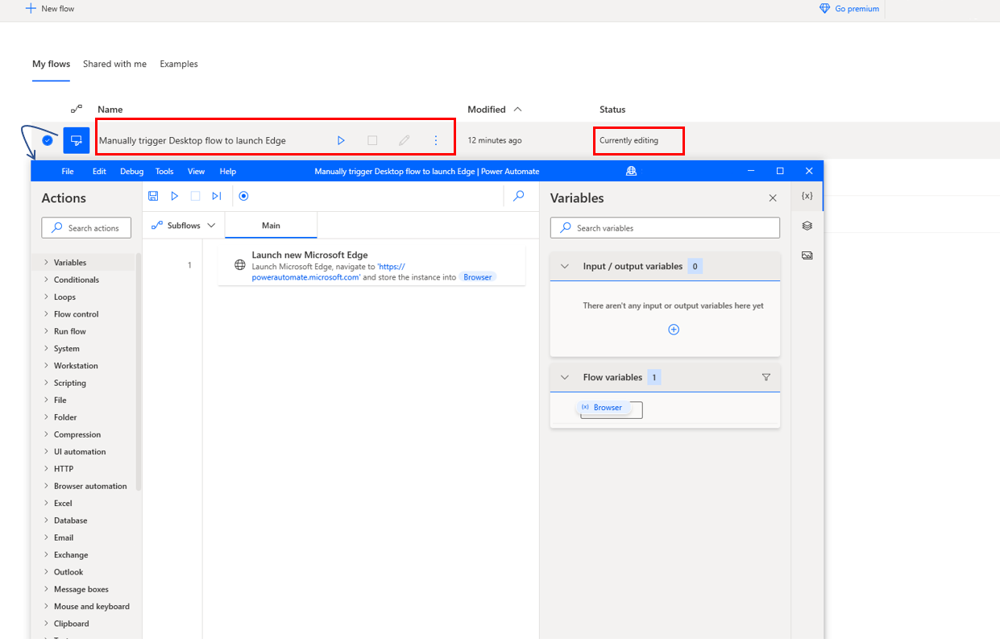

The new desktop flow you just created will also be available in **https://make.powerautomate.com**, **My flows**, under **Flows**.

> [!div class="mx-imgBorder"]
> 

When you edit this flow, it will ask if you'd like to launch the app. Click on **Launch app**.

> [!div class="mx-imgBorder"]
> 

This will first open Power Automate Desktop with a list of all your flows and will launch another window that will open the desktop flow you selected.
> [!div class="mx-imgBorder"]
> 