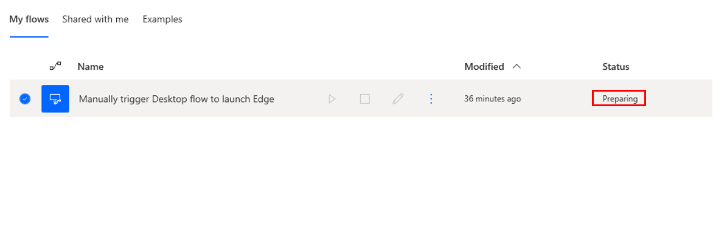
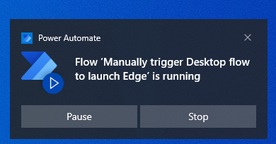
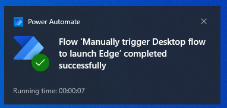
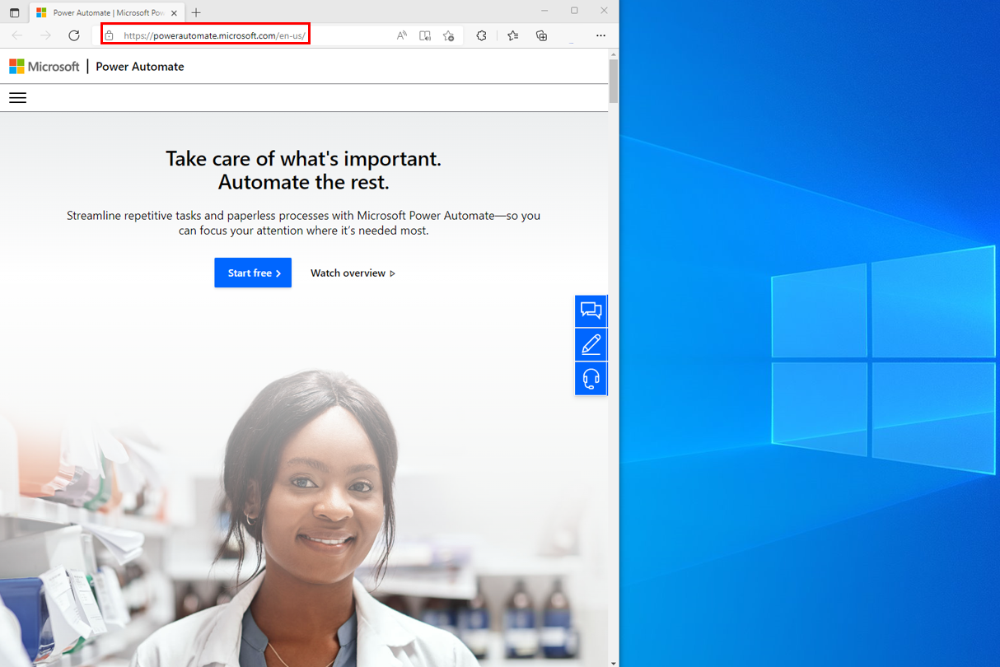

With the Power Automate desktop app running, select the **Manually trigger Desktop flow to launch Edge** and click on the play.

> [!div class="mx-imgBorder"]
> 

After a moment, the status changes to **Preparing** and then **Running**.

> [!div class="mx-imgBorder"]
> 

You also receive notifications on your desktop, first notification states the flow is running.

> [!div class="mx-imgBorder"]
> 

The second notification states the flow has completed successfully.

> [!div class="mx-imgBorder"]
> 

Finally, you'll see the **Microsoft Edge** browser launch with the Power Automate URL loaded.

> [!div class="mx-imgBorder"]
> 

Now, you have completed the process of building a desktop flow.