A data factory is a service for processing structured and unstructured data from any source. A pipeline is a logical grouping of activities that together perform a task. The activities in a pipeline define actions to perform on your data.

In this exercise, you’ll create an Azure Data Factory pipeline that will connect to your Dataverse environment and will copy three columns of the **Emission** table into a JSON file in blob storage.

## Step 1 – Create an Azure AD app registration

The Data Factory pipeline will use the Azure AD app registration to gain access to your Dataverse environment.

1. Go to the [Azure portal](https://ms.portal.azure.com/?azure-portal=true).
2. Go to Azure Active Directory.
3. Go to **App registrations**.
4. Select **New registration**.
    - Enter any name, such as **adf-mc4s**.
    - Select **Single tenant** for the **Supported account types** section.
    - Leave the **Redirect URI** section blank.
    - Select **Register**.
        > [!div class="mx-imgBorder"]
        > [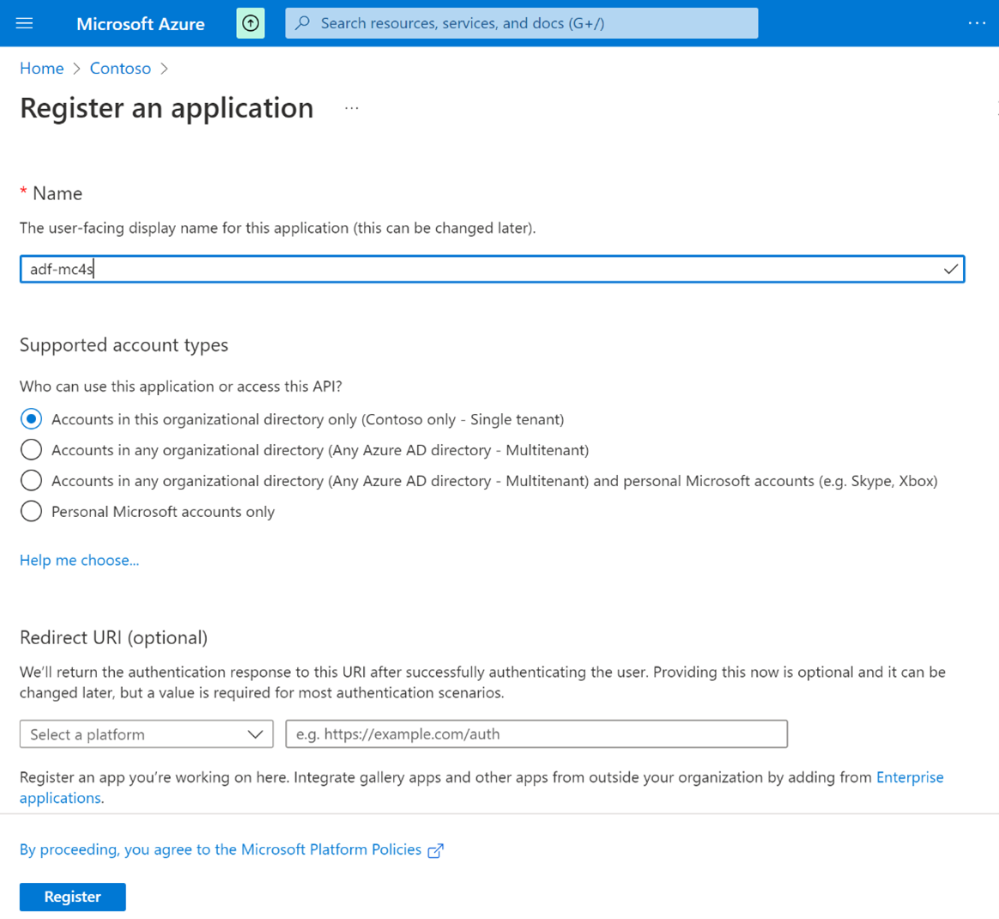](../media/register-application-data-factory.png#lightbox)

    The app registration will be created, and the **Overview** tab will open.

5. Note the **Application (client) ID** because you’ll need it later in this exercise.
6. Select **Certificate & secrets > Client secrets > New client secret**. 

    > [!div class="mx-imgBorder"]
    > [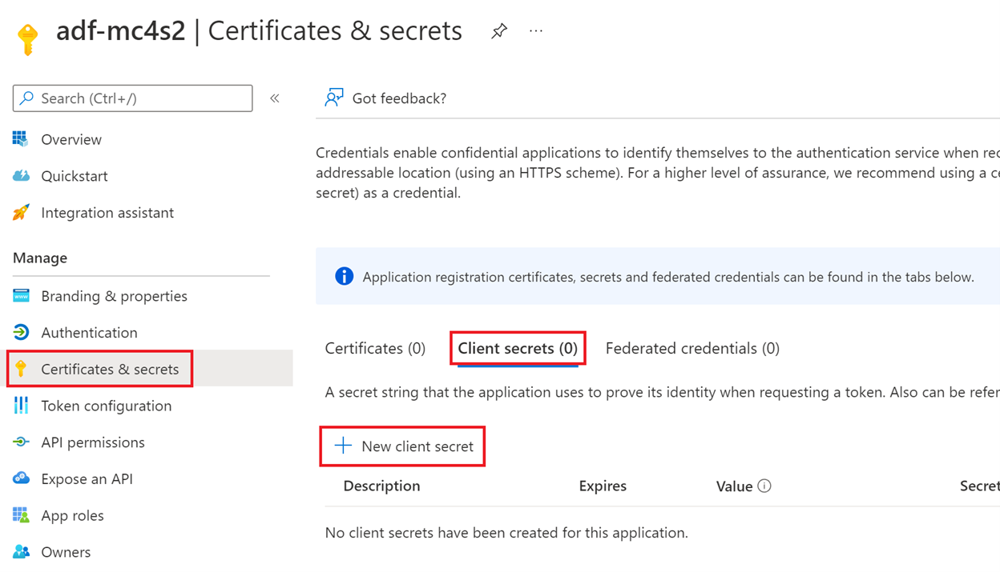](../media/certificates-secrets.png#lightbox)

7. Enter any description, retain the default expiration, and then select **Add**.
8. Copy the new client secret because you’ll need it later in this exercise.

    > [!Warning]
    > You won’t be able to retrieve the secret later, so make sure that you copy it without fail.

## Step 2 - Grant access to Dataverse

In this step, you’ll create an application user that’s linked to the app registration and then you’ll grant access to Dataverse.

1. Go to [Microsoft Power Platform admin center](https://admin.powerplatform.microsoft.com/?azure-portal=true).
2. Go to **Environments** and select the environment where your Microsoft Cloud for Sustainability is installed.
3. Note your **Environment URL** because you’ll need this information later in this exercise. The URL will resemble `org12345.crm2.dynamics.com`
4. Select **Settings** in the toolbar at the top.
5. Expand **Users + permissions** and then select **Application users**. 

    > [!div class="mx-imgBorder"]
    > [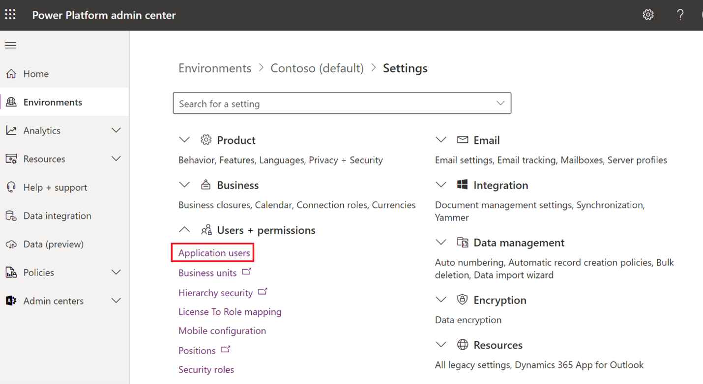](../media/application-user.png#lightbox)

6. Select **New app user**.
7. Select **Add an app**.
8. From the list, select the app registration that you created in the previous step (for example, **adf-mc4s**), and then select **Add**.
9. In the **Business units** section, select the organization that matches the environment URL that you took note of previously.
10.	Select the edit icon to the right of **Security roles**.
11.	Select **System administrator** from the list, select **Save**, and then select **Create**.

    > [!Note]
    > For simplicity, Data Factory has the System Administrator role in this exercise. However, in a production environment, you would create a specific role with only the needed permissions.

## Step 3 - Create a storage account

In this step, you’ll create the storage account to which the data factory pipeline will write the output files.
1. Go to the [Azure portal](https://ms.portal.azure.com/?azure-portal=true).
2. Create a new storage account resource:
    - Give any name, such as samc4s.
    - Select a region (preferably the same region where your Microsoft Cloud for Sustainability environment is deployed).
    - In the **Redundancy** dropdown menu, select **Locally-redundant storage (LRS)** .
    - Retain everything else as default and then create the resource. 
        > [!div class="mx-imgBorder"]
        > 

3. Go to **Containers** and select **+ Container** in the toolbar to create a new container. Enter the details as follows:
    - Name - **adf-output**
    - Public access level - **Private** 
        > [!div class="mx-imgBorder"]
        > [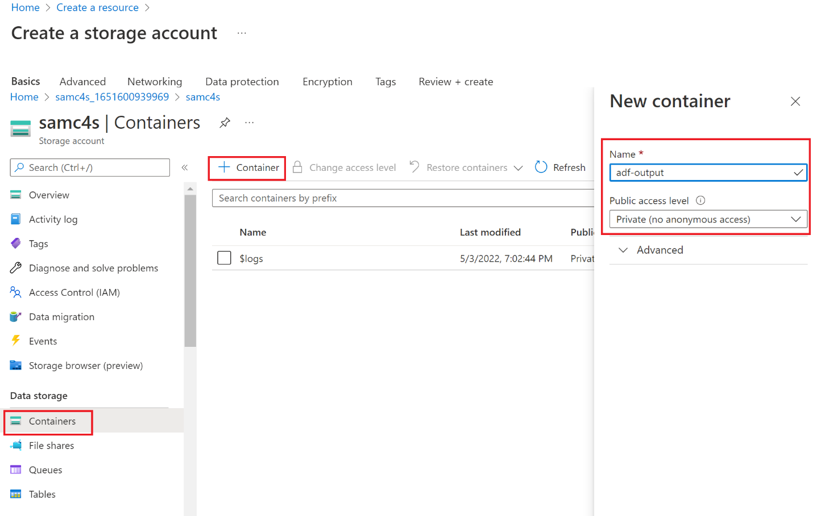](../media/container-storage.png#lightbox)

4.	Select **Create**.

## Step 4 - Create a Data Factory resource

To create a Data Factory resource, consider the following steps:

1. From the Azure portal, create a new Data Factory resource. 

    > [!div class="mx-imgBorder"]
    > [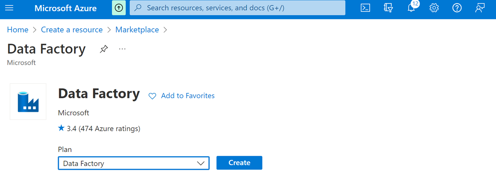](../media/data-factory.png#lightbox)

2. On the **Basics** tab, enter a name, such as **adf-mc4s**, and then select the same region that you previously selected for the storage account. 

    > [!div class="mx-imgBorder"]
    > [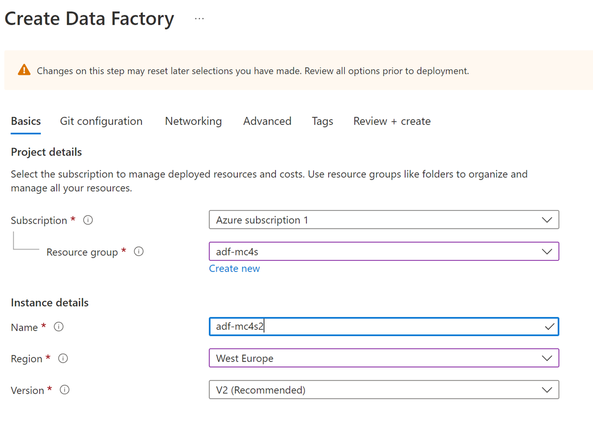](../media/create-data-factory.png#lightbox)

3. On the **Git configuration** tab, select **Configure Git later**. 
    
    > [!div class="mx-imgBorder"]
    > [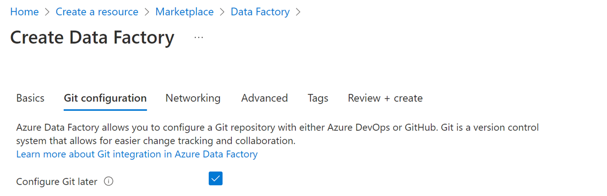](../media/git-configuration.png#lightbox)

4. Retain all other options as default and then create the Data Factory resource.
5. When the resource has been created, from the **Overview** tab, select **Open Azure Data Factory Studio**. 

## Step 5 - Create the Data Factory Linked services

To create the linked services to Dataverse (for the pipeline input) and to the storage account (for the pipeline output), follow these steps: 

1. From the Azure Data Factory Studio, select the **Manage** icon (the last icon in the toolbar on the left) and then select **Linked services > New**. 

    > [!div class="mx-imgBorder"]
    > [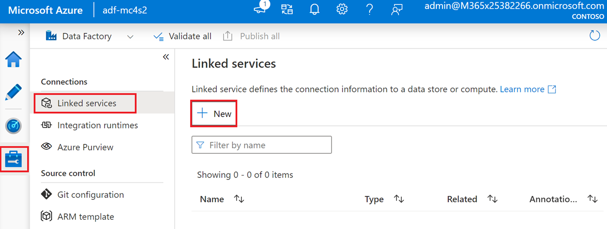](../media/linked-service.png#lightbox)

2. Search for Dataverse, select **Dataverse (Common Data Service for Apps)**, and then select **Continue**.
3. Fill in the **New linked service** page as follows:
    - **Name** - MC4S Dataverse Link
    - **Service Uri** - Enter the environment URL that you previously took note of in the exercise
    - **Service principal ID** - Enter the **Application (client) ID** that you previously took note of in the exercise
    - **Service principal key** - Enter the secret key that you previously created in the exercise

        > [!div class="mx-imgBorder"]
        > [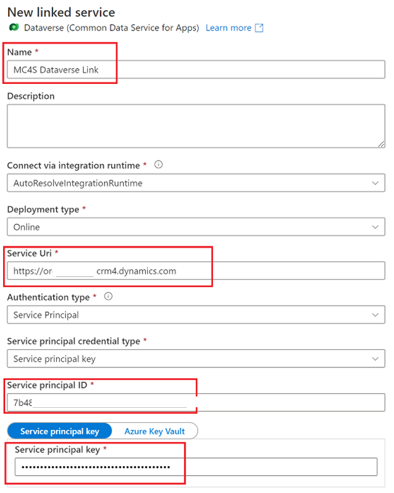](../media/linked-service-name.png#lightbox)

4. Select **Test connection** to validate the connection.
5. Select **Create**.
6. On the **Linked services** page, select **New**. You’ll now create the output connection to the storage account.
7. Search for **storage** and then select **Azure Blob Storage**. 
    > [!div class="mx-imgBorder"]
    > 

8. Select **Continue**.
9. Fill in the **New linked service** page as follows:
    - **Name** - Blob storage link
    - **Storage account name** - Select from the list the storage account that you previously created in this exercise 
10. Select **Test connection** to validate the connection. 
11. Select **Create**.
    
    > [!div class="mx-imgBorder"]
    > [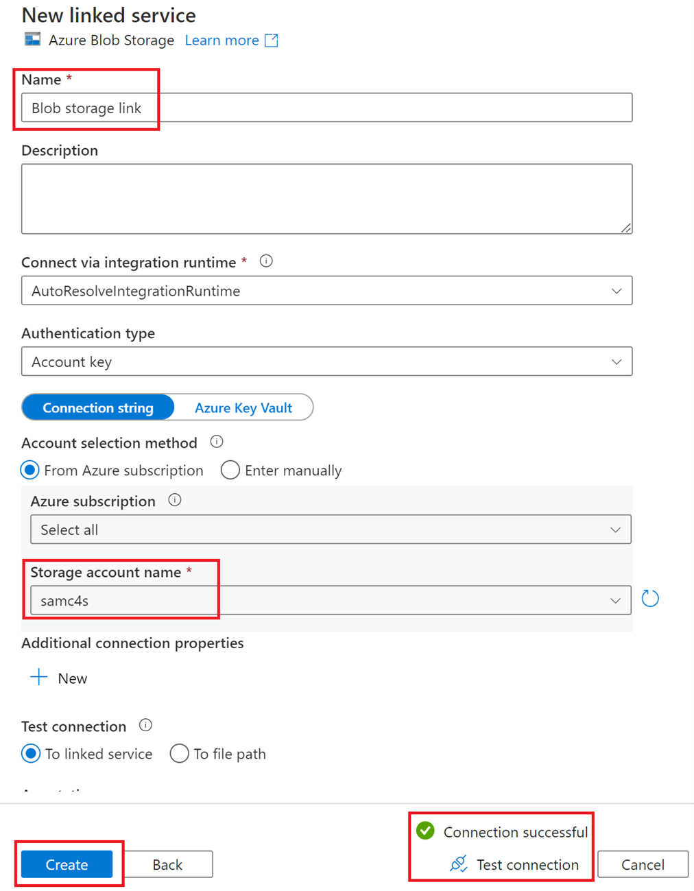](../media/blob-storage-account-name.png#lightbox)

    Two linked services will be displayed on the **Linked services** page.

    > [!div class="mx-imgBorder"]
    > [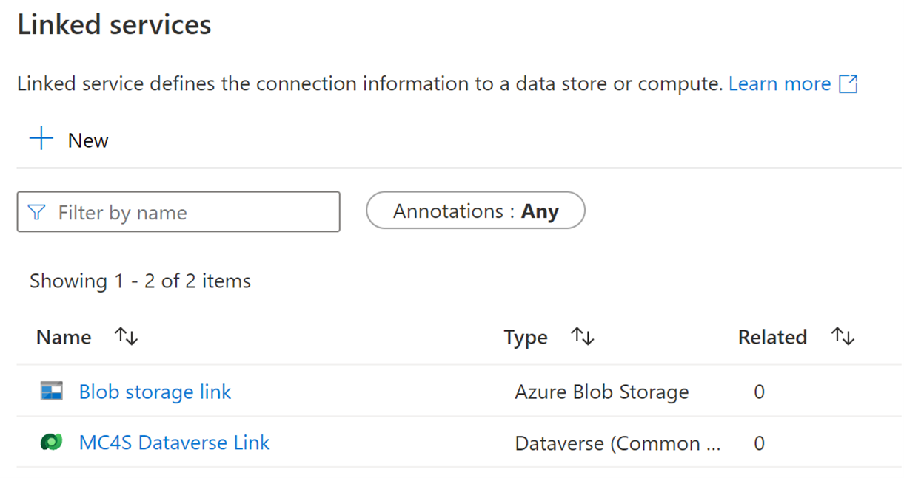](../media/linked-service-page.png#lightbox)

## Step 6 - Create the input dataset

A dataset is a named view of data that points to or references the data that you want to use in your activities as inputs and outputs.

To create the input dataset, complete the following steps: 

1. On the left toolbar of the Azure portal, select the **Author** icon (the second icon from the top). Select the plus (+) symbol, and then select **Dataset** to add a dataset.

    > [!div class="mx-imgBorder"]
    > [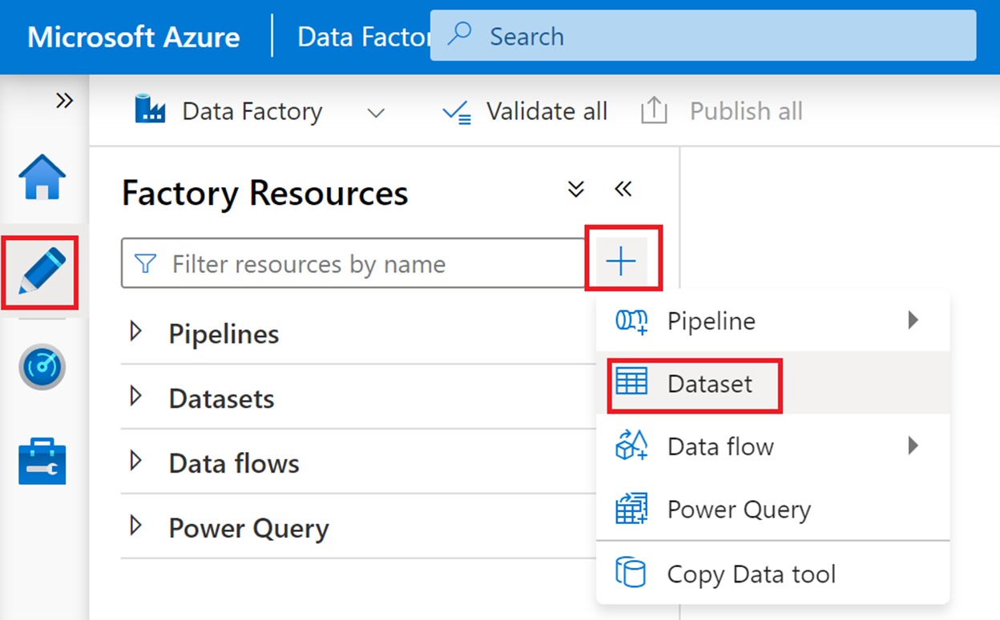](../media/dataset.png#lightbox)

2. On the **New dataset** page, search for Dataverse, select **Dataverse (Common Data Service for Apps)**, and then select **Continue**.
3. In the **Set properties** page, fill in the form as follows:
    - Enter any name, such as **Emission**.
    - Select **MC4S Dataverse Link** from the **Linked service** list.
    - Select **Emission (msdyn_emission)** from the **Entity name** list.
    - Select **OK**.

        > [!div class="mx-imgBorder"]
        > [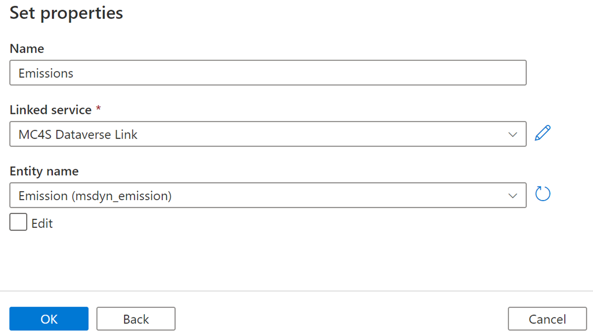](../media/set-properties.png#lightbox)

4. Review the connection and then select **Publish all > Publish**.

    > [!div class="mx-imgBorder"]
    > [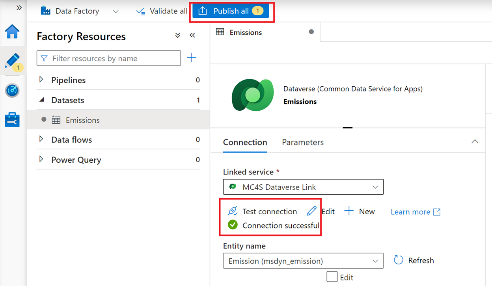](../media/publish-all.png#lightbox)

## Step 7 - Create the output dataset

To create the output dataset, follow these steps: 
1. On the left toolbar of the Azure portal, select the **Author** icon, select the plus **(+)** symbol, and then select **Dataset** to add a dataset.

    > [!div class="mx-imgBorder"]
    > 

2. On the **New dataset** page, search for **storage**, select **Azure Blob Storage**, and then select **Continue**.
3. On the **Select format** page, select **JSON**, and then select **Continue**. 
4. On the **Set properties** page, fill in the form as follows:
    - Enter any name, such as **OutputEmissions**.
    - Select **Blob storage link** from the **Linked service** dropdown list.
    - Enter **adf-output / mc4s** for the file path, and then leave the last box blank.
    - Select **From sample file** for **Import schema**.
    - Download [this file](https://github.com/AndreaC-MSFT/MC4S-Labs/blob/main/assets/adf-sample-schema.json/?azure-portal=true) locally and then select it with the **Browse** button.
    - Select **OK**. 
        > [!div class="mx-imgBorder"]
        > [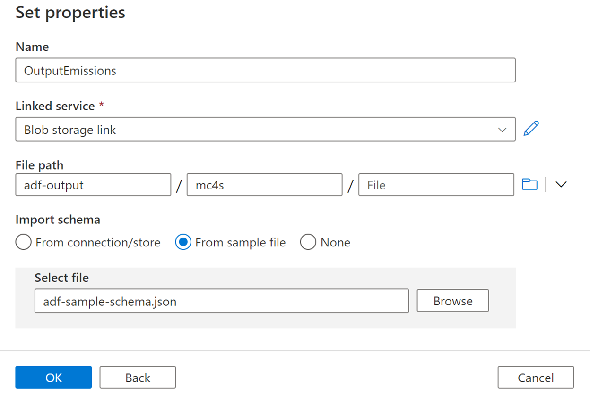](../media/set-properties-linked-services.png#lightbox)

5. Review the connection and then select **Publish all > Publish**. 

    > [!div class="mx-imgBorder"]
    > [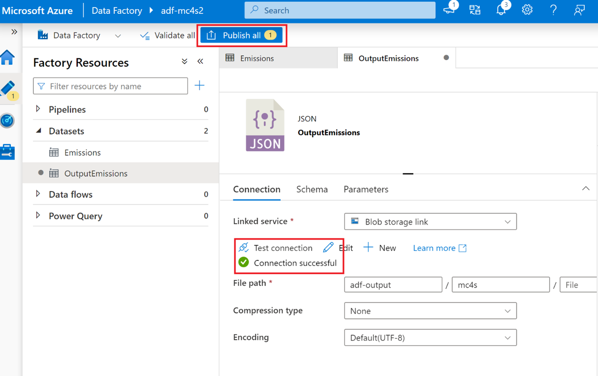](../media/publish-factory-resource.png#lightbox)

## Step 8 - Create a Data Factory pipeline

To create a Data Factory pipeline, follow these steps:

1. On the left toolbar of the Azure portal, select the **Author** icon, select the plus (+) symbol, and then select **Pipeline > Pipeline**. 
    
    > [!div class="mx-imgBorder"]
    > [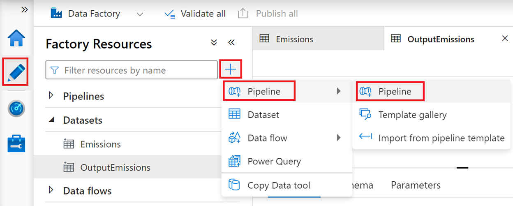](../media/add-pipeline.png#lightbox)

2.	Expand **Move & transform** and then drag the **Copy data** activity into the design surface. 

    > [!div class="mx-imgBorder"]
    > [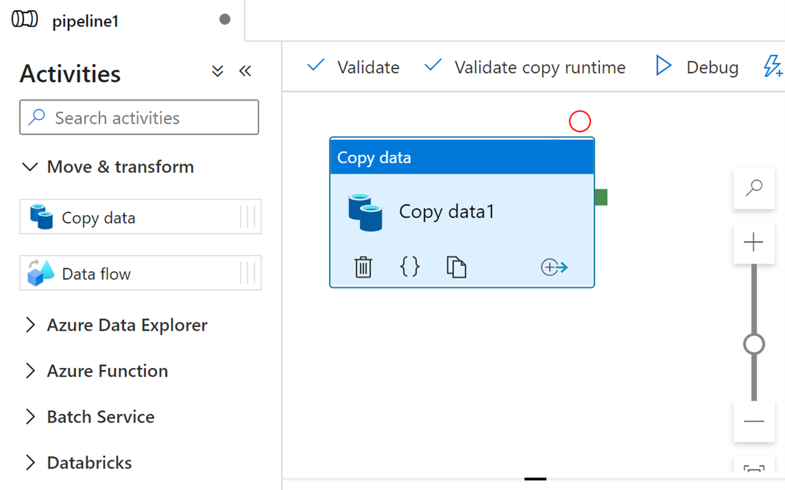](../media/copy-data.png#lightbox)

3.	On the **Source** tab, select **Emissions** from the **Source dataset** dropdown menu.
 
    > [!div class="mx-imgBorder"]
    > [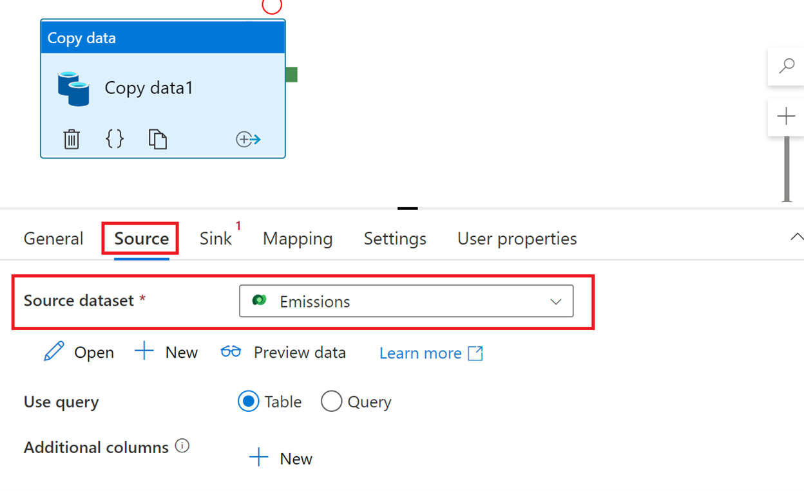](../media/source-dataset.png#lightbox)

4.	On the **Sink** tab, select **OutputEmissions** from the **Sink dataset** dropdown menu, and then select **Array of objects** from the **File pattern** dropdown menu. 

    > [!div class="mx-imgBorder"]
    > [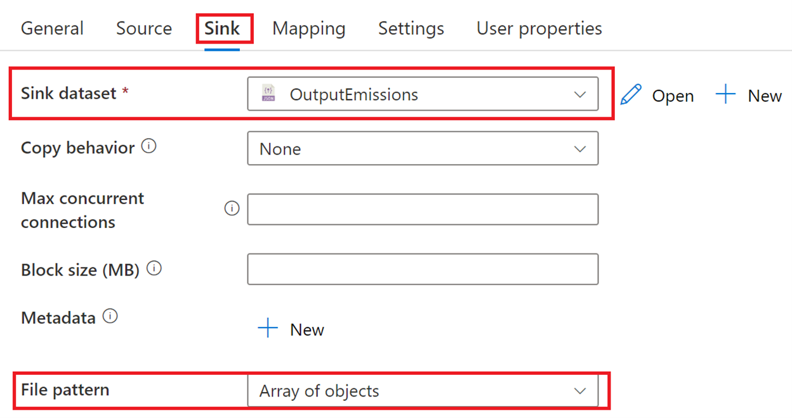](../media/sink-dataset.png#lightbox)

5.	On the **Mapping** tab, select **Import schemas**.

    > [!div class="mx-imgBorder"]
    > [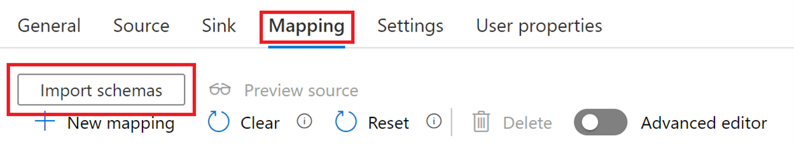](../media/schema-mapping.png#lightbox)

6. Define the mapping as follows:
    - msdyn_transactiondate > TransactionDate
    - msdyn_activityname > Activity
    - msdyn_co2e > CO2E

        > [!div class="mx-imgBorder"]
        > [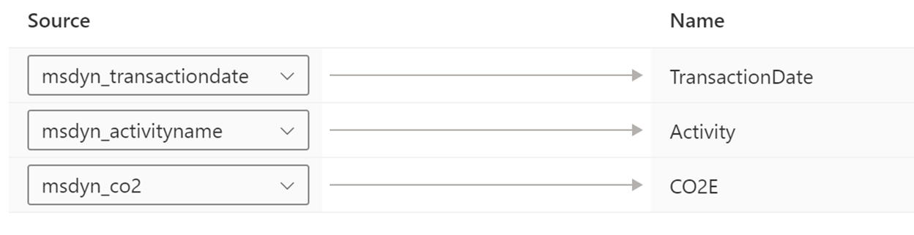](../media/source-schema.png#lightbox)
 
7.	Select **Debug** and then wait for the pipeline to run. 
    
    > [!div class="mx-imgBorder"]
    > [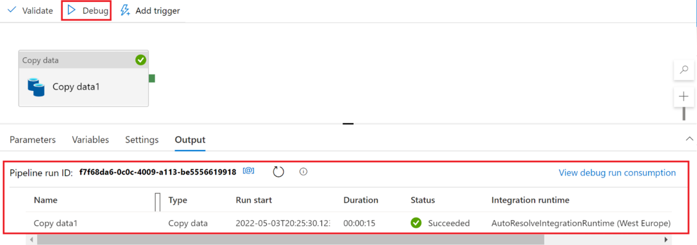](../media/debug.png#lightbox)
 
8. Select **Publish all > Publish** to save the pipeline. If you want to run the pipeline again without debugging, select Add **trigger > Trigger now**.
9. Return to the Azure portal and go to the storage account that you previously created.
10. Select **Containers** and then select the **adf-output** container. 
    
    > [!div class="mx-imgBorder"]
    > [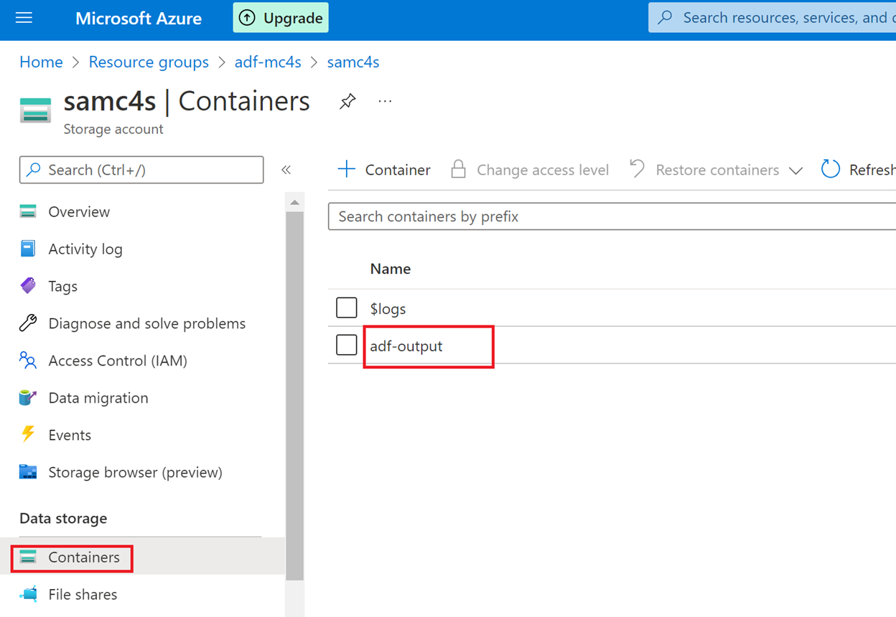](../media/adf-output.png#lightbox)

11.	Open the **mc4s** folder, select **msdyn_emission.json**, and then select **Download**. 
    
    > [!div class="mx-imgBorder"]
    > [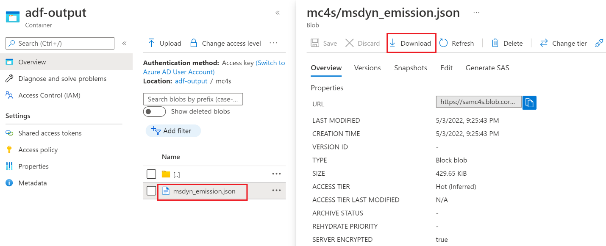](../media/emission-download.png#lightbox)

12.	Open the JSON file and confirm that the three mapped columns from the Emission table display in JSON format.
    
    > [!div class="mx-imgBorder"]
    > [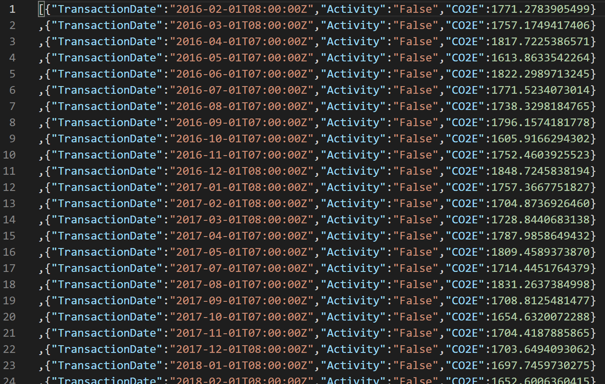](../media/emission-table.png#lightbox)
