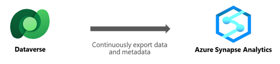
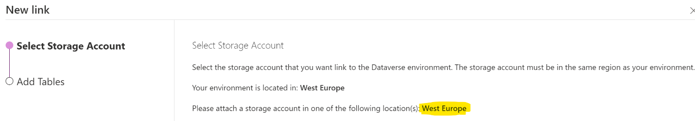
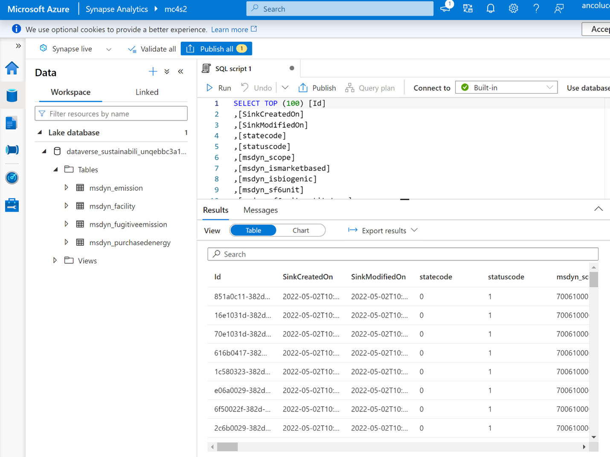

Azure Synapse Link for Dataverse enables you to get near real-time insights over your data in Microsoft Dataverse. With a tight, seamless integration between Dataverse and Microsoft Azure Synapse Analytics, Azure Synapse Link will help you run analytics, business intelligence, and machine learning scenarios on your data. 

In this exercise, you’ll connect your Dataverse data from Sustainability Manager to your Azure Synapse Analytics workspace by using Azure Synapse Link.

Before completing this exercise, make sure that you: 

- Have an Azure Data Lake Storage account, an Owner role, and an Azure Storage Blob Data Contributor role access. 
- Have a Synapse workspace and the Synapse Administrator role access within the Synapse Studio. 
- Add the storage account as a linked service within Synapse Studio. 
- Create the storage account and Synapse workspace in the same Azure AD tenant as your Power Apps tenant.
- Create the storage account and Synapse workspace in the same region as the Power Apps environment that you’ll use the feature in and the same resource group.
- Have Reader role access to the resource group with the storage account and Synapse workspace.
- Have the Dataverse system administrator security role so that you can link the environment to the storage account.
- Export only tables that have change tracking enabled.

## Step 1 - Locate the Azure region in which your environment is deployed

To locate the Azure region of your environment, follow these steps:

1. Go to the [Power Apps portal](https://make.preview.powerapps.com/?azure-portal=true).
2. In the upper-right corner, review the Environment badge to ensure that you’re in the correct environment.
3. Select **Data > Azure Synapse Link**.
4. Select **New link**.
5. In the **Select Storage Account** tab, note the Azure region. You’ll need to create the Synapse workspace in this region.

    > [!div class="mx-imgBorder"]
    > 

6. Select **Cancel**.

## Step 2 - Create an Azure Synapse Analytics workspace and add a role

To create the Azure Synapse Analytics workspace, follow these steps: 

1. Follow [this guide](/azure/synapse-analytics/get-started-create-workspace/?azure-portal=true) and create the Azure Synapse Analytics workspace. Ensure that you create the workspace in the region that was identified in **Step 1 of this exercise- Locate the Azure region in which your environment is deployed**. 
2. In the Azure portal, go to the storage account that you created as part of the Synapse workspace creation.
3. Go to **Access Control (IAM)**.
4. Select **Add > Add role assignment** and then assign yourself the **Storage Blob Data Owner** role.

    > [!Important]
    > Ensure that you complete this step because the Owner or Contributor role at resource level isn’t enough to query data from Synapse.

## Step 3 – Enable tracking for Dataverse tables to be linked to Synapse

To enable tracking for Dataverse tables so that you can link them to Synapse later, follow these steps: 
1. Go to the [Power Apps portal](https://make.powerapps.com/?azure-portal=true).
2. Go to **Data > Tables**.
3. Select **Managed** in the filter in the upper-right corner.
4. Select the **Emission** table.
5. Select **Settings** in the toolbar.
6. Expand **Advanced** options and ensure that **Track changes** is enabled.
7. Select **Save**.
8. Repeat steps 4 to 7 again for the following tables:
    - Facilities
    - Purchased energy
    - Fugitive emission

## Step 4 - Create the Azure Synapse Link for Dataverse

To create the Azure Synapse Link for Dataverse, complete the following steps: 
1. Go to **Data > Azure Synapse Link**.
2. Select **New link to data lake**.
3. Ensure that **Connect to your Azure Synapse workspace** is enabled and then select the **Subscription, Resource group, Workspace name**, and **Storage account** information. 

4. Select **Next**.
5. Select the following tables:
    - Emission
    - Facilities
    - Purchased energy
    - Fugitive emission
6. Select **Save**.
7. Go to **Data > Tables**.
8. Select the ellipsis (…) to the right of the **Emission** table, select **Azure Synapse Link**, and then select the name of the link that you’ve created. This step will enable the link for that table. 
    
    > [!div class="mx-imgBorder"]
    > 

9. Repeat the same process for the other linked tables. 

For more information, read [Create an Azure Synapse Link for Dataverse with your Azure Synapse Workspace](/power-apps/maker/data-platform/azure-synapse-link-synapse/?azure-portal=true) .

## Step 5- Confirm that Dataverse data is linked to Synapse Analytics

You can use Azure Synapse Link to connect your Microsoft Dataverse data to Azure Synapse Analytics to explore your data.

To confirm that data is linked to Synapse, complete the following steps: 

1. Go to the Azure portal, select the desired Azure Synapse Link, and then select **Go to Azure Synapse Analytics workspace** from the top panel. Alternatively, you can open Synapse Studio directly by going to `https://web.azuresynapse.net`.

2. Expand **Lake Databases**, select **dataverse-environmentName-organizationUniqueName**, and then expand **Tables**. All exported Dataverse tables will be listed and available for analysis.

3. Select the ellipsis (…) beside **msdyn_emissions**, and then select **New SQL Script > Select TOP 100 Rows**. 
    
    > [!div class="mx-imgBorder"]
    > 

4. After the query script has been generated, select **Run**. The first 100 rows of data from the **Emission** table will be displayed.
 
    > [!div class="mx-imgBorder"]
    > 

    
    > [!Important]
    > When you select **Run** and you get an error stating that the content can’t be displayed, make sure that you have the Storage Blob Data Owner role on the storage as assigned in the **Create an Azure Synapse Analytics Workspace** step.
