In this exercise, you'll be configuring live chat for **Dynamics 365 Omnichannel for Customer Service**. Omnichannel for Customer Service offers a suite of capabilities that extend the power of Dynamics 365 Customer Service Enterprise to enable organizations to instantly connect and engage with their customers across digital messaging channels.

In the following tasks, you'll complete these steps:

1. Assign Omnichannel agent security role.

1. Create an application user using the **MCH Application Id** and your **Bot ID**.

1. Configure queues for bot and agent users.

1. Configure a context variable and routing rule to route the message either to a bot or agent.

## Task 1: Assign Omnichannel agent security role

1. While in the In-Private or Incognito window, navigate to [Power Apps](https://make.powerapps.com/?azure-portal=true).

1. Select your environment from the upper right **Environment** drop-down.

    > [!div class="mx-imgBorder"]
    > 

1. Select the **gear icon** in the upper right corner and navigate to **Advanced Settings**.

    > [!div class="mx-imgBorder"]
    > 

1. A new window should open and navigate to Dynamics 365. If loading takes a while, reload the page. It will navigate to the Business Management section of Dynamics 365.

    > [!div class="mx-imgBorder"]
    > 

1. On the top command bar next to Dynamics 365, select **Settings** to open the drop-down, then select **Security** in the third column under System.

    > [!div class="mx-imgBorder"]
    > 

1. Under Security, select **Users**.

    > [!div class="mx-imgBorder"]
    > 

1. Switch the view drop-down from Omnichannel Users to **Enabled Users** for the grid view so that your user will show in the list.

    > [!div class="mx-imgBorder"]
    > 

1. While in the Enabled User list, scroll to **find your user** or use the **Search** bar.

1. Select your user for the training and select **Manage Roles** on the top command bar.

    > [!div class="mx-imgBorder"]
    > 

1. Select the **Omnichannel agent** roles to assign to your user and select **OK**.

    > [!div class="mx-imgBorder"]
    > 

**Congratulations!** You assigned the proper omnichannel agent role to your user to allow you to be a live agent in omnichannel.

## Task 2: Create Health Bot user in Dynamics 365 Customer Service

We need two users to configure in Omnichannel for Dynamics 365 Customer Service:

- **Health Bot User** - This is the Azure Health Bot user we created in the previous exercise.

- **Omnichannel Agent User** - This is your current user that you're logged into Dynamics 365 with. This will allow you to be a live agent in Customer Service who receives messages from portal users through Azure Bot escalations.

In this task, you'll create a **Bot User** which helps connect **Azure Health Bot** with **Omnichannel live Chat**.

1. Go to https://admin.powerplatform.microsoft.com/.

1. Select your Microsoft Cloud for Healthcare environment from the list.

    > [!div class="mx-imgBorder"]
    > 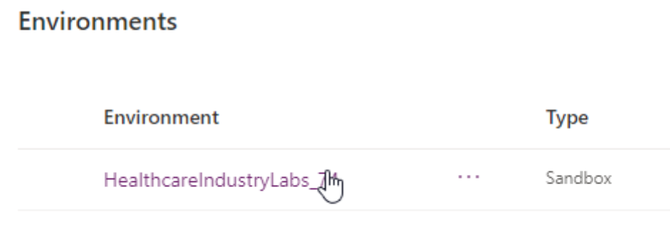

1. You'll land on your environments detail page.

    > [!div class="mx-imgBorder"]
    > [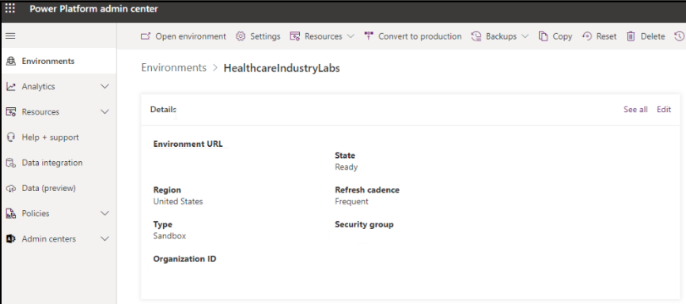](../media/39-new-application-user.png#lightbox)

1. Select the **Settings** button on the top command bar.

    > [!div class="mx-imgBorder"]
    > [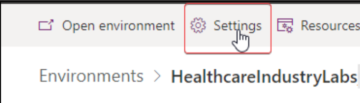](../media/40-application-user.png#lightbox)

1. Expand **Users + permissions** and select **Application users**.

    > [!div class="mx-imgBorder"]
    > [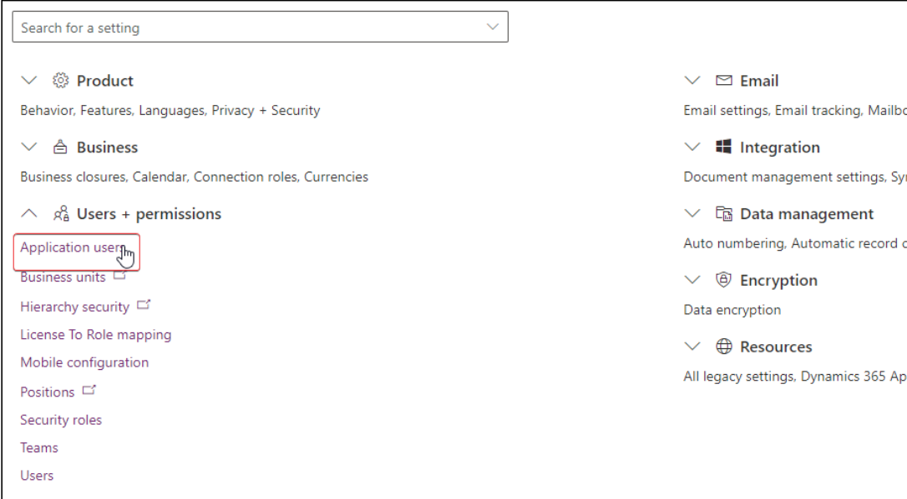](../media/41-new-user-form.png#lightbox)

1. Select **(+) New app user** button to create a new Application User. 

    > [!div class="mx-imgBorder"]
    > 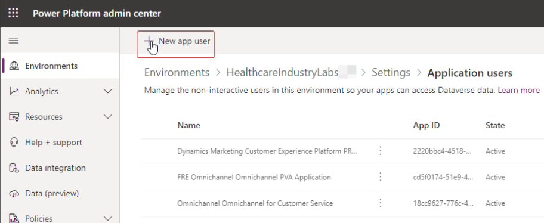

1. Select (+) Add an app on the create screen that slides out on the right side.

    > [!div class="mx-imgBorder"]
    > [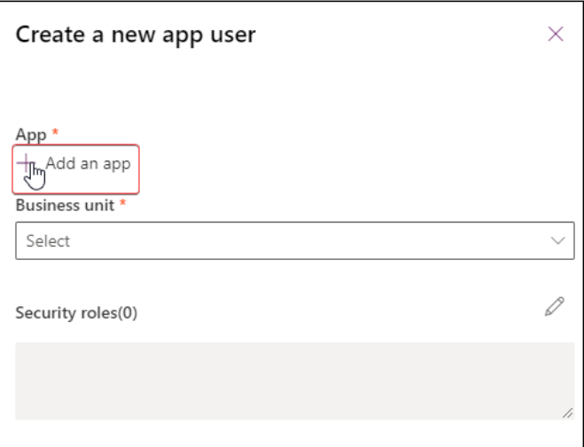](../media/44-application-manage-roles.png#lightbox)

1. Paste the **Application ID** (the Application (client) ID you obtained in the Azure portal for the supplied MCH Application ID) into the search box and select the app from the list. Select **Add** at the bottom right.

    > [!div class="mx-imgBorder"]
    > 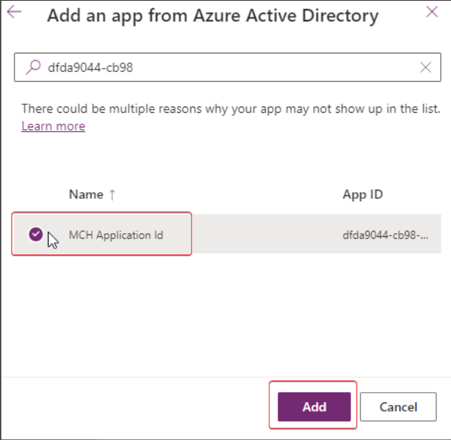

1. Select a **Business unit** from the drop-down list (the options in the list will be unique for each Dynamics 365 environment). Select **Create** at the bottom right.

1. Return to the Dynamics 365 User page, switch the view to **Enabled Users**.

    > [!div class="mx-imgBorder"]
    > 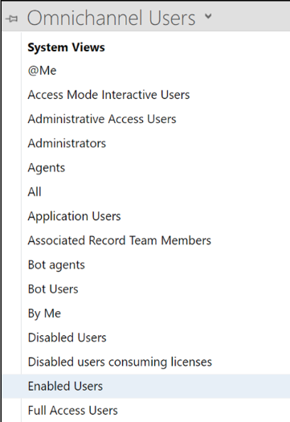

1. While in the Enabled User list, scroll to **find your App user** or use the **Search** bar. Double select on the user or select the row and select Edit. 

    > [!div class="mx-imgBorder"]
    > 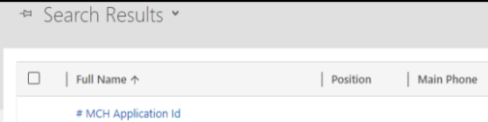

1. Change the form type from **User** to **Application User** above the User Name. 

    > [!div class="mx-imgBorder"]
    > 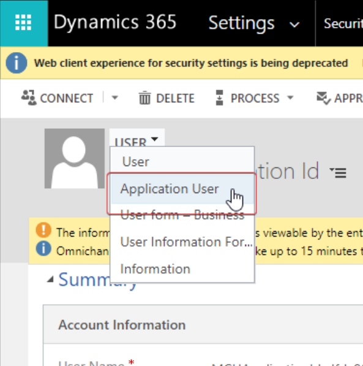

1. You'll see a new form appears that aligns to an Application User. 

    > [!div class="mx-imgBorder"]
    > 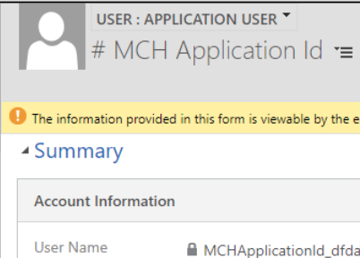

1. In the **User Information** section, enter or select the following information and select the **Save** icon in the bottom right corner: 

    - **User type** - Select **Bot application user**. This will display a new field to store the Bot application ID. 
    - **Bot application ID** - This is the Azure Health BotId you copied when enabling the Teams channel. This field is displayed once the User Type is selected to be Bot application user. 
    > [!div class="mx-imgBorder"]
    > 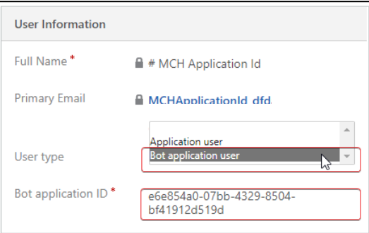

1. Select **Manage Roles** on the command bar. 

    > [!div class="mx-imgBorder"]
    > 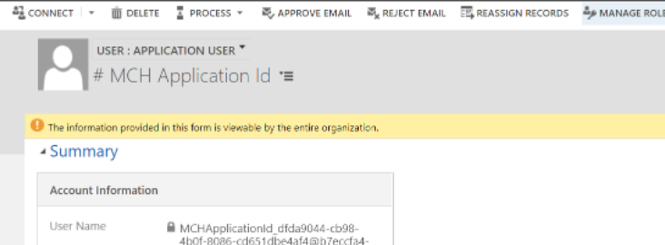

1. Assign the **Omnichannel Agent** role to the Bot User as you did for your own user in the previous task.  This will allow the bot to act as an omnichannel agent like your user. 

    > [!div class="mx-imgBorder"]
    > 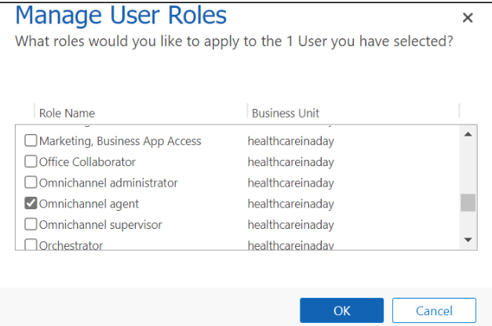

**Congratulations!** You successfully created a Bot User and assigned the Omnichannel Agent role to it.

## Task 3: Create and configure Human Agent queues

Queues are used to collect and distribute workload among agents. Agents are added as members to the queues and the workload is distributed among the agents based on assignment methods.  For more information, see [Manage queues for unified routing](/dynamics365/customer-service/queues-omnichannel?tabs=customerserviceadmincenter). 

In this task, you'll create the omnichannel queue necessary to communicate with a human agent. 

1. In [Power Apps](https://make.powerapps.com/?azure-portal=true), open the **Omnichannel admin center** app.

    > [!div class="mx-imgBorder"]
    > 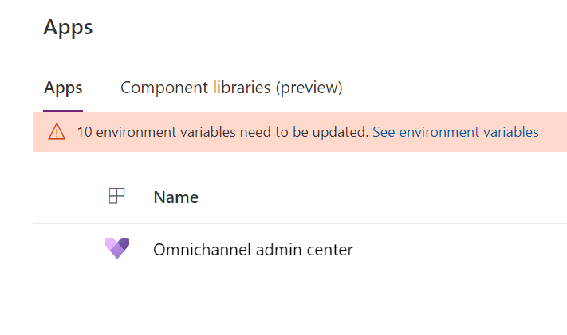

1. You should be on the **Homepage**.  Select **Create a queue** from the center shortcut. 

    > [!div class="mx-imgBorder"]
    > 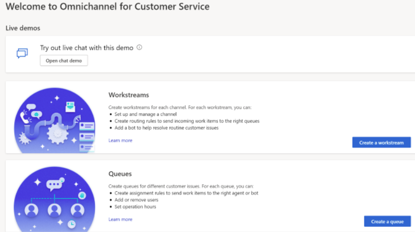

1. You'll now create a queue called **Escalate to Human** which will manage and redirect the incoming messages from a user to a Customer Service (human) Agent when Bot sends the user through to a live agent.  Create the new Queue with the following details: 

    - **Name** - Escalate to Human 
    - **Type** - Messaging 
    - **Group number** - [any number] 
    - Select **Create**.   

    > [!div class="mx-imgBorder"]
    > [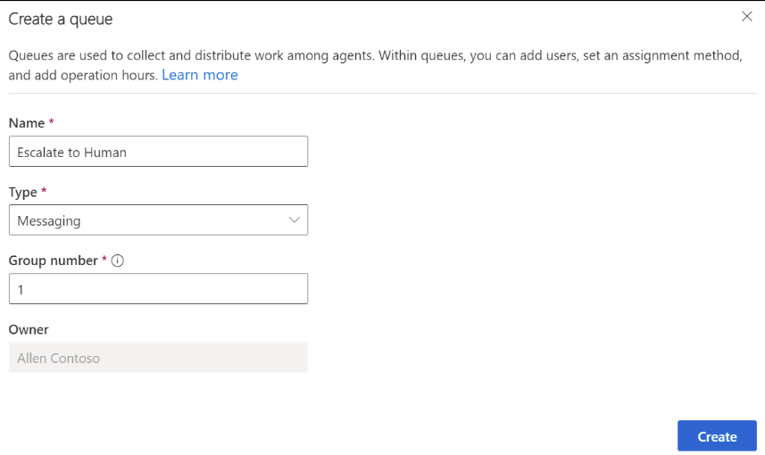](../media/47-default-messaging.png#lightbox)

1. The new Queue record will open and contain a **User** subgrid. Select **Add users** in the subgrid. 

    > [!div class="mx-imgBorder"]
    > [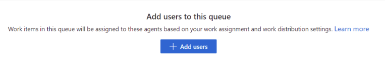](../media/48-add-existing-user.png#lightbox)

1. Search for your user and add it to the queue. 

    > [!div class="mx-imgBorder"]
    > 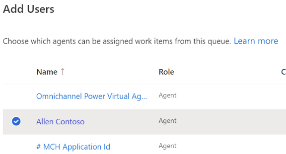

1. The user is now added to the queue with the **agent** role. 

    > [!div class="mx-imgBorder"]
    > 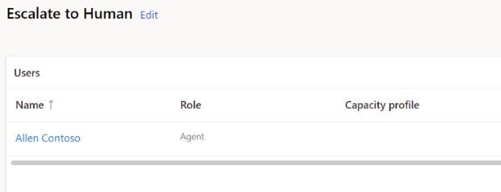

1. Select **Queues** on the left navigation bar and you'll now see it listed in the queues subgrid. 

    > [!div class="mx-imgBorder"]
    > [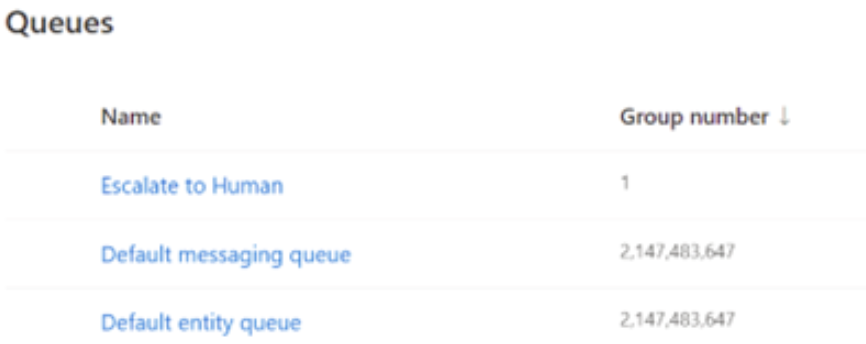](../media/51-default-messaging-summary.png#lightbox)

**Congratulations!** You created the necessary queue to escalate to human agent and added your user to the messaging queue.  Now we can create the workstream to initially route to a virtual bot along with routing rules to direct the user to Escalate to Human queue in the proper conditions.

## Task 4: Update live work stream with context variables and routing rules

Workstreams are containers to enrich, route, and assign work items. A workstream is associated with a channel, such as live chat, voice, or case.  After a bot is added to a workstream, the incoming work item is first routed to the selected bot at runtime based off classification rules.  For more information, see [Create workstreams for unified routing](/dynamics365/customer-service/create-workstreams?tabs=customerserviceadmincenter).

In this task, we'll set up basic chat routing with a new workstream.  This will allow for users to chat with a bot user initially and route to a live human agent in the proper situation. We'll complete the following: 

- Create a new workstream 
- Set up a live chat channel 
- Add bot for initial routing: Initial customer conversation is directed to the Azure Health Bot.
- Create context variable and routing rule to escalate to human agent: When context variable **EscalateToAgent** is present and set to 1, we route to the **Escalate to Human** queue we previously set up with our user as an agent who can take over the conversation. 

1. Navigate to **WorkStreams.**

    > [!div class="mx-imgBorder"]
    > 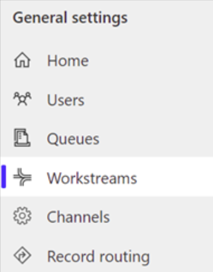

1. Select **+ New Workstream** on the command bar. 

    > [!div class="mx-imgBorder"]
    > 

1. Enter the following details for the new workstream: 

     - **Name** - Chat Workstream 
     - **Type** - Messaging 
     - **Channel** - Chat 
     - **Work distribution mode** - Push 
     - Select **Create**

    > [!div class="mx-imgBorder"]
    > [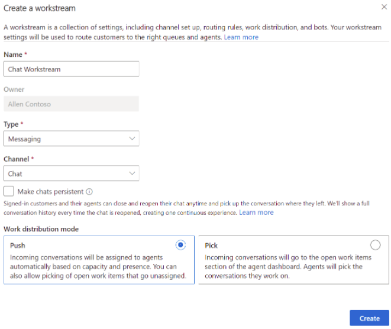](../media/57-context-variables.png#lightbox)

1. On the Chat Workstream record, you must set up your chat channel. Select **Set up chat** under Live chat. 

    > [!div class="mx-imgBorder"]
    > 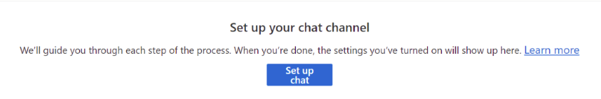

1. **Live Chat setup** screen will open.  Enter the channel details as follows: 

    - **Name** - Chat Widget 
    - **Language** - English – United States
    - Select **Next**. 

    > [!div class="mx-imgBorder"]
    > [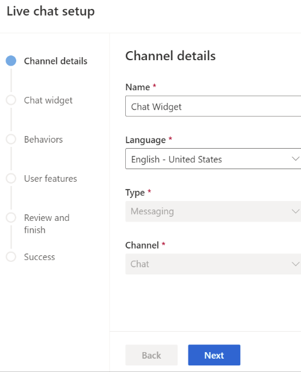](../media/live-chat-setup.png#lightbox)

1. On the following screen, toggle to enable **Proactive chat**. Here you may define any other settings for the chat widget. 

    > [!div class="mx-imgBorder"]
    > 

1. Select **Next** to see the **Behavior** settings you can customize for your bot, including automated messages and surveys.  No need to customize anything here now. 

    > [!div class="mx-imgBorder"]
    > [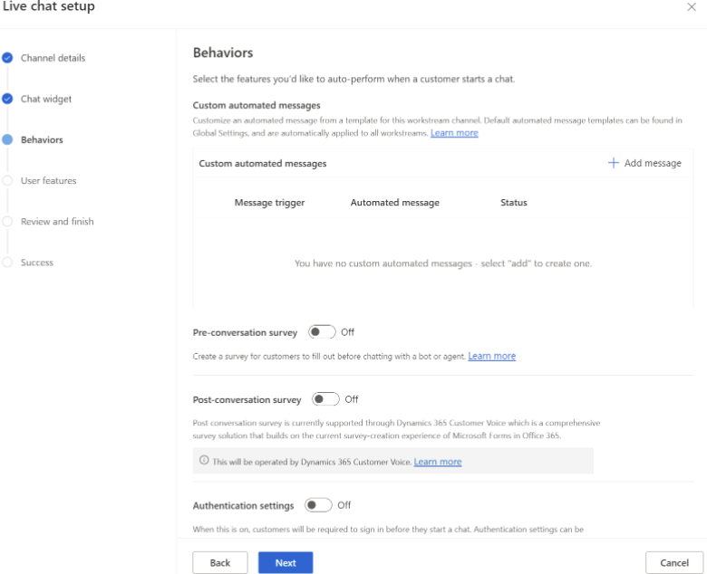](../media/60-routing-rules.png#lightbox)

1. Select **Next** to see the User features that can be defined for the bot.  Nothing is needed here now. 

    > [!div class="mx-imgBorder"]
    > [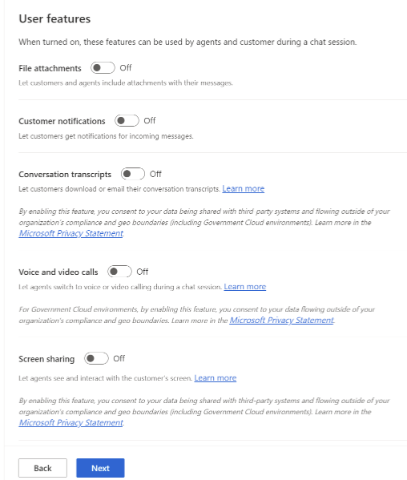](../media/61-new-rule-item.png#lightbox)

1. Review your settings and select **Create channel**. 

    > [!div class="mx-imgBorder"]
    > [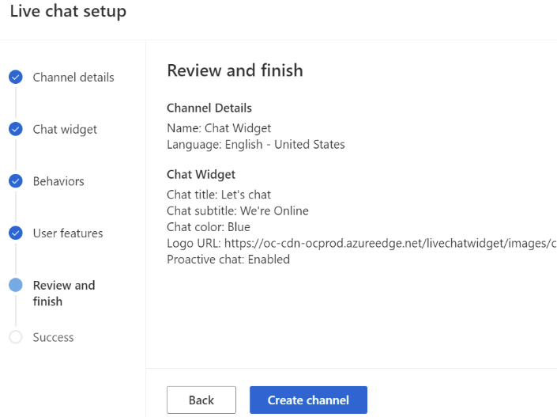](../media/62-add-routing-rule.png#lightbox)

1. Once the chat channel is successfully created, **copy the script** of the chat widget, and save it somewhere to add it to your website later. Select **Done** to close the wizard. 

    > [!div class="mx-imgBorder"]
    > [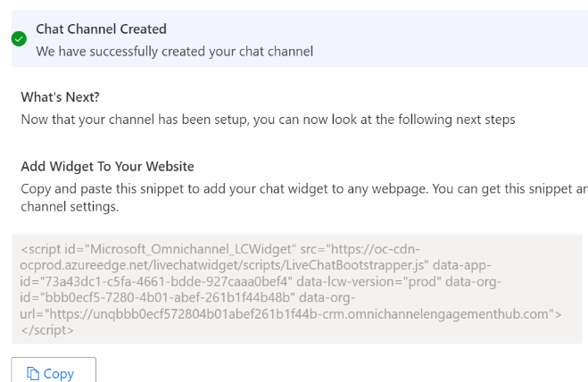](../media/63-new-rule-general.png#lightbox)

1. In your new **Chat Workstream** record, select **Add Bot** to add the Azure Health bot for initial routing. 
    > [!div class="mx-imgBorder"]
    > [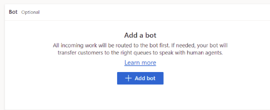](../media/64-condition.png#lightbox)

1. Find and select your bot. Select **Add**. 

    > [!div class="mx-imgBorder"]
    > [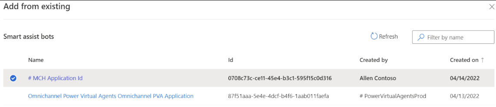](../media/add-existing-bot.png#lightbox)

1. This should open the advanced settings and display your bot in the **smart assist bots** subgrid. 

    > [!div class="mx-imgBorder"]
    > [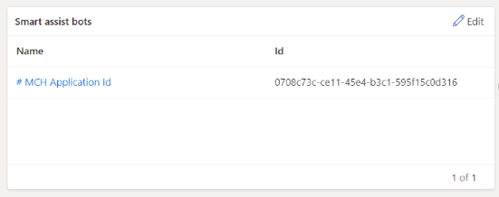](../media/65-bot-agent-rule.png#lightbox)

1. You can also access the advanced settings at the bottom of the record page by selecting **Show advanced settings**.

1. Now we want to define a new context variable and routing rule. Select **+ Add Context variable**. 

    > [!div class="mx-imgBorder"]
    > [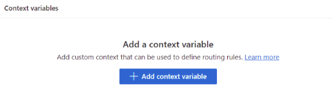](../media/context-variable.png#lightbox)

1. In the context variable flyout, select **+ Add** to add new context variable. 

    > [!div class="mx-imgBorder"]
    > [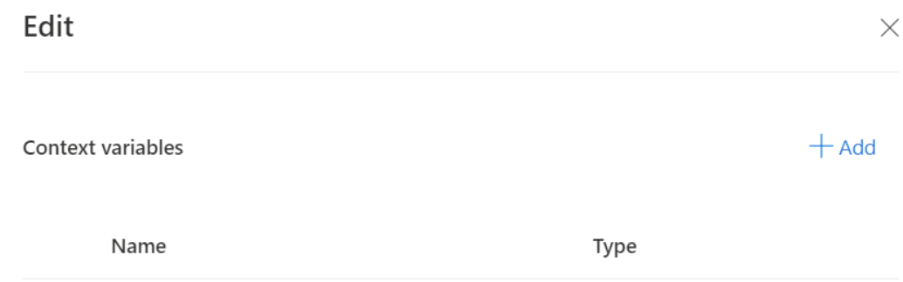](../media/context-variable-add.png#lightbox)

1. Create the new Context Variable with the following details: 

    - **Name** - EscalateToAgent 
    - **Type** - Number 
    - Select **Create **

    > [!div class="mx-imgBorder"]
    > 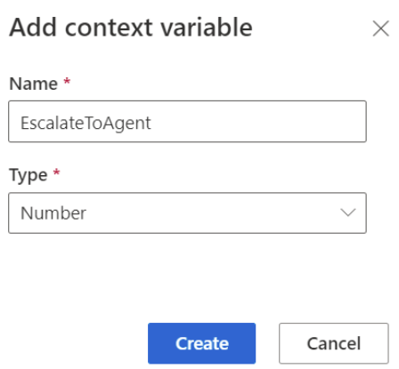

1. **Close** the context variable panel. 

1. You should now see the new **EscalateToAgent** context variable in the live chat workstream. 

    > [!div class="mx-imgBorder"]
    > 

1. Select **Advanced Settings** to collapse to the main page. 

1. Under **Route to queues**, select **+Create ruleset**. 

    > [!div class="mx-imgBorder"]
    > [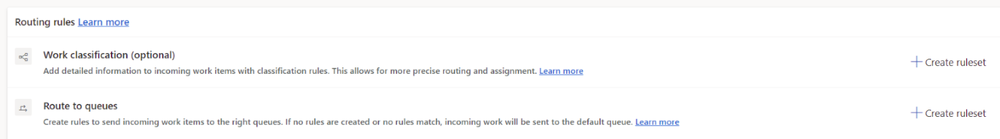](../media/create-ruleset.png#lightbox)

1. Create the new route-to-queues ruleset with the following details: 

    - **Name** - Human Agent 
    - **Description** - Escalate to human agent 
    - No Conditions. 

    > [!div class="mx-imgBorder"]
    > 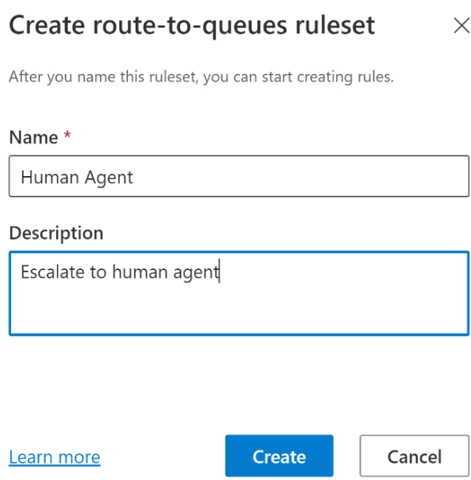  

1. In the new Human Agent queue ruleset, select **+ Create rule**. 

1. Name the new rule **Human Agent Rule**. 

1. Under conditions, choose **Add related entity** from the dropdown. 

    > [!div class="mx-imgBorder"]
    > 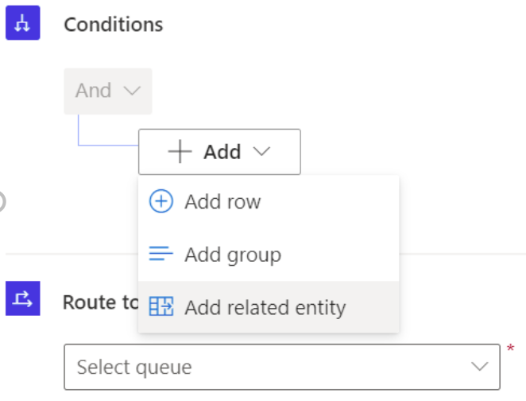

1. In the first two drop downs, Choose **Context item value** and **Contains data**. In the inline condition, choose **EscalateToAgent Equals 1**. 

    > [!div class="mx-imgBorder"]
    > 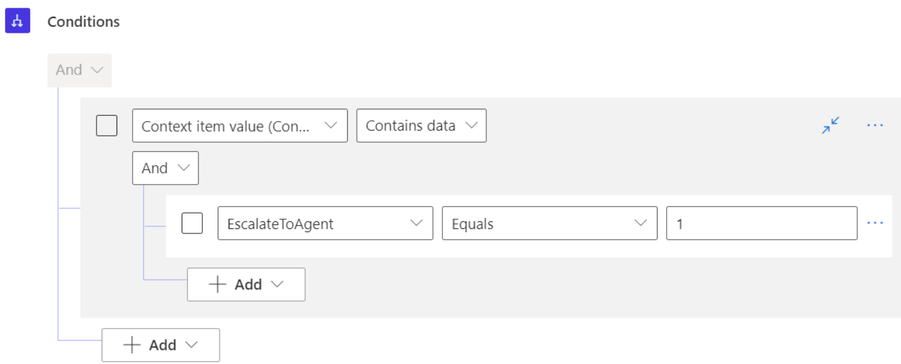

1. In the Route to queues section, choose **Escalate to Human** queue created previously. 

1. The configured rule set is shown below. Select **Create.**

    > [!div class="mx-imgBorder"]
    > [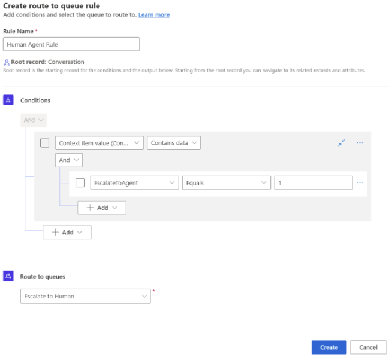](../media/create-routing.png#lightbox)

1. The Chat Workstream now has a Human Agent ruleset that will escalate to a human agent when the EscalateToAgent context variable is set to 1

    > [!div class="mx-imgBorder"]
    > [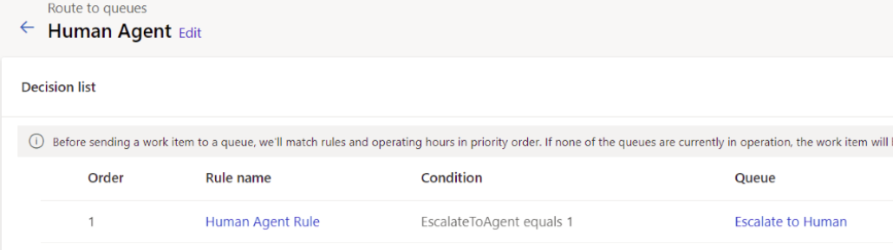](../media/rule-added.png#lightbox)

**Congratulations!** You've created a new Workstream with the proper live chat channel, smart assist bot, and routing rule that will allow customers to begin conversation with a health bot and escalate to a human agent. 