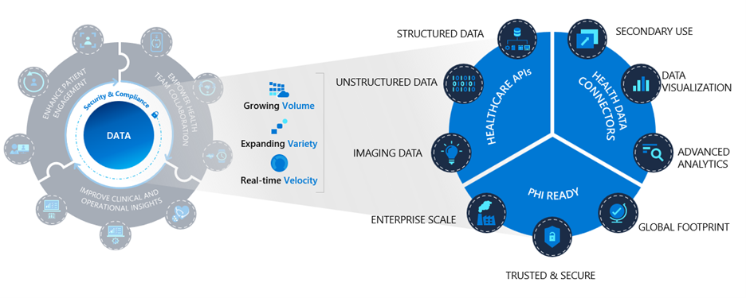

Azure Health Data Services is a managed Platform-as-a-Service (PaaS) based on OpenAPI standards and frameworks that enable secure and scalable health data solutions. Azure Health Data Services empowers the Microsoft Cloud for Healthcare and other health workloads by enabling secure and compliant paths to ingest, persist and connect health data in the cloud.

Azure Health Data Services is a set of tools and connectors that enable organizations to bring health data to the Microsoft Cloud and improve health through insights. Using a set of API services and frameworks dedicated to the healthcare industry is beneficial because health data can be fragmented across multiple systems, device types, and data formats. Having a centralized platform for collecting insights from health data is one of the greatest opportunities for improving people's overall wellness, from population health all the way down to personalized care. That is why interoperability, the ability of computer systems or software to exchange and make use of information, is such an important global health data objective. Health data comes in many forms, often from dissimilar sources.  Interoperability between all types of health data is key to the next generation of wide-scale medical advances. Bringing disparate systems, workflows, and health data formats together is the core function of Azure Health Data Services. As a centralized platform for unifying health data of all types, Azure Health Data Services enables organizations to unlock the full potential hidden in their data - yielding new health insights and discoveries.

Azure is a secure cloud, so it can contain protected health information and store it safely. Using Azure Health Data Services as a compliant solution where different types of health data are harmonized together, organizations can de-identify protected health information (PHI) and can connect to the machine learning and data analytics resources in the greater Azure ecosystem.

By offering a Business Associate Agreement (BAA), Microsoft helps support HIPAA compliance, but using Azure or other Microsoft cloud services doesn't automatically impart compliance onto your cloud solutions.  For more information regarding HIPAA compliance, visit [Microsoft docs](/azure/compliance/offerings/offering-hipaa-us). 

In this module, we'll help you understand the interoperability challenges of health and life sciences data and the benefits of Azure Health Data Services. You'll gain a high-level understanding of interoperability, Health Data & FHIR, Medical Imaging & DICOM, and MedTech & IoT. 

Upon completion of this module, you’ll be able to:
- Understand interoperability challenges of health and life sciences data
- Understand the core global health data standards Azure Health Data Services supports today
- Describe the tools and connectors that comprise Azure Health Data Services and the benefits they provide
