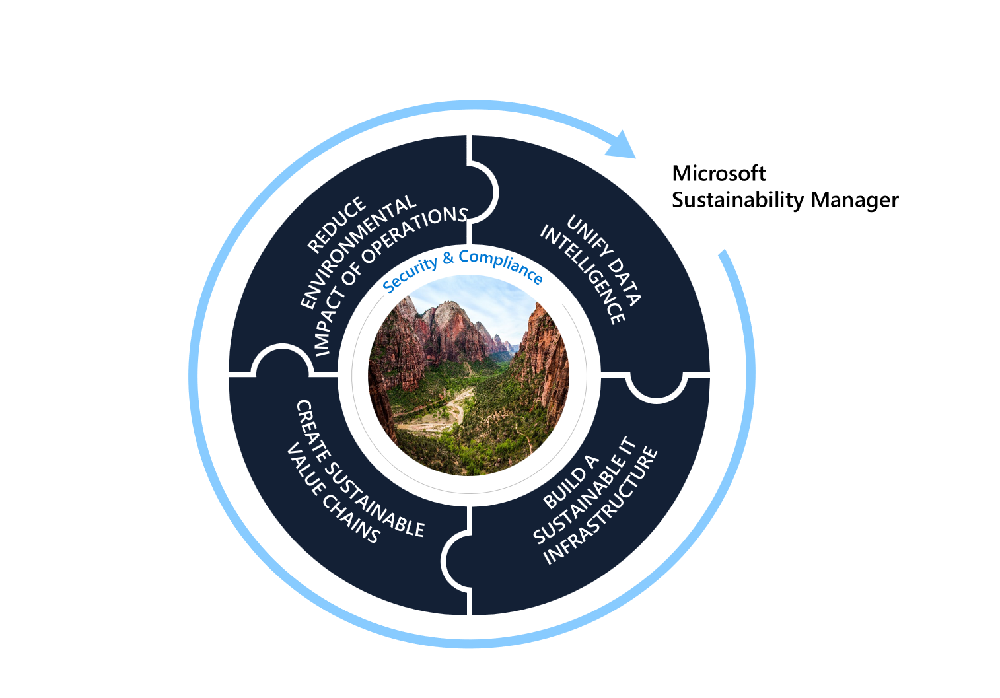

Microsoft Cloud for Sustainability empowers organizations to accelerate sustainability progress and business growth by bringing together a set of environmental, social, and governance capabilities across the Microsoft cloud portfolio plus solutions from Microsoft’s global ecosystem of partners.

Microsoft Cloud for Sustainability is working closely with customers and partners on the following:

- Unifying data intelligence to drive sustainability reporting, sustainability efforts, and business transformation.
- Identifying opportunities to build a more sustainable IT infrastructure by replacing tools, systems, or activities with more efficient options and defining ways to add business value.

By working with partners and using advanced analytics, machine learning, and virtual models in the cloud, Microsoft helps organizations:

- **Reduce the environmental footprint of their operational systems and processes** – Companies can create energy efficiencies and transition to clean energy, while reducing carbon emissions, water consumption, and waste.
- **Facilitate greater transparency and accountability through their value chain** - From raw materials to product creation to distribution, organizations will be able to drive efficiencies, reduce emissions, and design out-waste programs to promote a circular economy.

As a result, organizations can measure, monitor, and manage their data to understand where they're today, set future goals, and make data-driven decisions about the best steps to achieve those goals.

