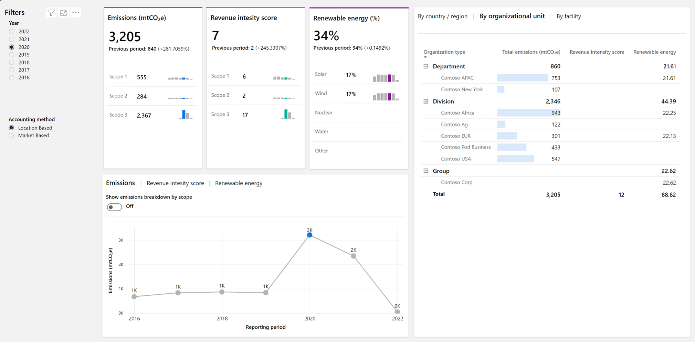
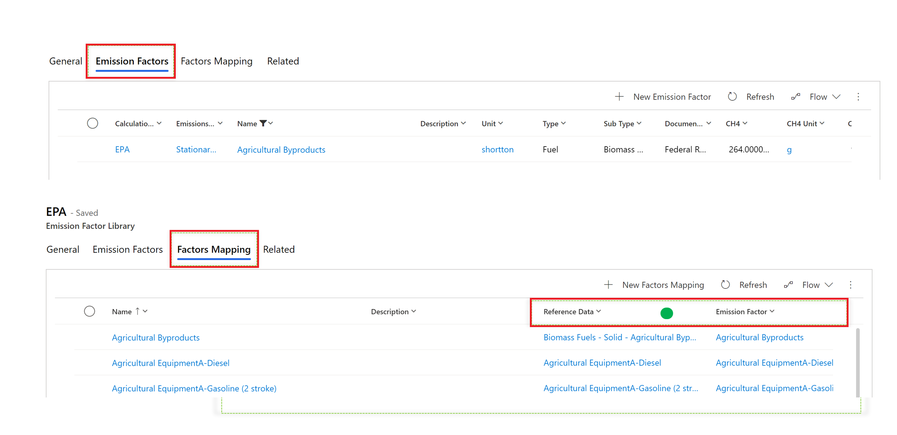
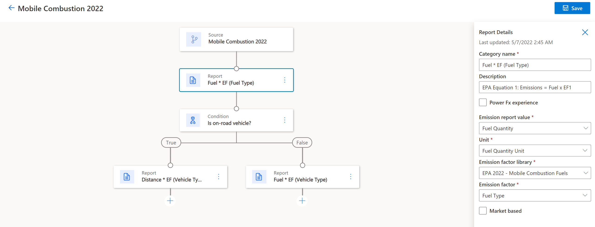

The following scenario depicts how a fictional company named Contoso Coffee might use Sustainability Manager to record, report, and reduce its environmental impact by using data connections and actionable insights.

> [!VIDEO https://www.microsoft.com/videoplayer/embed/RWO4gN]

In this scenario, the chief sustainability manager for Contoso Coffee will use the application.

## Insights on emissions activities
Sustainability Manager provides visibility into Contoso Coffee’s emissions activities and empowers the company to report its impact and progress more efficiently. Moreover, it gives the company’s employees and partners access to the intelligence and collaboration tools that are required for refining and scaling sustainability initiatives to transform their business end to end. 

The Contoso Coffee dashboard provides consolidated emissions data visualizations that represent Contoso Coffee’s carbon footprint around the world and insights that the team can use to accelerate their sustainability strategy. 

Go to the **Home** page.

> [!div class="mx-imgBorder"]
> 

## Set up centralized emission data collection
Manual processes to collect and connect emissions data are labor-intensive, inexact, and unreliable. In some instances, manual data entry is still necessary, due to the platform of data providers.

Sustainability Manager streamlines the process of data ingestion and calculation so that organizations can more effectively measure and monitor the emissions that are generated through their operations and value chain.

This flexible solution allows a blend of data ingestion methods: 
- Manual input or file imports 
- Direct connections to data sources

Under **Data Connections**, you can: 
- Import existing data one time or schedule imports by using the connector wizard.
    - Go to **Data > Data Connections**.
- Set up direct connections to data so that, as changes are made to that data within an existing business system, the changes are also made dynamically within Sustainability Manager.
    - Go to **Data > Connections**.

Sustainability Manager can monitor and connect all types of data that are generated by your operations, and it is business system-agnostic. 

With Sustainability Manager, you can:
 
- Establish direct connections to almost any business system, ERP system, or cloud platform that your organization uses so that data would continue to refresh on an ongoing basis.
- Choose from a growing catalog of prebuilt connections to internal sources (such as IoT sensors, systems telemetry, or business solutions in facilities around the world) and external sources (such as suppliers or energy providers).
- Work with a partner to create your own custom connectors.

In this scenario with Contoso Coffee, one of the connectors is a direct connector to the **Emissions impact** dashboard, which provides transparency into the emissions that are produced from a Microsoft customer’s use of Azure services.

Go to ****Data > Data Connections > Create new data connection > Pre-calculated emissions > Scope 3 > Purchased goods and services**.

The solution breaks down data silos by using the Microsoft Cloud for Sustainability data model that centralizes emissions data from disparate sources with a shared data language. This data model streamlines data ingestion, integration, calculations, and reporting.

The data model is publicly available to share with your internal teams, vendors, and trading partners to drive data integrity and consistent reporting upstream and downstream. It’s available as part of the Microsoft industry data model libraries for use across your organization and value chain to enable more accurate and reliable reporting. 

## Define emission calculations 
In the **Calculations** section, you can set up the emission or estimation factors and factor mappings. You can connect to standard factor libraries or bring your own factor libraries to tailor calculations to your business needs and maintain consistent emissions calculation and reporting over time. Additionally, you could customize the emission factors and formulas to convert raw data into calculated emissions to generate more accurate results for your organization.

Emission factors are presented in libraries that can be segmented by specific year or any other criteria. You can add emission factors continually, and you can select the appropriate library when setting up reporting capabilities or reporting periods. 

Go to **Data > Calculations > Factor Libraries > Emission factors**.
 
> [!div class="mx-imgBorder"]
> 

When master data is set up in the application, you can perform calculations at scale by using built-in, dynamic calculation models. For example, if you operate in several different countries and have operations performing many different activities, each with its own emission factors, then you’ll need to create a formula for making calculations for each activity that you want to analyze. 

You need a way to choose the correct emission factors for the calculation. In this case, you would select the **Factor library** option from the dropdown menu, which holds your emission and estimation factors. You could also use a Microsoft Power Fx model for extra flexibility. Power Fx is a Microsoft Excel-like language that lets you express more complex mathematical models. Considerable flexibility and power are offered in this solution.

You can correlate multiple variables to create an output. These formulas (or calculations) that are configured in the models can be as simple as multiplication of an emission factor times an activity quantity. Alternatively, for more granularity, you could use a Power Fx experience. 
Go to **Data > Calculations > Calculation Models > New**.

> [!div class="mx-imgBorder"]
> 

## Validate the emission calculations 
The **Calculation Profiles** page is where you can manage calculation jobs. When data is connected and calculations have been set, you can put the solution to work to perform calculations continuously. 
1. Select the data that you want to calculate, and then apply the model that you built in the previous step. 
2. Schedule the calculations and then examine the preview. 
This step enables you to validate the results of a formula and ensure that the correct data is applied before generating the outcome, which gives confidence that the calculations are accurate. 
3. Finish setting up the job and then let it run. 
4. You can choose to run calculations on a schedule or even on demand if that’s needed.
5. Go to the **Profiles** page.
6. Go to **New calculation profile**.
7. You can bring in precalculated emissions across any scope or emissions categories. To do so, go to **Data > Data Management > Data Connections > Create new connection > Select data type > Pre-calculated emissions**.

## View all emissions 
When data has been calculated and results have been produced, you’ll want to view the **All emissions** tab. This tab is where you can view the outcome of your calculations. It’s also the source of all analytics and scorecards, which are data driven. 

Go to the **Analytics > All emissions** page.

## Define emission reduction goals
Even without an initial understanding of where you are in your sustainability efforts, you can still set emission reduction goals so that you can track your progress. 

Contoso Coffee’s goals are shown in the **Scorecards** section. 

Each goal is interactive so that you can set goals and then continuously check progress toward achieving them because the goals are connected to actual data. You can connect any entity within Sustainability Manager to a goal.

Furthermore, you can set rules for how the status of those goals are updated and add notes for context. 

You can set up goals on the **Scorecards** page so that they’re monitored automatically. The different statuses are data-driven based on data that’s coming from all activities and calculations that have been done. Essentially, it will take less work to monitor progress against goals.

Go to the **Scorecards** page. The following screenshot is an example of a Scorecard, but not specific to this scenario.
 
> [!div class="mx-imgBorder"]
> 

Alternatively, you can open one of the goals to demonstrate the different rules that you can set for tracking individual goals.

Open the **Edit Goal** pane to observe how data is connected and then close it.

## Track goal progress
A general dashboard is available for you to check progress toward goals based on different periods of time and types of data. The dashboard is interactive in that data can be generated from location-based calculations, market-based calculations, or other parameters. The dashboard also allows data exploration. 

In the scenario with Contoso Coffee company, you can review your progress by country/region, organizational unit, or facility. You can also review emissions by scope. Furthermore, because each organization might have many different facilities with different types of operations, you can drill down to view the different scopes and emissions for each facility.

Go to **Analytics > Home** page. The following screenshot is an example of a Scorecard, but not specific to this scenario.

> [!div class="mx-imgBorder"]
> 

In the **Facility** section, select **Contoso Farms Costa Rica** and then explore totals by **Scope**.

Data exploration is a powerful way to observe how sustainability projects are progressing based on different variables that you can define. Another important way to gauge progress is through deep analysis by using a data decomposition tree or key influencers. 

If you’ve observed that Contoso Coffee’s factory facility operations has higher emissions compared to other facilities, you can investigate by drilling down on each facility to determine what types of emissions that each is producing.

- Open **Analytics > Insights > Emissions > by Facility**. 
- Open **Analytics > Insights > Deep Analysis > Decomposition tree**.

Exploring data and correlating different data streams helps answer those questions. 

The solution is flexible, and it provides information that you might otherwise miss. This scenario is where deep analysis is extremely helpful. The main idea to understand is that you can detect patterns by correlating data. Every segment represents a different group of data. In this case, it’s a specific emissions source. You examine the activity for the source and then compare it. 

The solution presents two levels of analytics: 

- The **Home** page, which summarizes overall progress
- Detailed analysis by emissions under **Insights**

    Under **Insights**, you can view the progress by scope, and those scopes are grouped by emission source. Consider an example where **Scope 1** has one source of emissions that’s stationary combustion, another is mobile combustion, another is industrial processes, and the last source is fugitive emissions. Those scenarios are the different activities that would be listed under **Scope 1**. 

Go to **Analysis > Emissions Overview > Scopes**.

## Generate progress reports 
In this module’s scenario, Sustainability Manager is saving the Contoso Coffee company time with automated reporting functionality. You can export regular reports on your progress to share internally and externally and use configurable reports to ease preparation for audits and quantitative public reporting.

1. Go to **Analytics > Reporting**.

    For example, you have a goal for all your roasteries to run on renewable energy by 2030, but you’ll notice from the reports that one facility isn’t making progress as expected.

2. In the **Goals Progress** section of the application, you could contact the facility manager to discuss opportunities for improvement, and they could return carbon reduction plans to you. Then, you could share these plans with your executive leadership team for visibility and approval, improving accountability and transparency throughout the organization. Because the solution tracks and stores your conversation in the context of the facility’s goals, finding and referencing this conversation in the future will be simple, thus saving time and increasing productivity.

3. Go to **Scorecards** in the **Analytics** system map menu section.

    Sustainability Manager consolidates insights from sustainability solutions and reduction initiatives in one place, giving organizations a comprehensive view of their sustainability activities and progress.

4. Go to **Analytics > Home**.

## Configuration guide 
A configuration guide is available in the application as a simple, quick reference for you to set up the solution. It includes instructions to help you set up your data, calculations, and reports successfully.

You can access the configuration guide by following these steps: 

1. Go to the **Home** page.
2. Select **Open Configuration Guide**. 
3. Select the **book** icon in the upper-right menu beside your user initials.
