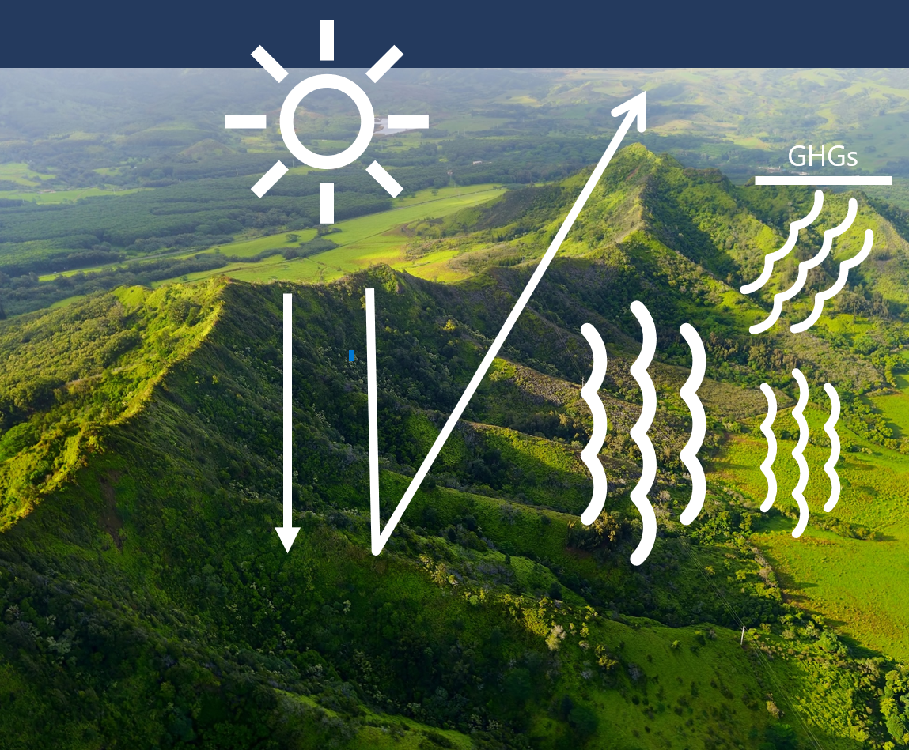
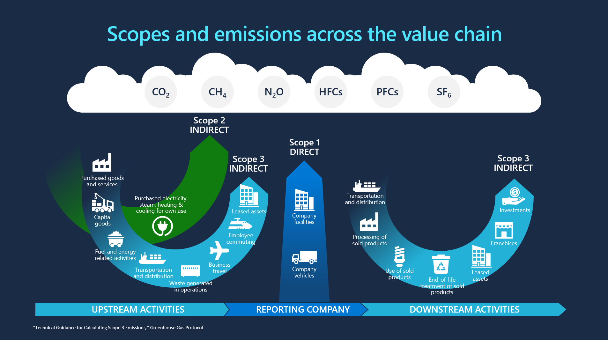

The following sections explain key concepts about sustainability.

## Carbon accounting
Carbon accounting is the process by which organizations measure the amount of greenhouse gases that they’re emitting. This process is necessary for organizations to understand their climate impact and meet emissions reporting requirements.

## Greenhouse effect 
 

The greenhouse effect is a condition that’s caused by the presence of greenhouse gases (GHGs) in the atmosphere that trap some of the heat that’s emitted by the sun. Until relatively recently, the earth has had a balance whereby the oceans, forests, and soils recycled GHG emissions (principally carbon). 

Now, extra GHGs that are released by human activities have become so excessive that it's not all recycled by ecosystems. As a result, climate change has occurred, including increasing temperature and extreme weather patterns that have already influenced many physical systems.

Human-created emissions come from a wide range of sources, including energy generation (electricity and heat), buildings, transportation, manufacturing, and agriculture.

## Global Warming Potential 
Human activities produce carbon dioxide, methane, refrigerants, and other greenhouse gases, each with its own Global Warming Potential (GWP). These emissions are converted to a single unit of measurement, carbon dioxide equivalent (or CO2e), by using their GWP.

GWP is the potency with which each gas traps heat from the sun. The Sustainability Manager uses GWP to convert an organization’s multifaceted emissions into carbon dioxide 
equivalent (CO2e).

Carbon dioxide equivalent (CO2e) is a unified metric for multiple greenhouse gases.
Different human-emitted gases cause global warming at varying intensities and timescales:

- Carbon dioxide (CO2) 
- Methane (CH4)
- Nitrous oxide (N2O)
- Refrigerant gases (HFCs, PCFs, and CFCs)
- Sulphur hexafluoride (SF6)
- Water vapor (H2O)
- Ozone (O3) 

## Greenhouse gas protocol
Emissions activities are divided into a classification system that’s based on the [Greenhouse Gas Protocol](https://ghgprotocol.org/?azure-portal=true), which is a methodology that’s most accepted globally. 

Thereafter, emissions are classified into the following scopes:

- **Scope 1** - Direct emissions that an organization’s activities create through the combustion of fossil fuels, such as exhaust from transport trucks or diesel generators. It also includes direct gas leakage from refrigerants or other fugitive emissions.
- **Scope 2** - Indirect emissions come from the purchase of electricity or heat that’s used in offices or manufacturing plants.
- **Scope 3**- Indirect value chain emissions come from all other activities in which an organization is engaged, including supply chain emissions. For businesses, this scope includes the emissions that are associated with the materials that are procured from suppliers, the business travel of its employees, and the full life cycle of its products, including the electricity that customers might consume when using the products. 

Delivery is a good example of Scope 3. Because an organization doesn't have full control of it, delivery is more challenging to track. Consider an organization that buys a product and has it shipped to their factory. They need to get data on indirect emissions that are created throughout the shipping process. Basically, they’re relying on the supplier's data to calculate their own Scope 3 impact.

## Emission targets 

To lower emissions, organizations around the world are making commitments and defining targets according to the impacts that they’re responsible for. The targets should be quantifiable and include carbon reduction and removal goals. 

Carbon targets include:

- **Carbon neutral** - Some organizations aspire to become carbon neutral, meaning that they’re reducing emissions and/or paying others to not emit an equivalent to their remaining emissions. Microsoft has operated carbon neutral since 2012.
- **Carbon net zero** – An organization is considered net zero carbon when it removes as much carbon as it emits.
- **Carbon negative** - Other organizations aspire to become carbon negative, meaning that they’re removing more carbon than they’re emitting each year. Microsoft has committed to becoming carbon negative by 2030.

Organizations need to understand their actual environmental footprint to focus their carbon reduction efforts and achieve their goals. This level of awareness starts with determining where their emissions derive based on their organization’s activities.

In the absence of metered data, the best practice for carbon calculation is to use emission factors with activity quantities to calculate emissions.

## Emission factors 
Emission factors are variables that convert emission-causing activities into carbon emissions. Factors differ for every emission source or category that’s applied to the activity data. 

### Role of emission factors
The volume of greenhouse gas (GHG) emissions and their low concentration in the atmosphere make measuring specific GHG emissions that result from a particular action difficult. By using emission factors, you can estimate emissions that are created by an activity. 

Activity x Emission factor = Emission

An emission factor shows the quantity of GHGs that are emitted in relation to a particular activity, in carbon dioxide equivalent (CO2e) for each accounting unit of the activity (for example, Lbs CO2e/KWh).

**Important**: Efficiencies and changes in an activity can impact the emission factors, so it’s important to constantly update the factors based on the latest standards and research. 

For example, if you have a certain amount of gasoline or diesel, and you drive a certain distance, and your vehicle is off road or on road, each detail will translate to a specific factor that’s used. To calculate your emissions, multiply the activity by the emission factor, which will give you the emissions.

Another variable to keep in mind is that emission factors can change over time and as organizations customize by region and activity types. Sustainability Manager can store these factors and map to applicable data, called factor mappings.

Pairing transformation with a digital-first approach delivers the data, insights, and knowledge to find further reductions, improve oversight and progress reporting, and create the ability to build a truly sustainable business.

Sustainability Manager provides a reliable system of record to inform and guide sustainable transformation.
