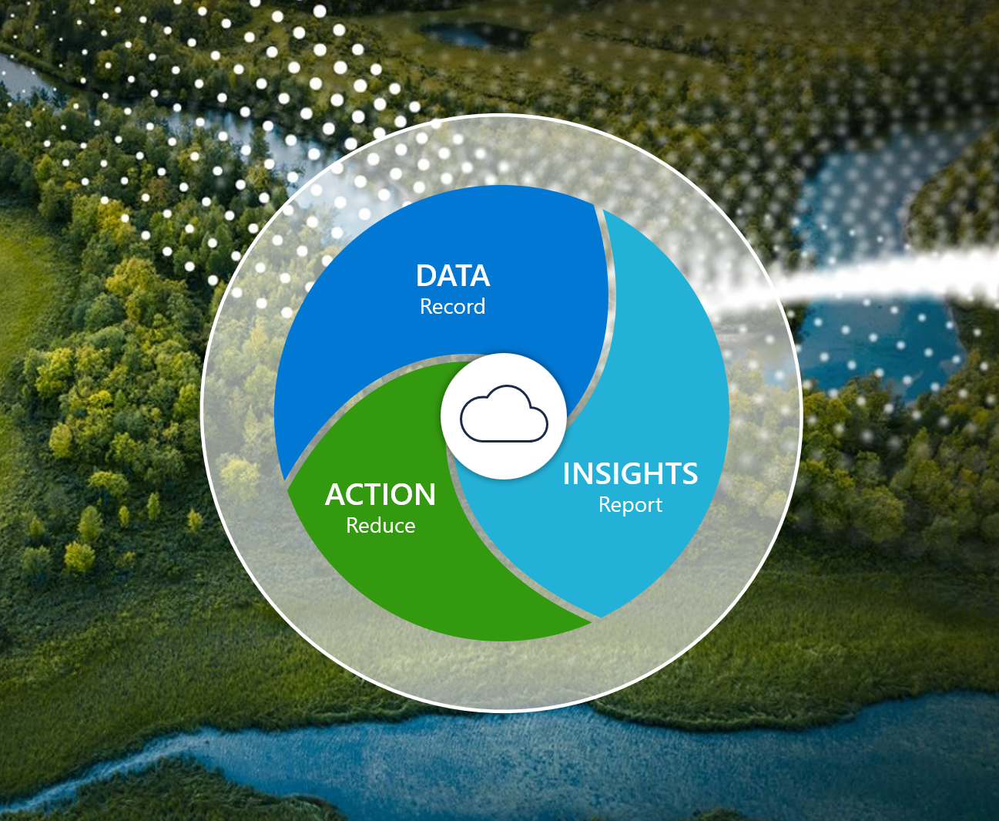

Sustainability Manager unifies data intelligence to help organizations monitor and manage their sustainability performance. It provides a reliable system of record to inform and guide sustainable transformation.

Sustainability Manager helps organizations record the emissions footprint of their organization and value chain more accurately through direct data connections and automation, streamlining the process of data collection and calculation.

> 

The solution is flexible, allowing a blend of data ingestion methods. From manual input or file imports to direct connections to data sources that allow organizations to increasingly automate data collection, the solution helps eliminate manual uploads. Organizations can set up data connections from a growing catalog of prebuilt connections to internal or external data sources.

Sustainability Manager connects data from almost any existing business system, ERP system, or cloud platform that your customers use. 

Sustainability Manager is built on the Microsoft Cloud for Sustainability data model, which streamlines data ingestion, sharing, calculations, and reporting. It breaks down data silos across emissions sources and centralizes emissions data in a common format. Organizations can share this publicly available data model with their teams, vendors, and trading partners to drive data integrity and consistent reporting upstream and downstream.

Sustainability Manager also includes prebuilt, dynamic calculation models that simplify complex calculations at scale, delivering a more accurate record of emissions activities.

Key capabilities of Sustainability Manager include: 
- **Data** - Collect emission data by using a data-first approach. Companies can apply a data-first approach to solve some of their biggest obstacles: collecting, connecting, and analyzing data that comes from different sources, in different formats, at different times. 
- **Insights** 
    - **Analyze emission impact** -This extensible solution unifies data intelligence and offers organizations an increasingly automated and comprehensive view into the emissions impact of their entire operations and value chain. 
    - **Record and report emissions** -This capability helps organizations record and more accurately report their emissions. Additionally, they can continually test and optimize reduction strategies to reach their goals.
- **Action** -Set reduction goals by using scorecards. Organizations can set and track their progress against incremental and long-term targets with scorecards. Scorecards can help companies set goals based on any entity within the application. By using scorecards, companies can manually or automatically track progress and visualize and monitor progress against benchmarks, such as carbon neutrality. These insights help organizations develop a data-informed, more effective roadmap to minimize their environmental footprint and achieve their goals. 

With Sustainability Manager, organizations can unify sustainability data intelligence and monitor and manage the environmental impact of their operations and value chain through a single interface.
