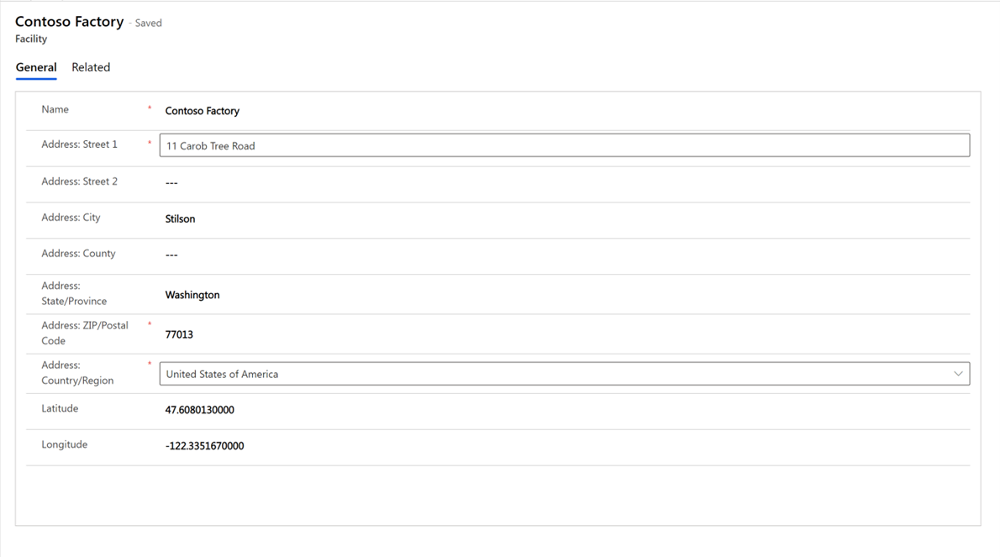
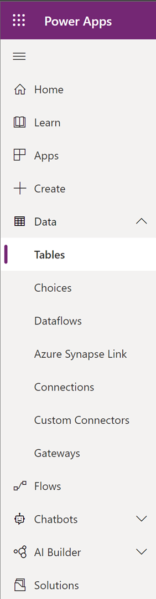
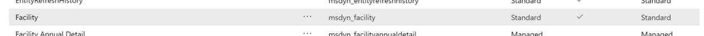
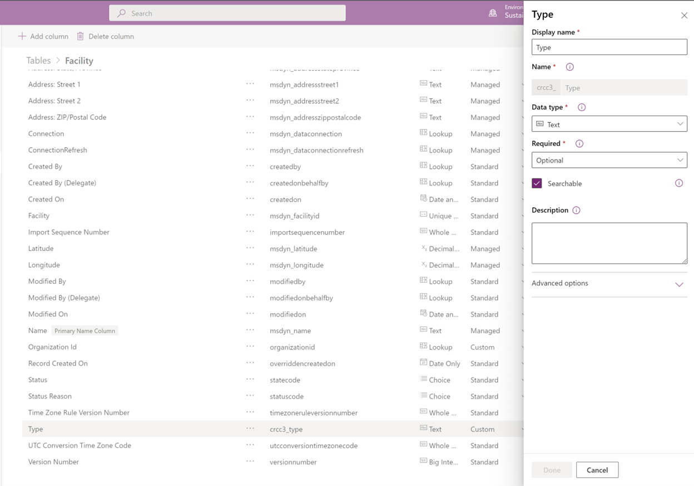
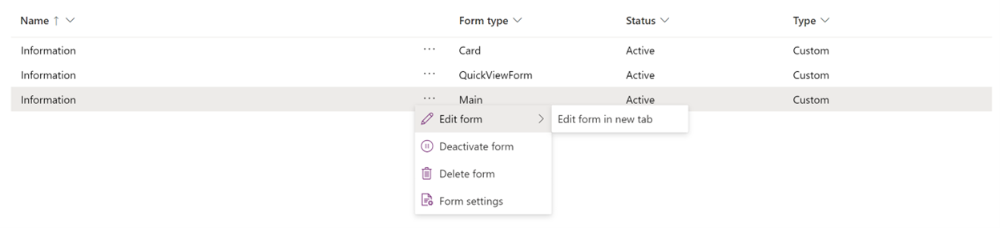
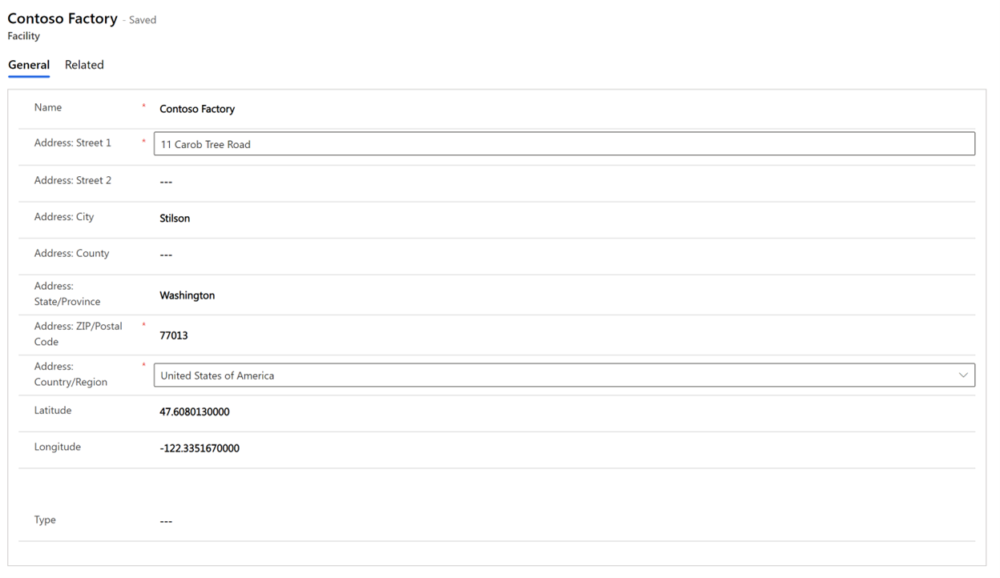

You might want to add more descriptive details about your facility. To do so, you can add a custom field to the existing **Facility** form. 

In this exercise, you create a field in a table and add that field to an existing form.

1. Sign in to the application, and search for the form that you want to add the new field to. 

1. Select **Company profile**, and then select the **Facilities** tab. 

    > [!div class="mx-imgBorder"]
    > 

1. Select the **Edit** (pencil icon) button next to the facility whose table you want to add a field to.
 
   The **Facility** form opens.

    > [!div class="mx-imgBorder"]
    > 

1. To find the table in the data model that you want to edit, look in the application URL for the **ent** value. The **ent=msdyn_facility** value will be displayed in the URL. 

1. Sign in to [Power Apps](https://make.preview.powerapps.com/environments/839eace6-59ab-4243-97ec-a5b8fcc104e4/home/?azure-portal=ture). 

1. In the dropdown list at the top of the page, select the **Sustainability Trial** environment.

1. On the left pane, expand **Data**, and then select **Tables**.

    > [!div class="mx-imgBorder"]
    > 

1. In the dropdown list, change **Default** to **All**.

1. Search for the name of the table that you found in the URL. In this example, the table name is **msdyn_facility**. This table allows for customization, as indicated by the checkmark.
    
    > [!div class="mx-imgBorder"]
    > 

1. Select the **Edit** (pencil icon) button to edit the table.

1. Select **Add column** and then, in the **Type** panel, enter the display name of the column as you want it to appear on the form.

    > [!div class="mx-imgBorder"]
    > 

1. On the menu at the top of the page, select **Forms**.
1. In the **Form type** column, select the ellipsis (**…**) next to **Main**, and then select **Edit form** > **Edit form in new tab**.

    > [!div class="mx-imgBorder"]
    > 

1. Select **Form field** to display a list of fields that you can add to the form.
1. Select **Type**, and then drag it onto the form.
1. Select **Save**, and then select **Publish**.
1. Return to the application and refresh it. 

   The new **Type** field is added to the form.

    > [!div class="mx-imgBorder"]
    > 

 

