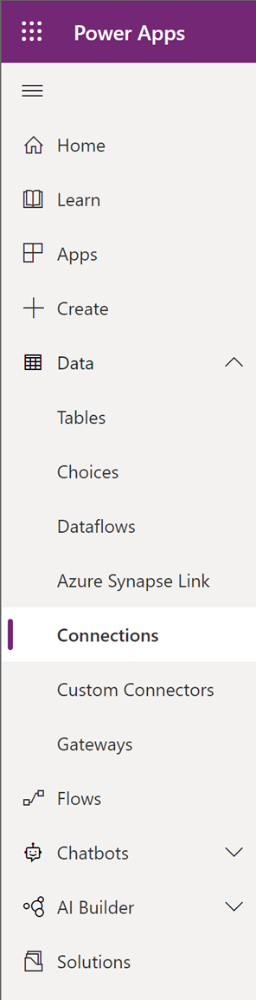
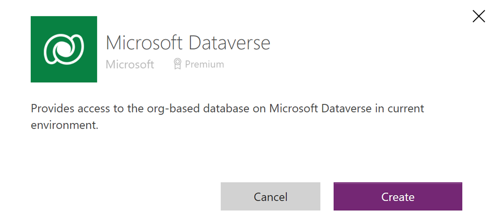
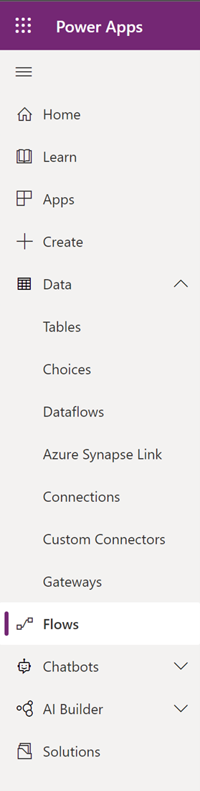
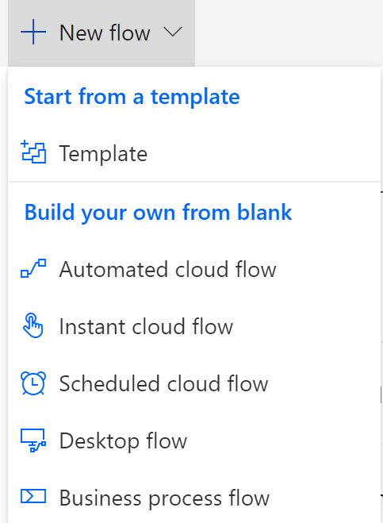
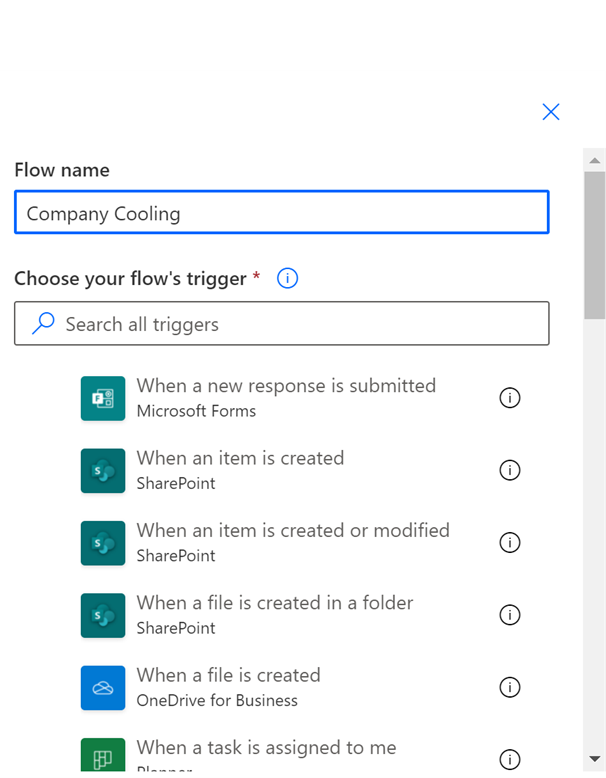
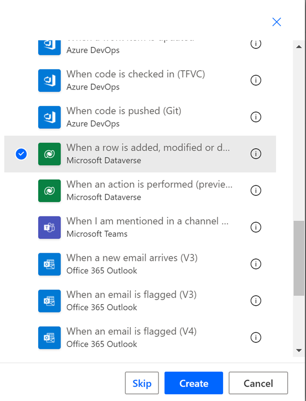
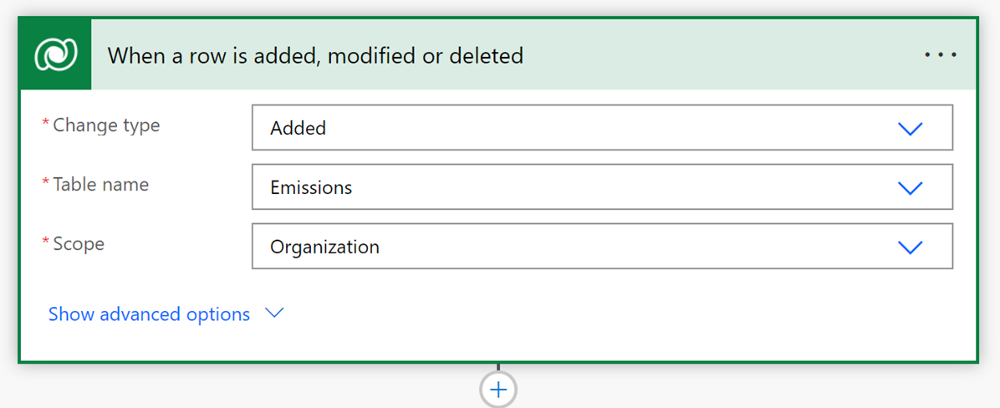
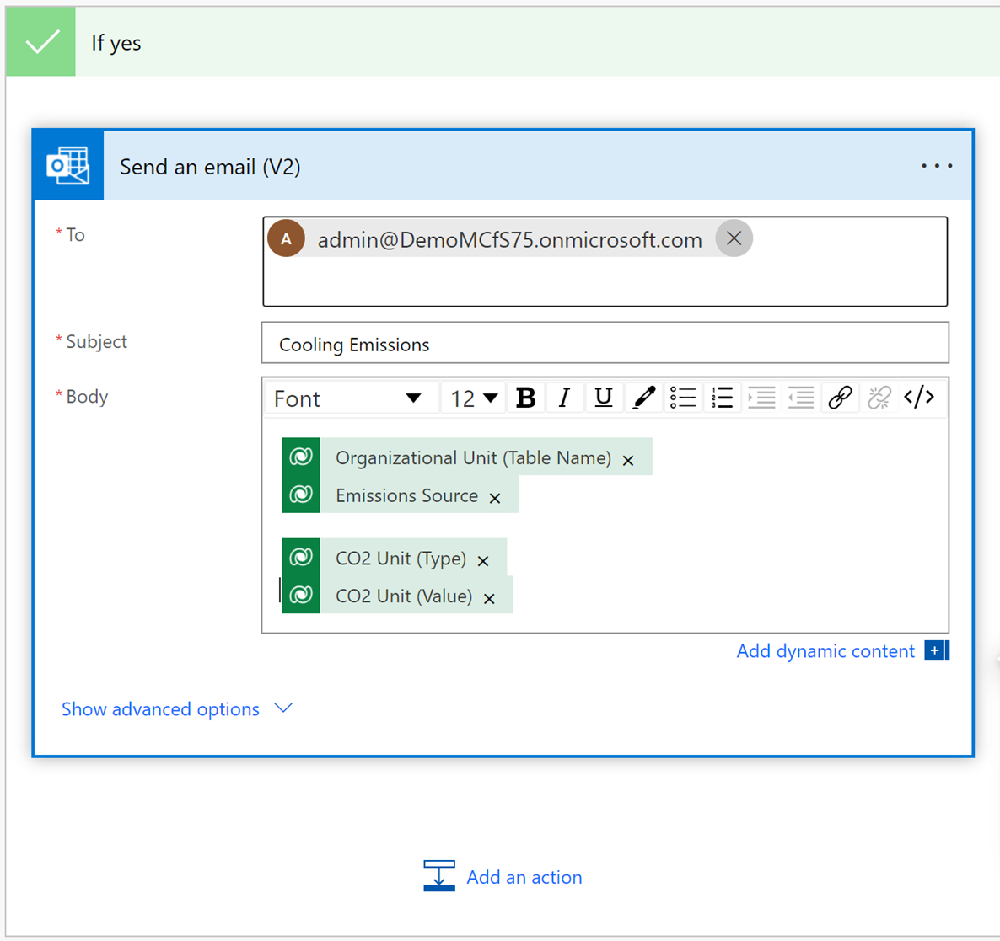

With Microsoft Power Automate, you can automate a task, get or send notifications, and track the completion of tasks. 

In this exercise, you create a notification when an emissions factor for fictitious business Company Cooling has been recorded to have a CO2 calculation that's greater than 1,800 lb.

1. Sign in to [Power Apps](https://make.preview.powerapps.com/environments/839eace6-59ab-4243-97ec-a5b8fcc104e4/home/?azure-portal=true).

1. On the left pane, expand **Data**, and then select **Connections** to create a connection to Microsoft Dataverse, Microsoft Teams, and Office 365 Outlook. 

    > [!div class="mx-imgBorder"]
    > 

1. Select **New connection**.
1. Select the application from the list to make a connection, and then select **Create**.

    > [!div class="mx-imgBorder"]
    > 

1. Sign in with your credentials.
1. On the left pane, select **Flows**.
 
    > [!div class="mx-imgBorder"]
    > 

1. Select **New flow**, and then select **Automated cloud flow**.

    > [!div class="mx-imgBorder"]
    > 

1. In the **Flow name** box, enter a name for the flow.
   
    > [!div class="mx-imgBorder"]
    > 

1. For your flow's trigger, select **When a row is added, modified, or deleted for Microsoft Dataverse**, and then select **Create**.

    > [!div class="mx-imgBorder"]
    > 

1. In the **When a row is added, modified, or deleted** dropdown lists, do the following:

    a. For **Change type**, select **Added**.  
    b. For **Table name**, select **Emissions**.  
    c. For **Scope**, select **Organization**.
        
    > [!div class="mx-imgBorder"]
    > 

1. To add a condition, select the **Add** button.

    > [!div class="mx-imgBorder"]
    > 

1. For example, for the **If yes** action condition, you can select the **Send Office 365 email** action.

    > [!div class="mx-imgBorder"]
    > 

1. Save the flow.
