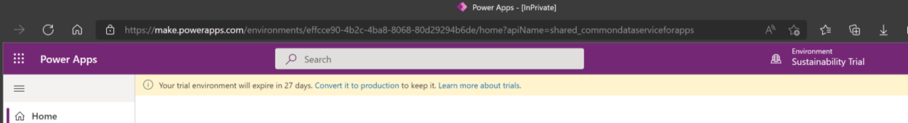
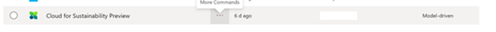
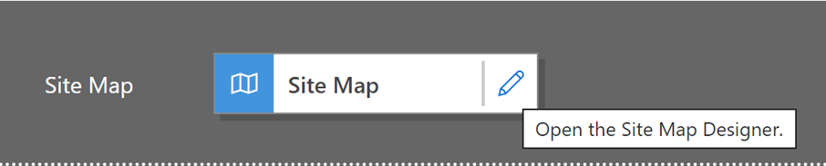
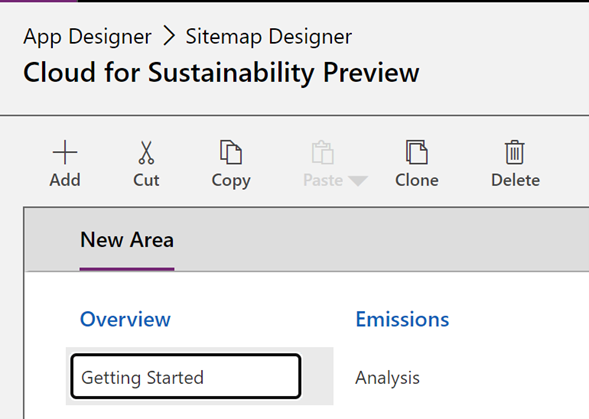
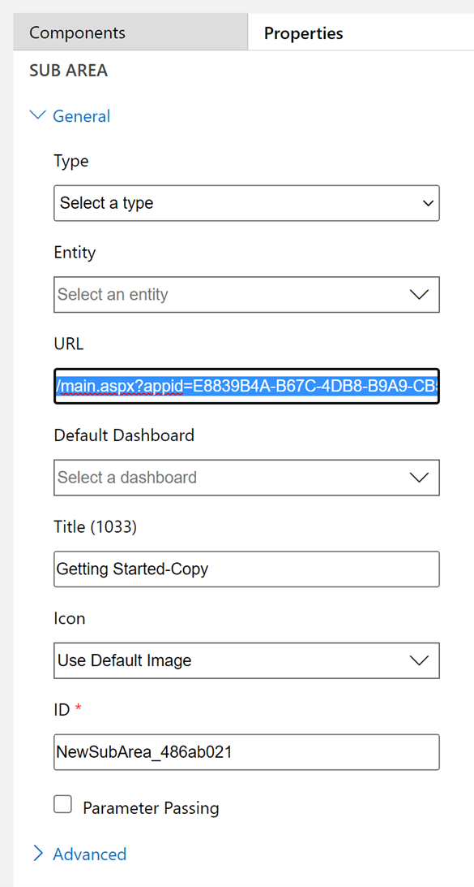
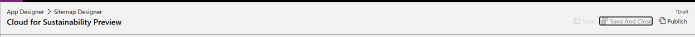
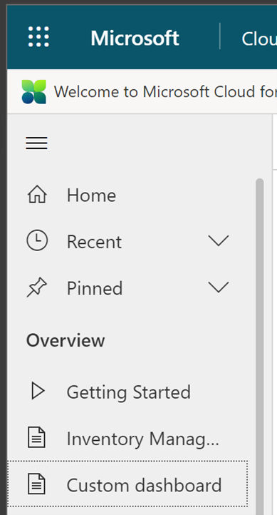

In this exercise, you create a custom dashboard by adding a custom Power BI report to Microsoft Sustainability Manager. This custom dashboard gives you easier access to the report within the application.

1. Sign in to the [Microsoft Power BI](https://msit.powerbi.com/home) site.

1. For the custom Power BI report, select **Workspaces**, and then copy the URL for the Power BI report.

    > [!div class="mx-imgBorder"]
    > 

1. Go to the [Microsoft Power Apps](https://make.preview.powerapps.com/environments/839eace6-59ab-4243-97ec-a5b8fcc104e4/home/?azure-portal=true) site.

1. At the top right, select **Environment** and then, in the list, select your environment.

    > [!div class="mx-imgBorder"]
    > 

1. In the list of environments, select **Cloud for Sustainability Preview**, and then select the **More Commands** ellipsis (…) next to the name. 

    > [!div class="mx-imgBorder"]
    > 

1. Select the pencil icon next to **Edit**.
1. Select the pencil icon next to **Site Map** in the app.

    > [!div class="mx-imgBorder"]
    > 

1. In the Site Map Designer, select **Overview** > **Getting Started**, and then select **Clone**.
    
    > [!div class="mx-imgBorder"]
    > 

1. At the top of the pane, select the **Components** tab, and then do the following:

   a. In the **Title** box, rename the new item as **Custom Dashboard** (or the name of the Power BI report).  
   b. In the **URL** box, change the URL to point to the URL of the Power BI report that you copied earlier in a share.

    > [!div class="mx-imgBorder"]
    > 
 
1. Select **Save**, and then select **Publish**.

    > [!div class="mx-imgBorder"]
    > 

1. Refresh the application. To access the custom dashboard (or the name of your report), on the left pane, select **Custom dashboard**.

    > [!div class="mx-imgBorder"]
    > 

 
