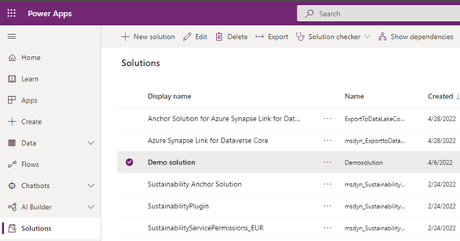
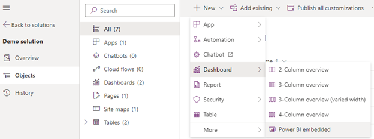
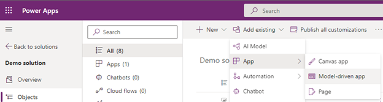
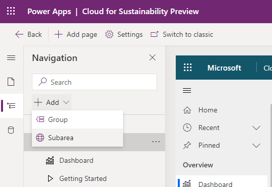

In this exercise, you add a shared workspace for a custom Power BI report to Microsoft Cloud for Sustainability, which gives your users easier access within the application.

> [!NOTE]
> This exercise assumes that a Power BI report already exists in a shared workspace in Power BI in the same Office 365 tenant. It also assumes that the Power BI report has at least one report and one dashboard. 

1. Sign in to [Power Apps](https://make.powerapps.com/?azure-portal=true).

1. Select **Solutions** > **New solution**. In the following example, the name of the solution is **Demo solution**.

    > [!div class="mx-imgBorder"]
    > 

1. Open **Demo solution**, and then select **New** > **Dashboard** > **Power BI embedded**.
    
    > [!div class="mx-imgBorder"]
    > 

1. In the **New Power BI embedded dashboard** pane, do the following:

    a. In the **Display name** box, enter a name for the report.  
    b. In the **Type** section, select **Power BI report** or **Power BI dashboard**.  
    c. In the **Power BI workspace** dropdown list, select the existing shared workspace.  
    d. In the **Power BI report** dropdown list, select the existing Power BI report.  
    e. Select **Save**.

    > [!div class="mx-imgBorder"]
    > 

1. In the same solution, select **Add existing** > **App** > **Model-driven app**. 

    > [!div class="mx-imgBorder"]
    > 

1. Select the **Cloud for Sustainability Preview** app. 

1. Select the ellipsis (**...**) next to **Cloud for Sustainability Preview**, and then select **Edit** > **Edit in preview**.
1. On the left pane, expand **Overview**, and then select **Add** > **Subarea**.

    > [!div class="mx-imgBorder"]
    > 

1. On the **New subarea form**, in the **Content type** dropdown list, select **Dashboard**.
1. In the **Dashboard** dropdown list, select **Demo Power BI report**.
1. In the **Title** box, enter a title for the dashboard, and then select **Add**. 
1. Select **Save**, and then select **Publish**.
