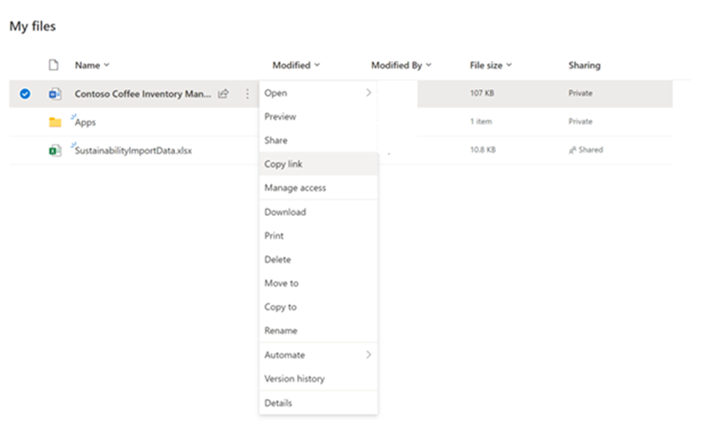
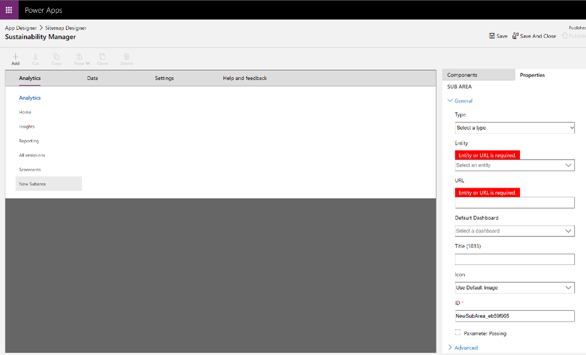
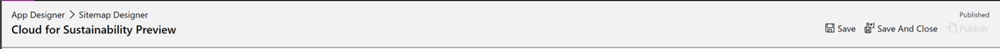

You can add an inventory management plan to Sustainability Manager so that its more accessible to all users. 

1. Sign in to the environment as an admin user. 
2. Upload the **Contoso Coffee Inventory Management Plan** file to your admin user’s OneDrive.
3. When the inventory management plan file has uploaded, you’ll share the file and copy the URL that’s generated for later use.
 
    > [!div class="mx-imgBorder"]
    > 

4. Go to the [Microsoft Power Apps portal](https://make.preview.powerapps.com/environments/839eace6-59ab-4243-97ec-a5b8fcc104e4/home/?azure-portal=true) and select your environment from the dropdown list in the upper-right corner.
 
    > [!div class="mx-imgBorder"]
    > 

5. On the **Home** screen, scroll down to the list of environments, select your Sustainability Manager environment, and then select the **More Commands** ellipsis (…) next to the name. 

    > [!div class="mx-imgBorder"]
    > 

6. Select the pencil icon next to **Edit**.
7. Select the pencil icon next to **Site Map** in the app.

    > [!div class="mx-imgBorder"]
    > 

8.	Select **Add > Subarea**

    > [!div class="mx-imgBorder"]
    > 

9. Select Type = URL, add the URL link for the one drive location of the Inventory Management Plan, and change the title to be Inventory Management Plan.

    > [!div class="mx-imgBorder"]
    > 

10.	Select **Save** in the upper right of the window.

    > [!div class="mx-imgBorder"]
    > 

11.	Select **Publish**.
