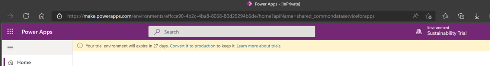
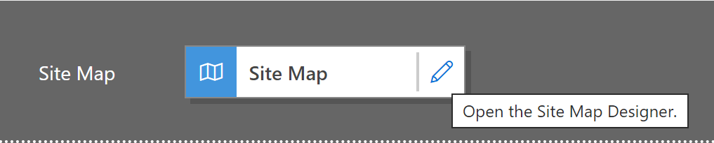
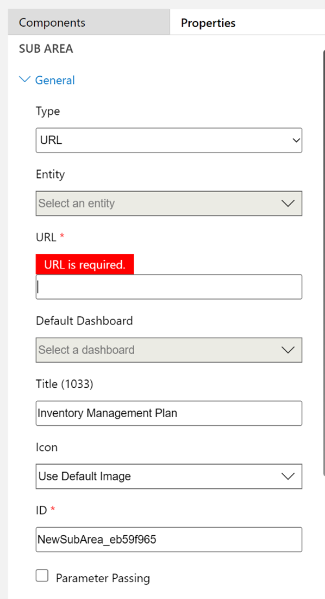

In this exercise, you add an Inventory Management Plan to Sustainability Manager so that it's more accessible to all users. 

1. Sign in to the environment as an admin user. 

1. Upload the *Contoso Coffee Inventory Management Plan* file to your admin user’s OneDrive.

1. After the Inventory Management Plan file is uploaded, you’ll share the file and copy the URL that’s generated for later use.
1. Go to the [Microsoft Power Apps](https://make.preview.powerapps.com/environments/839eace6-59ab-4243-97ec-a5b8fcc104e4/home/?azure-portal=true) site.
1. At the top of the page, next to the Search box, select **Environment** and then, in the list, select your environment.
 
    > [!div class="mx-imgBorder"]
    > 

1. In the list of environments, select your Sustainability Manager environment, and then select the **More Commands** ellipsis (**…**) next to the name. 

    > [!div class="mx-imgBorder"]
    > 

1. Select the pencil icon next to **Edit**.
1. Select the pencil icon next to **Site Map** in the app.

    > [!div class="mx-imgBorder"]
    > 

1. Select **Add** > **Subarea** and then, at the top of the pane, select the **Components** tab. Do the following:

   a. In the **Type** dropdown list, select **URL**.  
   b. In the **URL** box, enter the URL link for the OneDrive location of the Inventory Management Plan.  
   c. In the **Title** box, enter **Inventory Management Plan**.

    > [!div class="mx-imgBorder"]
    > 

1. Select **Save**, and then select **Publish**.
