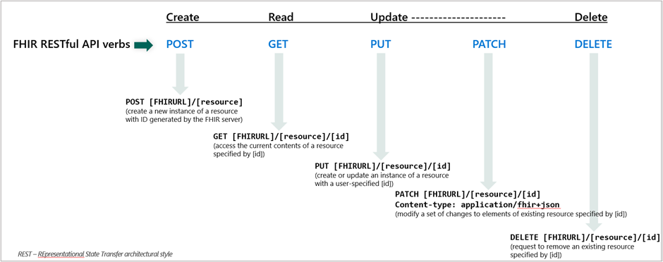
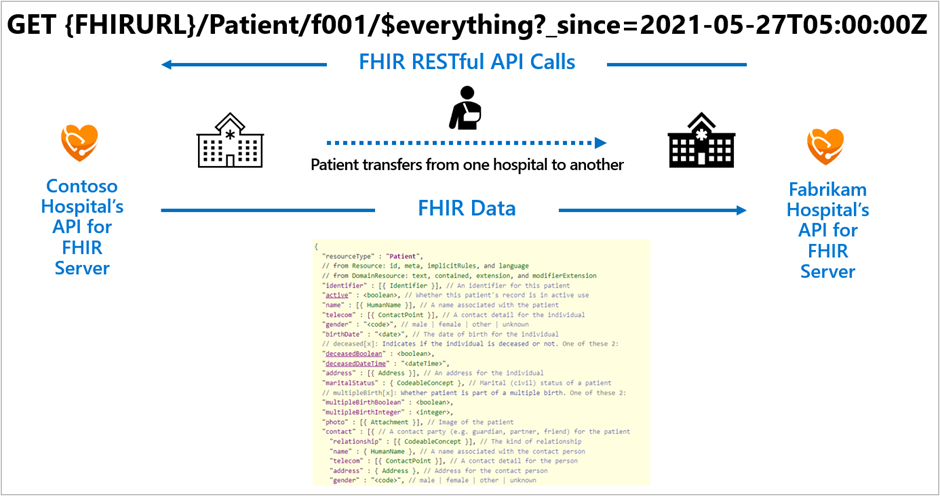

FHIR R4 specifies a RESTful (Representational State and Transfer) API to allow remote client access to a FHIR server. When a remote client connects with a FHIR server through the FHIR API, if the remote client has the needed permissions, the remote client can retrieve and/or modify FHIR data.

The following image illustrates how each of the RESTful HTTP verbs can be used with FHIR resources.

> [!div class="mx-imgBorder"]
> 

One common application of the FHIR API is the exchange of a patient's health data from one EHR (Electronic Health Record) to another when the patient transfers between medical facilities.

> [!div class="mx-imgBorder"]
> 

Previously we discussed how the US Core Implementation Guide specifies mandatory capabilities for RESTful FHIR interactions. The following are some examples of a RESTful API request pattern and the name search parameter supported in the FHIR API:

### Patient request using the resource ID in the RESTful path

`GET [base]/Patient/[id]`

`GET [base]/Patient/1032702`

### Patient query by name

`GET [base]/Patient?name=[string]`

`GET [base]/Patient?name=Shaw`

A good way to get familiar with the FHIR RESTful API is to actually use it. By deploying and configuring a client application, you can prepare to do some exercises using it. The following provide details on deploying and configuring a client application:

- FHIR service deployed in Azure. For information about how to deploy the FHIR service, see [Deploy a FHIR service](/azure/healthcare-apis/fhir/fhir-portal-quickstart/?azure-portal=true).

- A registered client application to access the FHIR service. For information about how to register a client application, see [Register a service client application in Azure Active Directory](/azure/healthcare-apis/register-application/?azure-portal=true).

- Permissions granted to the client application and your user account, for example, "FHIR Data Contributor", to access the FHIR service.

Once you've completed those prerequisites, the following how-to guides can be followed:

- [Access using Postman](/azure/healthcare-apis/fhir/use-postman/?azure-portal=true)

- [Access with cURL](/azure/healthcare-apis/fhir/using-curl?azure-portal=true&tabs=PowerShell)

- [Accessing using the REST Client](/azure/healthcare-apis/fhir/using-rest-client/?azure-portal=true)

## SMART on FHIR

[SMART on FHIR](https://docs.smarthealthit.org/?azure-portal=true), which is an extension of the base FHIR standard, enables the secure exchange of data between a FHIR server and a mobile or web-based remote client application. The base FHIR standard defines the RESTful actions for creating, reading, updating, and deleting FHIR data on a FHIR server, but the base FHIR standard doesn't specify a mechanism for authenticating or authorizing remote client access to FHIR data. This is where SMART on FHIR comes in. SMART on FHIR extends the FHIR API with a protocol based on the OAuth2.0/OpenID Connect standard, enabling secure exchange of FHIR data between a trusted client and a FHIR server. This opens the door to user-facing remote client applications that can securely interact with FHIR data, displaying it to authorized parties (patients, providers, payors, and so on).

## Open-source repositories

Following the GitHub repositories for the open-source versions of Microsoft health data tools can be beneficial if you're developing applications that connect with FHIR service or the other managed services in Azure Health Data Services. Often the repositories will provide access to new functionality before it's added to the official products. You may also have access to the product teams if you submit GitHub issues or pull requests. The following are the open-source repositories related to Azure Health Data Services:

- [FHIR Server for Azure](https://github.com/microsoft/fhir-server/?azure-portal=true)

- [FHIR Converter](https://github.com/microsoft/FHIR-Converter/?azure-portal=true)

- [FHIR Loader](https://github.com/microsoft/fhir-loader/?azure-portal=true)

- [FHIR Proxy](https://github.com/microsoft/FHIR-Proxy/?azure-portal=true)

- [Medical Imaging Server for DICOM](https://github.com/microsoft/dicom-server/?azure-portal=true)

- [FHIR Analytics Pipelines (Synapse Sync)](https://github.com/microsoft/FHIR-Analytics-Pipelines/?azure-portal=true)

- [FHIR Anonymization](https://github.com/microsoft/Tools-for-Health-Data-Anonymization/?azure-portal=true)

- [IoMT FHIR Connector for Azure](https://github.com/microsoft/iomt-fhir/?azure-portal=true)

The FHIR Server for Azure, for example, is the code backing the managed FHIR Service (which is part of Azure Health Data Services).

You can deploy and manage the FHIR Server for Azure yourself and have full control over all the components that are needed for a FHIR server. Keep in mind that when using the open-source version, you must manage all of it - the codebase is only presented on an as-is basis, which means you're responsible for:

- Maintaining the service

- Compliance

- Managing the database, disaster recovery, etc.

When using the managed Azure offering, you use a provisioned deployment of the open-source project, offered as a Platform-as-a-Service (PaaS) in Azure. That service is built, managed, and maintained by the Microsoft Health and Life Sciences engineering team. You'll have extra features not available in the open-source version, and the service will enable you to meet regulatory compliance requirements for Protected Healthcare Information (PHI).

If you're interested in learning how to deploy, configure, and use Azure Health Data Services for FHIR workloads and other health data interoperability solutions, check out the [Azure Health Data Services Workshop](https://github.com/microsoft/azure-health-data-services-workshop/?azure-portal=true).
