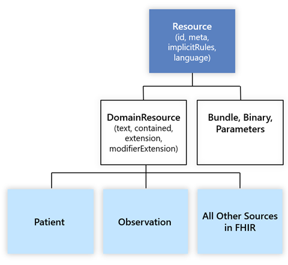
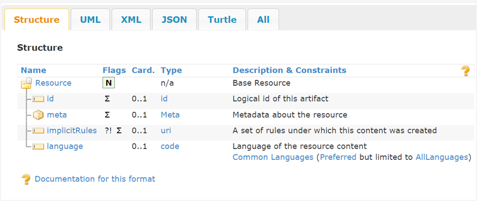
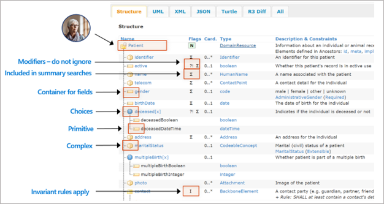

Resources in FHIR are the entities that form the main pieces of the FHIR data model. Earlier we looked at an overview of the way resources are structured and how real-world healthcare interactions are modeled by resources referencing each other to form a web of health information. Now we'll go more in depth into what constitutes a resource in FHIR and what sets resources apart from each other.

## Hierarchy

At the foundation of the FHIR data model, there's an abstract "base resource" class that all resource types inherit from, directly or indirectly. There are only three resource types that inherit directly from the base resource class, and they're the Bundle, Binary, and Parameters resource types. In addition to these three resource types, there's a resource class that also inherits directly from the base resource class, and this class is known as the "DomainResource" class. DomainResource is the parent class to all the familiar real-world resource types in FHIR, such as Patient, Practitioner, Observation, Device, CarePlan, and so on. All resource types aside from Bundle, Binary, and Parameters inherit from the DomainResource class.

From the HL7 FHIR documentation: "Only three resources - Bundle (collection of resources), Binary (the data of a single raw artifact in its native form), and Parameters (operation requests or responses) inherit *directly* from base Resource. DomainResource (what most other resources are derived from) allows other resources to contain text, contained resources, extensions and data elements specific to the particular domain of each resource."

> [!div class="mx-imgBorder"]
> 

## Resource elements and structure

Each resource type in the FHIR specification is defined with a set of attributes to capture information as it is generated in real world healthcare scenarios. These attributes, or "elements" as they're referred to in FHIR, are what set FHIR resource instances apart from each other on a FHIR server.

For example, each FHIR resource instance has an "ID" element to store that instance's unique ID on the FHIR server where the resource lives. An ID is assigned to each resource instance so that we can tell different resource instances apart from each other. For example, on a FHIR server, there may be one Patient resource with ID of 123, and another Patient resource with ID of 124, and so on.

The ID element, along with metadata, implicitRules, and language, are the four elements that *all* resource types carry in FHIR. That is, the Bundle, Binary, and Parameters resource types plus all the common resource types that inherit from the DomainResource class.

> [!div class="mx-imgBorder"]
> 

In addition to these four elements, there are many other elements that are specific to the common resource types that inherit from the DomainResource class. For example, the Patient resource type has gender, birthDate, and address elements. Each patient resource instance on a FHIR server will have its own unique set of elements such as these to distinguish patients from one another. Beyond the Patient resource type, the Observation resource type will have another set of elements, as will the Encounter, Medication, and DiagnosticReport resource types, etc.

Each resource type is defined with a structure for the different elements that the resource type supports. Below we see the structure for the Patient resource type with some of its standard elements.

> [!div class="mx-imgBorder"]
> 

## Identity

There are two standard ways to identify a resource instance on a FHIR server: the resource ID element (as mentioned above) and another variety of element known as a "business identifier" element.

**Resource id** Included at the trailing end of a FHIR resource's "Location URL" (for example, `{{fhirurl}}/Patient/123`), the resource ID (such as "123") is unique to each resource instance on a FHIR server. If the resource instance is moved or copied to another FHIR server, then a new resource ID will be assigned to the copied or moved resource (with some exceptions in practice).

**Business Identifier** Generally, in addition to a server-wide resource ID, resources will have identifier elements to represent the entity uniquely in the real world. This identifier remains fixed if a resource instance is copied/moved to another FHIR server. For example, for a patient, a social security number is an ID that (typically) doesn't change. If the SSN for a patient is used as a business identifier for that patient's FHIR resource instance, then that business identifier will remain the same wherever the resource instance is hosted.

> [!NOTE]
> In the FHIR literature, the term "resource" is used to mean either a resource type or resource instance, depending on the context.

## Other resource details

**Resource Extensions** allow association of more data to a core resource definition. As an example, a Patient resource has required elements such as patient identifier, patient name, and gender. This resource must also support the following: contact detail (for example, a telephone number or an email address), a birth date, an address, a communication language, a race, an ethnicity, a birth sex (as part of the HL7 international standard). When a patient resource is extended for other purposes such as participation in a global clinical study, more details may need to be captured such as Nationality. Be mindful that this may disrupt standardization across platforms when an extension isn't included elsewhere.
