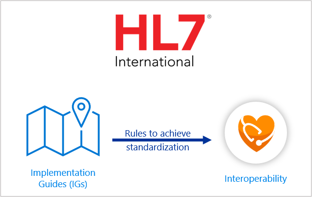
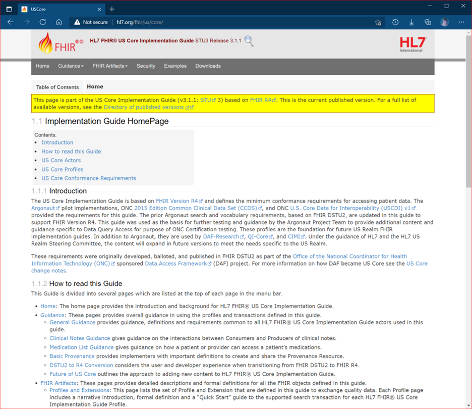
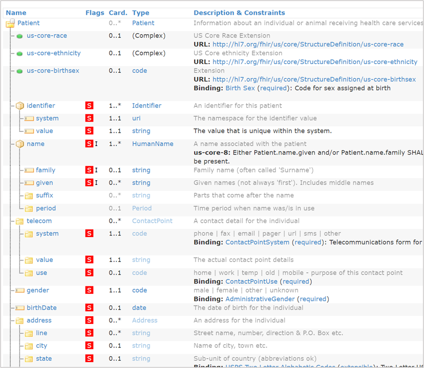
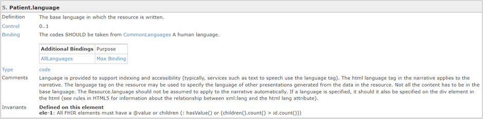
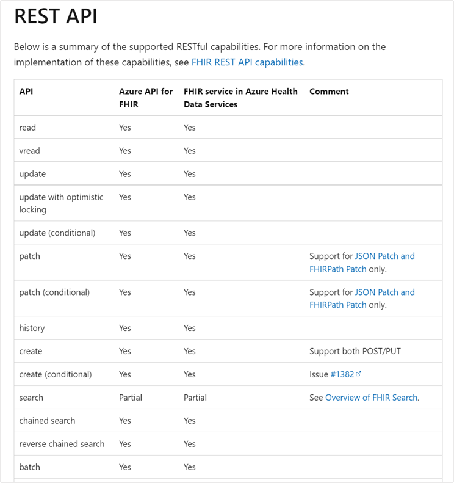

The HL7 organization defines an implementation guide (IG) as a set of rules about how FHIR resources are used (or should be used) to solve a particular problem. HL7 is a global consortium of healthcare and IT experts, and the US government and other governments have adopted its standards. Implementation guides offer rules that translate to standards for problem solving and interoperability.

> [!div class="mx-imgBorder"]
> 

Implementation guides contain the rules that allow organizations to standardize a data model. That, in turn, enables interoperability for the exchange of data between individuals and organizations that have been using disparate application interfaces and data storage systems. Applications often state what implementation guides they support.

Implementation guides contain two types of resource references:

**Contents** - a set of logical statements that implementations must conform to.

**Examples** - that illustrate the intent of the profiles (a set of constraints on a resource or the minimal expectations to record, search and fetch data specific to that resource) defined in the implementation guide.

Implementation guides also include associated documentation to clarify usage. Multiple implementation guides are available in FHIR to handle different tasks such as constraints, customized operations, and management of bulk transfer of data.

You can browse the [Implementation Guide Registry](http://fhir.org/guides/registry/?azure-portal=true) to see what has been published.

## HL7 FHIR US Core

One implementation guide that you should become familiar with is the HL7 FHIR US Core Implementation Guide. You can think of US Core as an "institutional" implementation guide, as opposed to the more technical FHIR IG. As implied by the name, this IG covers standards relevant to the United States. This guide is based on FHIR R4 and defines the minimum constraints on the FHIR resources.

US Core provides the framework for implementation of regulations driven by [CMS](https://www.cms.gov/?azure-portal=true) and the [ONC Final Rule](https://www.healthit.gov/curesrule/?azure-portal=true). Payors and providers across the United States who accept Medicare/Medicaid patients will implement FHIR by following the profiles that are defined in US Core.

For example, in a scenario about "pharmaceutical" data, you can find information in the US Core about how the different "roles" within a "care interaction" are arranged within the FHIR framework. By implementing both of these important implementation guides, you can communicate and collaborate effectively with others outside your organization to deliver what is needed for the patient.

The following image shows the US Core implementation guide. You can browse the [full guide](http://hl7.org/fhir/us/core/?azure-portal=true) to gain a better understanding of what it contains.

> [!div class="mx-imgBorder"]
> 

## US Core profiles

The US Core Implementation Guide (based on FHIR R4) defines the minimum set of constraints on the FHIR resources required to create US Core Profiles.  The US Core Profiles are the minimum mandatory elements, extensions and terminology that must be present.

Interoperability, which allows for different information systems, devices, and applications to access, exchange, integrate and cooperatively use data in a coordinated manner, is enabled by the profile elements that are described in detail within the US Core Implementation Guide. Numerous profiles exist including those for BMI, body temperature, heart rate and vital signs. There are currently 23 profiles included in US Core Profiles. Each profile has requirements and guidance provided. You can review the [list and full details](http://hl7.org/fhir/us/core?azure-portal=true#us-core-profiles).

Let's look at an example of one of the profiles (Patient). This profile sets minimum expectations for the Patient resource to record and be searchable for basic demographics and other administrative information about an individual patient. It identifies which core elements, extensions, vocabularies and value sets shall be present in the resource when using this profile.

The profile identifies mandatory and must support data elements. The mandatory elements must always be present or must be supported if the data is present in the sending system. In other words, a patient profile can't be created without the patient's name but can be without the email address. While not required in the profile, the elements (including US Core extensions like race and ethnicity) in the right column must be supported if present.

| Mandatory | Must Support |
|-----------|--------------|
| A patient identifier (that is, MRN) | A birth date |
| A patient name | An address |
| A gender | Contact details (for example, telephone and email) |
| | A race |
| | An ethnicity |
| | A birth sex |
| | Previous name |
| | Suffix |
| | A communication language |

The following is an example of the snapshot view patient profile content. You can explore the [full profile](http://hl7.org/fhir/us/core/StructureDefinition-us-core-patient.html?azure-portal=true) that includes JSON and XML examples.

> [!div class="mx-imgBorder"]
> 

From the above image, the flags column with a red S indicates the element must be supported. For each element, you can explore details by selecting the name. The following is an example of the [language element.](http://hl7.org/fhir/us/core/StructureDefinition-us-core-patient-definitions.html?azure-portal=true#Patient.language)

> [!div class="mx-imgBorder"]
> 

## Interoperability and patient access

The [US Core Server Capability Statement](http://hl7.org/fhir/us/core/CapabilityStatement-us-core-server.html?azure-portal=true) describes the expected capabilities of the US Core Responder actor (that is, the FHIR server) which is responsible for serving responses to queries submitted by applications that comply with the US Core Requestor specification (that is, the client). Azure Health Data Services supports capabilities enabling compliance with the US Core Implementation Guide. These capabilities include RESTful API interactions, data conversion, defining and indexing custom search parameters, and Touchstone open access for Testing as a Service (TaaS).

The following highlights a summary of the supported RESTful capabilities of the FHIR service in Azure Health Data Services:

> [!div class="mx-imgBorder"]
> 

The US Core Server Capability Statement in the FHIR documentation includes details for each profile. For example, you can review the [patient profile](http://hl7.org/fhir/us/core/CapabilityStatement-us-core-server.html?azure-portal=true#patient) to understand what is expected of a compliant client and server to ensure interoperability.

Understanding how the implementation guides bring the FHIR specification to life can help you work with Azure Health Data Services. Take some time to explore the parts of US Core that are most relevant to your work.
