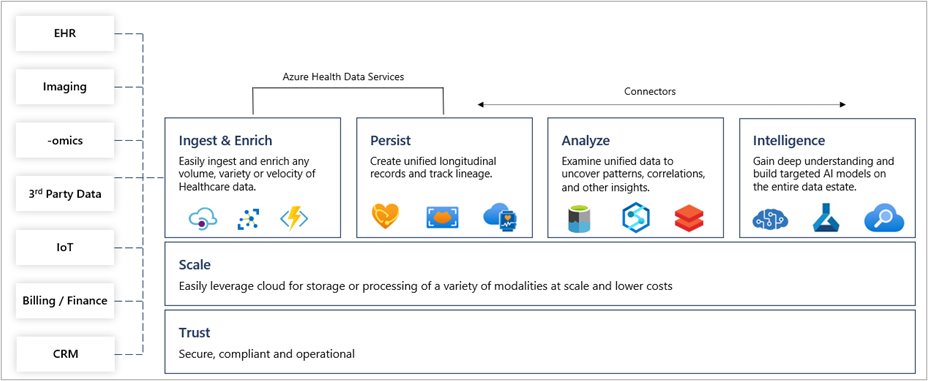

The healthcare industry is rapidly adopting FHIR® (Fast Healthcare Interoperability Resources) as the industry standard for storage and exchange of health data. FHIR gives the industry a robust, extensible data model with standardized semantics and exchange protocols that enable all systems using FHIR to work together.

Transforming health data to FHIR allows organizations to quickly connect existing data sources such as electronic health record systems (EHRs) or research databases. Microsoft Cloud for Healthcare brings together trusted capabilities to customers and partners that enhance patient engagement, empower health team collaboration, and improve clinical and operational data insights to improve decision-making and operational efficiencies. The data solutions within Azure Health Data Services empower the capabilities of Microsoft Cloud for Healthcare - from Microsoft Azure, Dynamics 365, Microsoft Power Platform, and Microsoft 365 - to transform the healthcare journey through more secure and connected patient experiences.

This module covers both the data architecture of FHIR and the details of how the FHIR API is implemented in the FHIR service in Azure Health Data Services. As health data is transformed and consumed, there are some common patterns and structure, as you see in the figure below.

First, you start with the data sources. This disparate collection of healthcare data that will be unified on Azure using Azure Health Data Services. The data from the various data sources are then ingested and persisted. Next, the data is analyzed. And finally, intelligence is applied and helps you gain a deeper understanding of this data.

> [!div class="mx-imgBorder"]
> 

- Identify types of FHIR Resources

- Identify Resource elements, structures, and hierarchy

- Understand the FHIR RESTful API framework
