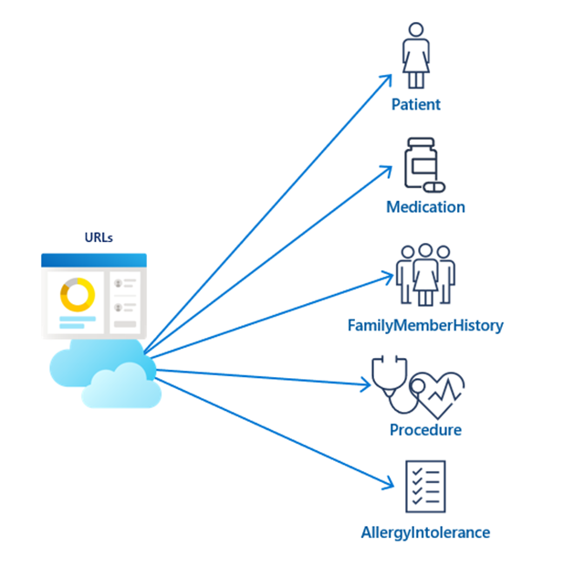
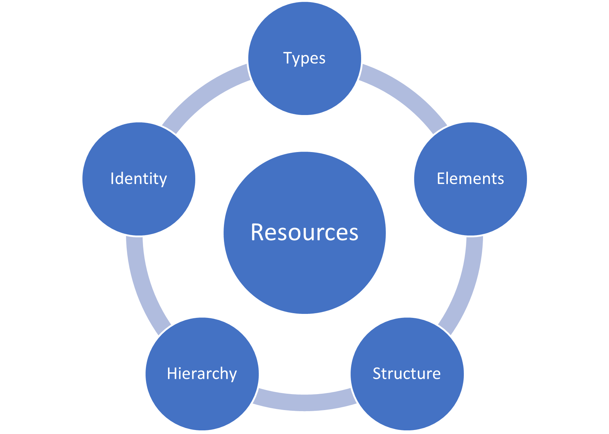
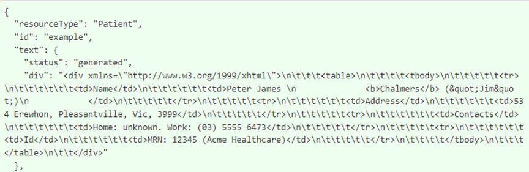
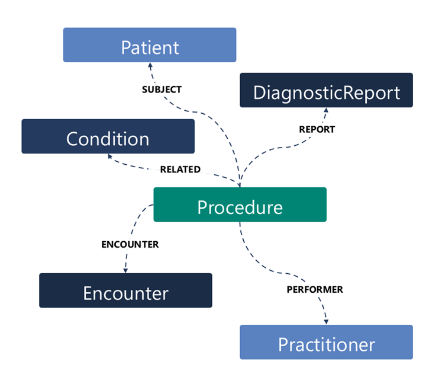
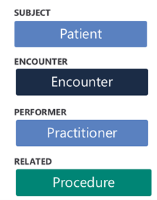

A FHIR resource is a discrete piece of data that represents an entity in a real-world healthcare interaction. Entities such as a patient, a practitioner, a procedure, a medication, and so on, are represented as resources in FHIR. Additionally, FHIR resources structure information as it’s generated in real-world healthcare settings.

> [!div class="mx-imgBorder"]
> 

All FHIR resource types have:

- A *canonical URL*, where the structure of the resource type is defined (for example, `http://hl7.org/fhir/StructureDefinition/Patient`).

- Four data elements: ID, metadata, implicitRules, and language.

- Elements within metadata, including versionId, lastUpdated, source, profile, security, and tag.

- An extensibility framework to support evolving methods in healthcare.

The common resource types (such as Patient, Practitioner, Encounter, and Observation) have a set of defined data elements that are specific to the real-world domain of the resource (such as the gender element for the Patient resource) and are different for each resource type.

FHIR resource instances (on a FHIR server) have a unique, server-wide resource ID (such as *123*) with a resource instance URL (for example, `{{fhirurl}}/Patient/123`).

Generally, you can classify resources in the context of the following five categories: Types, Elements, Structure, Hierarchy, and Identity.

> [!div class="mx-imgBorder"]
> 

- **Types** - Categories as defined by HL7 that help to distinguish the function of resources, including:

    - Clinical

    - Financial

    - Specialized

- **Elements** - Attributes that distinguish every resource instance.

    - **id** - The server-wide resource ID that’s unique to each resource instance on a FHIR server.

    - **metadata** - For storing information, such as the profile on which the resource is based.

    - **implicitRules** - For indicating special restrictions on a resource instance.

    - **language** - The human language that’s used to record information (such as English or Spanish).

    - The domain-specific elements for the common resources (such as the gender element for the Patient resource).

- **Structure** - For defining the schema of each resource type, including its data types, extensions, and constraints.

    - **Narratives** - XHTML-formatted information about a resource for display in a user interface.

    - **Extensions** - A framework for adding new structure and/or elements to extend a resource definition.

    - **Contained resources** - A framework for storing a resource's data within an enclosing resource.

- **Hierarchy** - For establishing how resources inherit their attributes from the foundational *base* resource class in FHIR.

    - **DomainResource class** - Inherits from the base resource class, which is parent to the common resource types, such as Patient or Practitioner.

    - **Bundle, Binary, Parameters** - Three resource types in FHIR that inherit directly from the foundational base resource class.

- **Identity** - How and where resource instances are tracked and located.

    - **Location URL** - The location of the URL, such as `{{fhirurl}}/Patient/123`.

    - **Location identifiers** - Codes that are used in addition to the resource ID for identifying a resource instance.

## Example - Patient resource

This example provides a high-level review at a patient resource. Patient is a normalized resource within the HL7 FHIR specification, meaning that it's universally received and standardized all over the world. A set of definitive data elements is associated with a patient, and a unique URL is associated with each patient resource instance. A FHIR client can use that URL to interact with the patient resource that’s managed by its hosting FHIR server.

FHIR resources contain data items, as described by the definition of the resource type. The patient resource includes demographics and other administrative information about an individual who’s receiving health-related services. The US Core Implementation Guide (IG) defines how to implement FHIR in the US. The IG required data elements for a Patient resource to define the standard Patient resource structure. A patient resource must include elements that store the patient name, an identifier (such as MRN or SSN), and the patient's gender.

The following screenshot shows a partial example of a patient resource. You can view the full example at [HL7 FHIR Example Instance](https://www.hl7.org/fhir/patient-example.json.html?azure-portal=true).

> [!div class="mx-imgBorder"]
> 

## Connections between resources in FHIR

The following graphic is only one example of the various resources that might be used for an event, such as a patient procedure. The shown resources are Patient, DiagnosticReport, Condition, Procedure, Encounter, and Practitioner, all of which are connected through the subject, report, performer, encounter, and related elements that are stored in the Procedure resource. These elements in the Procedure resource hold *references* to the other resources, which illustrates how the references between resources form a web of health information in FHIR. While not shown here, other resources could be referenced, including for administrative functions in the financials category for billing (for example, the Invoice, Claim, and ClaimResponse resources).

> [!div class="mx-imgBorder"]
> 

Often, resources are included together when they’re retrieved in a FHIR search. For example, a patient could have an annual physical (Encounter) with their physician (Practitioner) on August 1, 2021. The physician reviewed the patient’s family history (FamilyMemberHistory) and decided to order a mammogram (Procedure). When someone conducts a search for information about that particular encounter, these resources could be returned within a Bundle resource, with references between the different resources.

> [!div class="mx-imgBorder"]
> 
