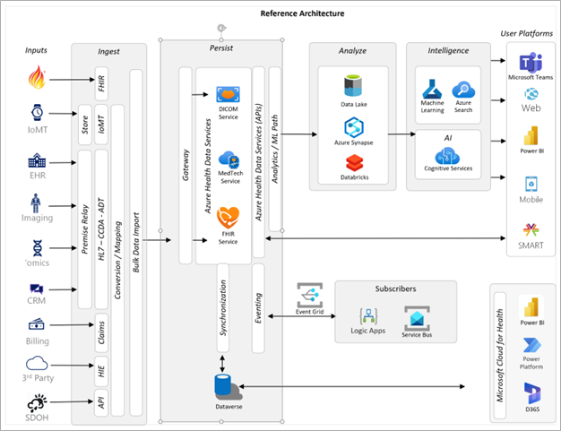
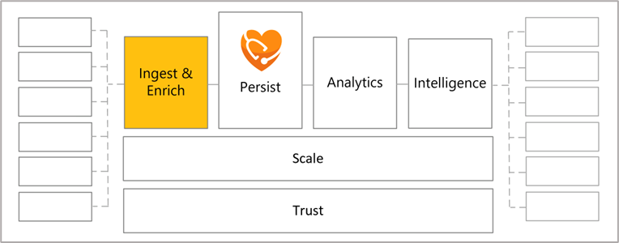
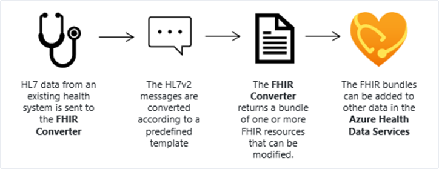
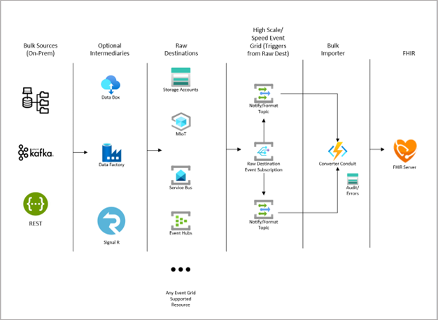
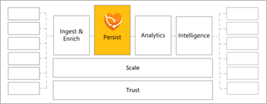
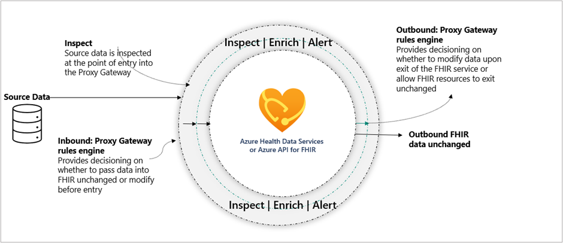
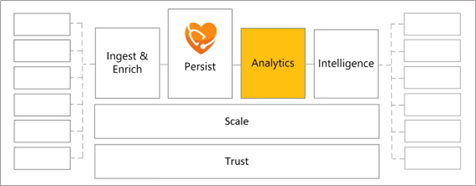
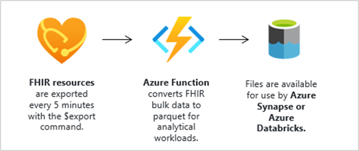
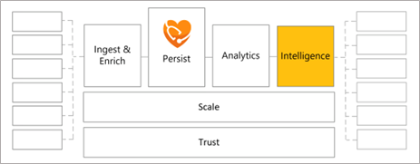
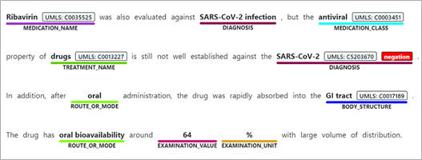

Now we'll take a look at the architecture of Azure Health Data Services and explore in more detail some of the primary functions. Let's start by looking at the sample reference architecture below. This is a view of a common, real-world architecture of a healthcare solution that includes the functional building blocks of Ingest, Persist, Analyze and Intelligence. Keep in mind that not all solutions will require every piece in this diagram. Take a minute to review what makes up each of the sections and how the data flows.

> [!div class="mx-imgBorder"]
> 

This reference architecture demonstrates how you can connect the various components to address an organization's unique health data challenges. You can review other [Solutions for Healthcare](/azure/architecture/industries/healthcare/?azure-portal=true) for more examples.

## Ingest

Ingest allows you to take data from different sources and load the data into Azure Health Data Services. As you look to build out your solution architecture, the ingestion requirement is a good place to start evaluating your needs.

> [!div class="mx-imgBorder"]
> 

The `$convert-data` operation built in to the FHIR service is useful for converting health data from legacy formats into FHIR, and the open-source [FHIR Loader](https://github.com/microsoft/fhir-loader/?azure-portal=true) (not shown above) is the recommended method of bulk-ingesting FHIR data into FHIR service.

The `$convert-data` operation enables conversion of legacy formatted healthcare data such as HL7v2 into FHIR bundles. Mapping templates define conversion between HL7v2 or C-CDA data format to FHIR bundles. The FHIR bundle is returned for further validation, if necessary, prior to persisting in the FHIR service. Keep in mind the `$convert-data` operation doesn't persist the data in FHIR service. That step has to be taken after conversion.

The following diagram illustrates the process:

> [!div class="mx-imgBorder"]
> 

The open source [FHIR Loader](https://github.com/microsoft/fhir-loader/?azure-portal=true) utility from Microsoft enables bulk ingestion of FHIR data in a robust way with auditing, logging, and retrying logic. The FHIR Loader supports multiple types of FHIR data input, including JSON formatted bundles or NDJSON formatted bundles. For small ingestion loads, you don't have to use the loader and can directly post to a FHIR service endpoint. However, this becomes impractically slow for bulk ingestion of FHIR data without the FHIR Loader.

The following diagram illustrates the FHIR Loader architecture:

> [!div class="mx-imgBorder"]
> 

## Persist

To persist data means to store the data on a server for later access. For example, the FHIR Loader helps to ingest FHIR data so that the data can be persisted in FHIR service. In addition to FHIR data ingestion and persistence, Azure Health Data Services enables the persistence of DICOM data through the DICOM service and medical IoT data through the MedTech service (both of which can be connected to the FHIR service for data merging in FHIR).

> [!div class="mx-imgBorder"]
> 

The open-source [FHIR Proxy](https://github.com/microsoft/fhir-proxy/?azure-portal=true) is a key component in the Azure health data ecosystem as it extends the FHIR service's capabilities in filtering FHIR data. Admins can use the FHIR Proxy to include custom code that applies pre and post processing business logic for enhancing the FHIR service's Role Based Access Control (RBAC) and Eventing capabilities.

The FHIR Proxy is an Azure Function that:

- Acts as an intelligent and secure gateway to the FHIR service

- Allows multi-tenant access and purpose driven security policies with specialized access to a common FHIR service

- Provides a consolidated approach to pre and post processing of FHIR API Calls to support various access and result filtering or actions

- Integrates with Azure Active Directory for authentication and to provide enhanced Role-Based Access Control (RBAC) for FHIR service

- Acts as a FHIR-specific reverse proxy rewriting responses and brokering requests to multiple FHIR services

The following diagram illustrates the extensibility points when using FHIR Proxy with the FHIR Service:

> [!div class="mx-imgBorder"]
> 

The FHIR Proxy can be configured to execute any number of logic processing modules to support various pre/post conditional actions on a per call basis. This can include logic to do bundle transformation, validation, or advanced authorization and consent. Admins can create custom processors by implementing the **IProxyPreProcess** or **IProxyPostProcess** interfaces. The modules are executed in a chained fashion determined by configured order.

## Analytics

In the context of Azure Health Data Services, analytics are managed through de-identifying and exporting FHIR data for use in the broader Azure data processing ecosystem (Azure Synapse, Azure Machine Learning, etc.). Secondary use of health data is defined as a "non-direct care use of PHI for things like analytics, research, public health provider certification, etc." Analytics uses the data persisted in the FHIR, DICOM or MedTech service to solve organizational problems and enable better health outcomes.

> [!div class="mx-imgBorder"]
> 

FHIR service, for example, supports the `$export` operation that allows you to export de-identified FHIR data to an Azure storage account. The `$export` operation supports inline, configurable anonymization. The following are examples of using the `$export` operation for different scopes of resources on the FHIR service:

**System**: `GET https://<<FHIR service base URL>>/$export>>`

**Patient**: `GET https://<<FHIR service base URL>>/Patient/$export>>`

**Group of patients**: `GET https://<<FHIR service base URL>>/Group/[ID]/$export>>`

You can also configure a continual analytical export using [FHIR Analytics Pipelines](https://github.com/microsoft/FHIR-Analytics-Pipelines/?azure-portal=true). This tool is open-source and runs as an Azure Function. The following diagram shows the data flow of Synapse Sync:

> [!div class="mx-imgBorder"]
> 

## Intelligence

The intelligence stage in a health data architecture is the part of the process where AI is used to extract health insights from the data. This could include Machine Learning, Azure Search, Cognitive Services, AI Builder, or similar AI components.

> [!div class="mx-imgBorder"]
> 

An example of this would be Text Analytics for Health, which is built on Azure Cognitive Services. Using Text Analytics for Health, you can extract and label relevant medical information from unstructured text. Example uses are doctor notes, discharge summaries, clinical documents, and so on.

> [!div class="mx-imgBorder"]
> 

All of these health data architecture components can be used together to meet your organization's specific needs.
