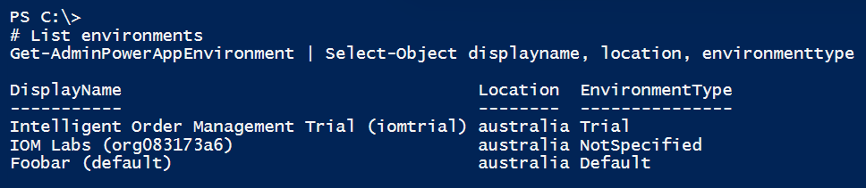

In this exercise, you'll complete the following:

1. Learn about operational aspects of IOM and Power Platform.

1. Learn about command line features of Power Platform to perform administrative tasks related to IOM.

## Operational aspects

### Scalability

IOM is built on Power Platform, Dataverse and Power Automate. It itself doesn't have turnkey features where one can adjust scale of deployment, instead, the scale is predicated by scaling features of foundational pieces (Dataverse, Power Platform and Power Automate) and the type of [license](https://go.microsoft.com/fwlink/p/?linkid=2085130&azure-portal=true).

### Monitoring

There are two ways to monitor Power Automate Flows that underpin Providers:

- [Power Automate](https://flow.microsoft.com/?azure-portal=true) stores the complete history of flows and associated run times. Power Automate platform, by default, stores history for 28-day run history. Selecting a timestamp will display all the Actions and Triggers that make up a flow. The details can be used to investigate and troubleshoot issues such as long-running flows.

  > [!div class="mx-imgBorder"]
  > 

- **Insights > System Monitoring** is a dashboard on IOM portal that surfaces metrics related to requests.

  > [!div class="mx-imgBorder"]
  > 

- **PowerShell Cmdlets for Power Platform**

  [PowerShell cmdlets](/power-platform/admin/powerapps-powershell/?azure-portal=true) for app creators and administrators, you can automate many of the monitoring and management tasks. See the **Automation** section for more details and examples.

### Administration

- Users can be granted access to IOM environment through the administrative capabilities of the [platform](/power-platform/admin/grant-users-access/?azure-portal=true).

- Security can be managed by using concepts such as business units; teams and users in [Dataverse](/power-platform/admin/wp-security-cds/?azure-portal=true).

- There are **two types of backup options**:

  - [System backups](/power-platform/admin/backup-restore-environments?azure-portal=true#system-backups) - These are performed continuously and production environments where Dynamics apps are deployed are retained for 28 days. Trial environments aren't backed up. Restore is performed from Power Platform admin portal and backups must be restored in the same region where backup was taken.

  - [Manual backups](/power-platform/admin/backup-restore-environments?azure-portal=true#manual-backups) - Microsoft creates a backup when an environment is updated. Manual backups for production environments that have been created with a database and have one or more Dynamics 365 applications installed are retained up to 28 days.

### Networking

  There are two connectivity models supported by Dynamics and Power Platform - one over public endpoint and the other over private network via ExpressRoute. We have built a flowchart to help customers guide through the decision process of choosing between the two connectivity models. Full list of considerations and recommendations for connectivity model is available [here](https://aka.ms/northstarpowerplatform/?azure-portal=true).

> [!div class="mx-imgBorder"]
> 

- **Connecting to Dynamics IOM over public endpoint**

    A default deployment of IOM is accessed using public endpoint. Connectivity is over HTTPS and data is encrypted using certificate generated and managed by Microsoft.

    Administrators can change the name of the URL via [Power Platform Admin portal](https://admin.powerplatform.microsoft.com/environments/?azure-portal=true). Using the Power Platform admin portal, Use the Power Platform admin center to review the status of your apps and solutions, apply updates, and manage your Dynamics 365 instances, solutions, and apps.

    > [!div class="mx-imgBorder"]
    > 

    > [!Note]
    > In this connectivity model, the sources which IOM interacts with via Providers can be behind a firewall i.e., on a corporate network, however proxies and routing rules on the source system side must be configured to facilitate communication between resources/source systems deployed on corporate network and Dynamics IOM which is accessible over a public endpoint.

- **Connectivity over private network using ExpressRoute**

    ExpressRoute enables connectivity to Microsoft Dynamics 365 and Power Platform over private network. Customers opt for this connectivity model for compliance, security, and predictable network bandwidth.

    > [!div class="mx-imgBorder"]
    > 

### Business Continuity and Disaster Recovery

  Microsoft provides business continuity and disaster recovery for production instances of Dynamics 365 software as a service (SaaS) application, to provide continuity if there is an Azure region-wide outage. Apps such as IOM run on the Microsoft Dataverse platform. A detailed set of design considerations and recommendations is available in [Design Considerations](https://github.com/microsoft/industry/tree/main/foundations/powerPlatform?azure-portal=true#design-considerations-5).

  For production environments, a replica of the different storage services (Azure SQL and file storage) is established in the secondary region for each environment at the time of deployment. Tenant admins can deploy a production instance of a customer engagement app or Dataverse with the purchase of appropriate licenses. These replicas are referred to as geo-secondary replicas. The geo-secondary replicas are kept synchronized with the primary instance through continuous data replication. There's a small replication latency, or lag--typically less than a few minutes--between the primary data sources and their corresponding geo-secondary replicas.

> [!div class="mx-imgBorder"]
> 

- **Unplanned failover**

  In an unplanned failover scenario such as primary region becoming unavailable due to a natural disaster, Microsoft will switch over the traffic to route to secondary instances. **In this case, RPO is approximately up to 15 minutes**.

- **Planned failover**

  If Microsoft determines there's a risk to the availability of the primary Azure region, for example if there's an impending hurricane, Microsoft will notify customers and switch over the traffic to route to the secondary region. Users connected to customer engagement and Dataverse apps at the time of the failover will experience a brief disruption. **There will be no data loss, because both Azure regions will be online, and data will be replicated fast enough to the secondary region**.

## Task 1: Command line features

With PowerShell cmdlets for app creators and administrators, you can automate many of the monitoring and management tasks that are only possible manually today in Power Apps. You can still use the cmdlets if you're not an admin on the tenant, but you'll be limited to the resources you own. Cmdlets that start with the word 'Admin' are for use by an administrative user account.

PowerShell Cmdlets are available as two separate modules:

- **Administrator** - targeted at administrators for administration and management operations

- **Maker** - targeted at app creators

1. Install PowerShell modules.

    > [!Note]
    > You need admin rights to install these modules on your machine.

    `Install-Module -Name Microsoft.PowerApps.Administration.PowerShell`

    `Install-Module -Name Microsoft.PowerApps.PowerShell -AllowClobber`

1. Add credentials. In this case, we're using an admin account.

    > [!Note]
    > You can also create and use [a service principal in Power Platform](/power-platform/admin/powershell-create-service-principal/?azure-portal=true).

    `Add-PowerAppsAccount`

1. Once you've signed in, you can run PowerShell commands to add, edit, and view details. For example, view environment details.

   `Get-AdminPowerAppEnvironment | Select-Object displayname, location, environmenttype`

    > [!div class="mx-imgBorder"]
    > 

1. Read connections.

   `Get-AdminPowerAppConnection | select-object connection,displayname,statuses`

    > [!div class="mx-imgBorder"]
    > 

1. Read Flows were created when we enabled BigCommerce provider.

   `Get-AdminFlow | select-object displayname,enabled | Where-Object displayname -match bigcommerce`

    > [!div class="mx-imgBorder"]
    > 

**Congratulations!** You've learned about administrative aspects of IOM and how to use CLI, which can be used for building automation.
