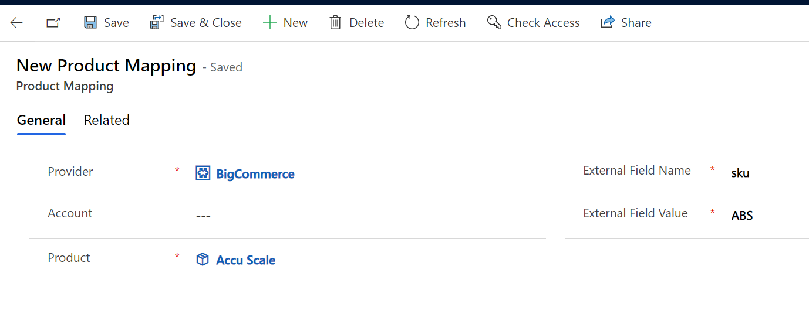

In this exercise, you'll complete the following tasks:

1. About IOM providers and their role.

1. Configure a provider for BigCommerce that enables communication between IOM and third-party e-commerce platform BigCommerce.

1. Configure Internal-External Mappings in IOM.

1. Configure a first-party provider for Intelligent Fulfillment Optimization. This provider enables the use of intelligent fulfillment optimization capabilities in IOM.

1. Configure a first-party provider for Inventory Visibility. This provider enables use of inventory feasibility capabilities in Dynamics 365 IOM.

## Overview of providers

A key value proposition of Dynamics 365 Intelligent Order Management is the ability to seamlessly integrate with other systems. To do so, Intelligent Order Management uses "providers". [Providers](https://docs.microsoft.com/dynamics365/intelligent-order-management/work-providers?azure-portal=true#components) are constructs that allow you to connect Intelligent Order Management to external systems.

Intelligent Order Management providers were designed with the following properties:

- **Extensibility**: Providers can be extended and customized by using the Microsoft Power Platform.

- **Low code customization**: Because providers are built on the Power Platform, customizations require little to no code.

- **Scale**: Providers use Power Automate, so providers can scale with volume of incoming messages.

Key components of a provider are:

- Connection

- Business event

- Action

- Parameter

- Transformation

## Task 1: Configure the BigCommerce provider

1. Open your browser in In-Private or Incognito window, navigate to [Power Apps](https://make.powerapps.com/?azure-portal=true).

1. Ensure to choose the correct environment from the upper right **Environment** drop-down is selected.

    > [!div class="mx-imgBorder"]
    > 

1. Select **Apps** on the left navigation bar.

    > [!div class="mx-imgBorder"]
    > 

1. Select **Intelligent Order Management**.

    > [!div class="mx-imgBorder"]
    > 

1. On the left pane, select **Providers** > **Catalog**. The form will display a list of pre-built Providers. IOM also supports custom providers. For our lab, we'll be using BigCommerce as our source system so select **Add provider** button on **BigCommerce** tile.

    > [!div class="mx-imgBorder"]
    > 

1. To accept the terms and conditions, select the **Create** button and it will take a few seconds to process.

    > [!div class="mx-imgBorder"]
    > 

1. The system will automatically open the Big Commerce provider screen with BigCommerce connection. Select BigCommerce Connection to enable communication between Dynamics 365 Intelligent Order Management to the associated BigCommerce account.

    > [!div class="mx-imgBorder"]
    > 

1. Select the **Retrieve Link**.

    > [!div class="mx-imgBorder"]
    > 

1. Selecting **Retrieve Link** will take you to **Power Automate**. Ensure the correct environment from the upper right **Environment** drop-down is selected.

    > [!div class="mx-imgBorder"]
    > 

1. On the left pane, select **Data** > **Connections**.

    > [!div class="mx-imgBorder"]
    > 

1. Select **New Connection**.

    > [!div class="mx-imgBorder"]
    > 

1. Search for **BigCommerce** in the search bar located in the top right edge and then select **BigCommerce** to add the connection.

    > [!div class="mx-imgBorder"]
    > 

1. You'll be prompted for **API Key**. Copy/paste the **Access token** generated during the training environment setup module - Exercise 1 under task 2 - step 4 that you had copied from the screen as below.

    > [!div class="mx-imgBorder"]
    > 

1. Paste the API key as below and select **Create**.

    > [!div class="mx-imgBorder"]
    > 

1. Once a connection has been created based on the API key, you should see the status of the connection as Connected.

    > [!div class="mx-imgBorder"]
    > 

1. Select BigCommerce connection to view the details of this connection. Copy the **URL** shown in the address bar of your browser.

    > [!div class="mx-imgBorder"]
    > 

1. Navigate to Dynamics 365 IOM and paste the URL in the **Connection URL** field in BigCommerce Provider Connection Reference screen. Once pasted, select **Save** and then **Activate**. IOM will then take a 15-20 seconds to activate a Provider for BigCommerce.

    > [!div class="mx-imgBorder"]
    > 

1. Select **Save and Close**.

1. Select **BigCommerce Dataverse (current environment)**.

    > [!div class="mx-imgBorder"]
    > 

1. Paste the Dataverse connection URL used in Exercise 2 - Task 1 - Step 1. Once pasted, select **Save** and then select **Activate**.

    > [!div class="mx-imgBorder"]
    > 

1. At this stage, you should have connections for BigCommerce and Dataverse configured and activated.

1. Select **Save and Close**.

1. Switch to Dynamics 365 IOM screen and on the **BigCommerce** provider screen, select the **Parameters** tab.

1. To find your store hash from BigCommerce site, sign in to your BigCommerce Store (created in Exercise 1 - Task 1). Go to **Advanced Settings** > **Select API Accounts** > **Create API Account (V2/V3 Token)**. You can find a field named API Path, with the following structure `https://api.bigcommerce.com/stores/<storehash>/v3`. You can also find it from the store URL, and highlighted below.

    > [!div class="mx-imgBorder"]
    > 

1. Paste the store hash value into the **value** field for **BigCommerce Store Hash** and then select **Save** and then **Activate**.

    > [!div class="mx-imgBorder"]
    > 

1. If all the connections are provided correctly, then you should see a message that reads that the record's status is Active.

    > [!div class="mx-imgBorder"]
    > 

    > [!Note]
    > You may encounter an error message as shown in the below screenshot if the System Connections have not been configured as mentioned in the earlier exercises and tasks.
    >
    > [!div class="mx-imgBorder"]
    > 

## Task 2: Configure Internal-External Mappings for BigCommerce provider transformations

Once BigCommerce Provider has been configured, next step is to configure Mappings in IOM. Mappings enable translation of fields between third-party platforms such as BigCommerce and IOM. With the internal external ID mappings functionality, you can perform the following tasks:

1. Define the relationship between identities in an enterprise across applications and operating systems.

1. Use the mapping for multiple integrations.

1. Enable an end-to-end visualization of mapping across multiple systems.

1. Configure and add your own mapping and mapping tables.

In context of BigCommerce Provider, following Internal External Mappings must be configured before orders generated in BigCommerce are visible in IOM:

- Accounts

- Products

- Price Lists

- Units

1. We need a customer account to map it to BigCommerce providers. To create a customer test account, navigate to **Customers** > **Accounts**.

    > [!div class="mx-imgBorder"]
    > 

1. Select **New** on the command bar.

    > [!div class="mx-imgBorder"]
    > 

1. Enter the following fields and select **Save & Close** in the command bar.

    - **Account Name**: TestBCAccount

    - **Account Number**: TestBCAccount

    > [!div class="mx-imgBorder"]
    > 

1. To access Mappings configuration, On the left pane of Dynamics 365 IOM, Change the area in left bottom edge of the screen from **Intelligent Order Management** to **Configurations**.

    > [!div class="mx-imgBorder"]
    > 

1. To configure Internal-External mapping for **Accounts**, select **New**.

    > [!div class="mx-imgBorder"]
    > 

1. Enter the following details and then select **Save & Close**.

    - **Provider**: BigCommerce

    - **Customer**: TestBCAccount

    - **External Field Name**: ProviderName

    - **External Field Value**: BigCommerce

    > [!div class="mx-imgBorder"]
    > 

1. Select **Save & Close**.

1. To configure the product mapping, on the left pane, select **Products**.

    > [!div class="mx-imgBorder"]
    > 

1. Select **New** and enter the following fields:

    - **Provider**: BigCommerce

    - **Product**: Accu Scale (We'll be mapping this item to ABS from BigCommerce platform.)

    - **External Field Name**: sku

    - **External Field Value**: ABS

    > [!div class="mx-imgBorder"]
    > 

    > [!Note]
    > Product Mapping step must be completed for each individual product which you expect to come through on orders from BigCommerce or any other third-party (3P) platform. If an order item doesn't have a corresponding item, then those orders will not flow through to IOM via a Provider.

1. Select **Save & Close**.

1. To configure the **Price Lists,** select **Price Lists** on the left pane.

    > [!div class="mx-imgBorder"]
    > 

1. Select **New** and enter the following fields and select **Save & Close**.

    - **Provider**: BigCommerce

    - **Price List**: Master price list

    - **External Field Name**: ProviderName

    - **External Field Value**: BigCommerce

    > [!div class="mx-imgBorder"]
    > 

1. To configure Units, Navigate to **Units** in the left pane.

    > [!div class="mx-imgBorder"]
    > 

1. Select **New** and then enter the values as below and select **Save & Close**.

    - **Provider**: BigCommerce

    - **Unit**: ea

    - **External Field Name**: unit

    - **External Field Value**: each

    > [!div class="mx-imgBorder"]
    > 

**Congratulations!** You have finished configuring BigCommerce Provider and Internal-External Mappings to enable flow of orders from BigCommerce.
