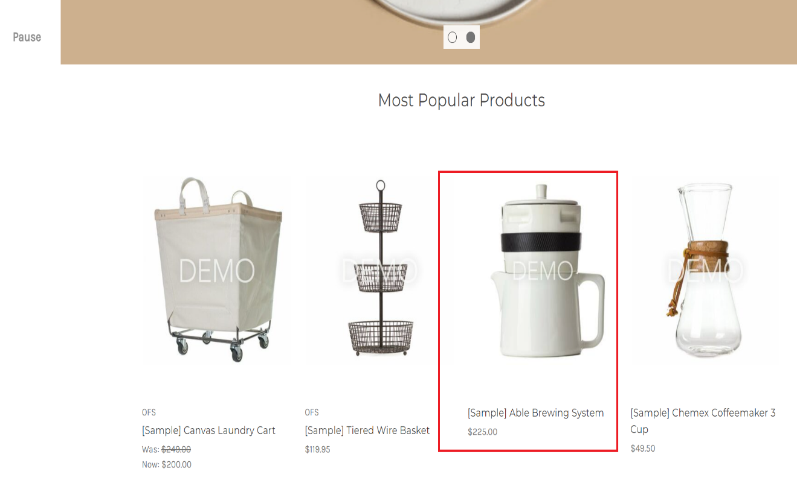
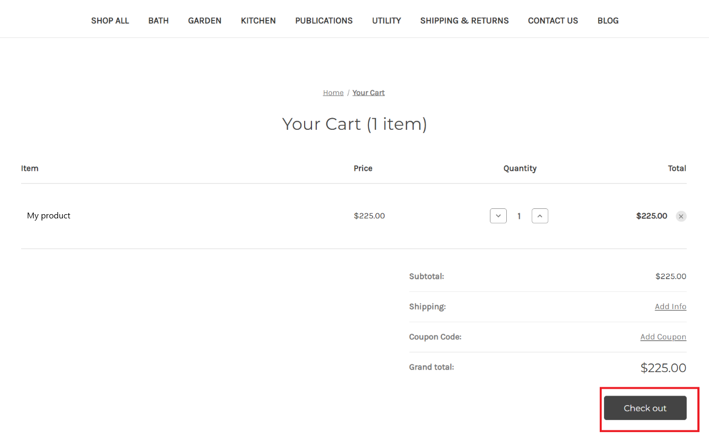
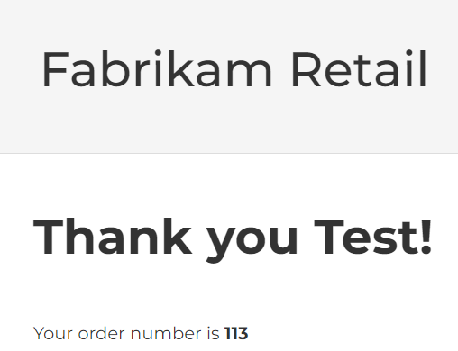

In this exercise, you'll complete the following tasks:

1. Learn about orchestration flows

1. Create a policy

1. Create an orchestration flow

## Overview

Orchestration flows determine how data obtained from configured providers is being orchestrated. Intelligent Order Management supports the ability to define orchestration flows for different purposes such as ordering intake to fulfillment and collecting and distributing inventory visibility information. Currently, IOM supports Order Orchestration, which enables users to define an end-to-end orchestration flow for orders, from order capture to fulfillment and billing.

IOM supports three types of orchestration flows:

> [!div class="mx-imgBorder"]
> 

Key components of an orchestration flow are policies, rules, actions, and elements:

- Policies and their associated rules enable businesses to perform the following types of actions on an orchestration flow - [**filter**](/dynamics365/intelligent-order-management/policies-rules?azure-portal=true#policy-types) the orchestration step to run based on the policy success criteria and [**allows checking and updating data running**](/dynamics365/intelligent-order-management/policies-rules?azure-portal=true#policy-types) through an orchestration flow.

- The policies are referenced as part of [**actions and elements**](/dynamics365/intelligent-order-management/orchestration-flows?azure-portal=true#actions-and-elements). An action may reference a policy to decide the course of flow of an orchestration flow.

As part of this lab, we'll create a **order orchestration** flow that validates an attribute associated with order header and based on the result, business can decide next course of action. For example, if the delivery address on the order is set to Seattle, then you can choose to fulfill the order from Seattle store.

The first step is to create a policy. The current experience doesn't support switching between **Orchestration Designer** and **Policy** designer view. In addition, a policy must be in **Published** state before it can be referenced in an orchestration flow.

## Task 1: Create a policy

1. We'll create an [execution policy](/dynamics365/intelligent-order-management/policies-rules?azure-portal=true#policy-types) that checks the order delivery address and validates if it's set to Seattle.

1. In Dynamics 365 IOM, select **Policies** on the left navigation pane.

    > [!div class="mx-imgBorder"]
    > 

1. Select **New**.

    > [!div class="mx-imgBorder"]
    > 

1. Enter the following details:

    - **Policy Name**: Demo - check city name

    - **Policy Type**: Execution Policy

    - **Policy Criticality**: Information

    - **Associated Entity**: Order

    > [!div class="mx-imgBorder"]
    > 

    > [!Note]
    > Policy criticality set to **Information** does not stop an orchestration flow if conditions are unsuccessful. Policy Criticality set to Critical means that an orchestration flow will stop in case of an unsuccessful evaluation.

1. Once details have been filled out, select **Save**. Once you've saved the policy, select **New Rules**.

    > [!div class="mx-imgBorder"]
    > 

1. **Rules** have conditions that must be evaluated. In the **Condition Builder**, add one condition where Ship to City evaluation is done. In this case, we're validating for ship to city **Equals** Seattle. You can enter one or more rules and then add one or more **Actions**. For now, we won't add any action. Select **Save & Close** to go back to Policy definition window.

    > [!div class="mx-imgBorder"]
    > 

1. In the policy definition window, select **Save** and then select **Publish**.

    > [!Note]
    > A policy must be published before you can reference it in an orchestration flow.

    > [!div class="mx-imgBorder"]
    > 

**Congratulations!** You've successfully created and published a policy.

## Task 2: Create an orchestration flow

In this task, you'll learn the steps to create an orchestration flow.

1. Select **Flows** in the left navigation pane.

    > [!div class="mx-imgBorder"]
    > 

1. Select **New** and provide the following details and then select on **Create**.

    - **Name**: Simple flow to validate city

    - **Journey type**: Order Orchestration

    > [!div class="mx-imgBorder"]
    > 

1. Select "+" sign to add a new action.

    > [!div class="mx-imgBorder"]
    > 

1. Select **Validate order header**.

    > [!div class="mx-imgBorder"]
    > 

1. Provide the following values in the properties of the action:

    - **Name**: Validate order header

    - **Input events**: Select **New Order**

    - **Execution Policies :** Select **Demo-check city name**. This is the policy created in the earlier task.

    > [!Note]
    > You can have more than one execution policy attached to a step if required. In this case, we have attached a single execution policy.
    >
    > [!div class="mx-imgBorder"]
    > 

    > [!Note]
    > At the bottom, you will observe a set of **Output Events**. These are the outputs that could be passed to subsequent steps in an orchestration flow as **Input Events**.

1. Once the details have been filled out, select **Save** and then **Publish** which are located on the top right edge of the properties pane. The status of the Orchestration flow will then be changed to **Live**.

    > [!div class="mx-imgBorder"]
    > 

Once **Live**, all incoming sales orders will be processed by this orchestration flow, and it will validate the address city as **Seattle**.

**Congratulations!** You've successfully created and published an orchestration flow.

## Task 3: Test orchestration flow

In this task, you'll test the orchestration flow created in the earlier task by creating a sample order in Big Commerce by setting the delivery city as Seattle. Once the sales orders flow into IOM, the order gets validated and marked as **"Order Validated**."

> [!Note]
> While creating an order in BigCommerce, ensure that the item is **Able Brewing System** as this is the only item for which we have configured in internal-external mapping.

1. Navigate to BigCommerce e-commerce portal store and sign-in with the credentials registered.

1. If your training team is using a BigCommerce Trial environment and using this URL for the first time in a browser session, then the e-commerce portal might be in private mode and expects a preview code per browser session. Enter the **Preview code** provided by your instructor, select the check box **I'm not a robot** and then select **Submit** button to enter the site.

    > [!div class="mx-imgBorder"]
    > 

1. Select **Able Brewing System** in the homepage and then select **Add to Cart**.

    > [!div class="mx-imgBorder"]
    > 

1. Select **Checkout** button.

    > [!div class="mx-imgBorder"]
    > 

1. Select **Continue**.

    > [!div class="mx-imgBorder"]
    > 

1. Select **Test Payment Provider** and enter credit card number as 4111 1111 1111 1111, Name on card as Success, any future expiration date and any value on CVV field and select **Place order** button to confirm the order.

    > [!div class="mx-imgBorder"]
    > 

1. Once the order has been successfully placed, BigCommerce will provide the order number for your order as per the screenshot below.

    > [!div class="mx-imgBorder"]
    > 

1. The order will be waiting for fulfillment and the order data will be flowing to Dynamics 365 IOM for fulfillment process within the selected frequency of poll setup in the Power Automate flow.

1. Navigate to Dynamics 365 IOM and on the left navigation pane, select **Sales orders**.

    > [!div class="mx-imgBorder"]
    > 

1. You'll notice the order on the Sales orders screen with BigCommerce order number in the Name field. In this case, the BigCommerce order number is 113.

1. In Dynamics 365 IOM portal, go to **Sales Order** screen, you should see order#11. At this stage, orchestrator flow hasn't processed this order yet. It usually takes a minute.

1. Once an order has been validated, its status should change to **Order Validated**.

    > [!div class="mx-imgBorder"]
    > 

**Congratulations!** You've learned about orchestration flows and how to use them to respond to business events related to order lifecycle.
