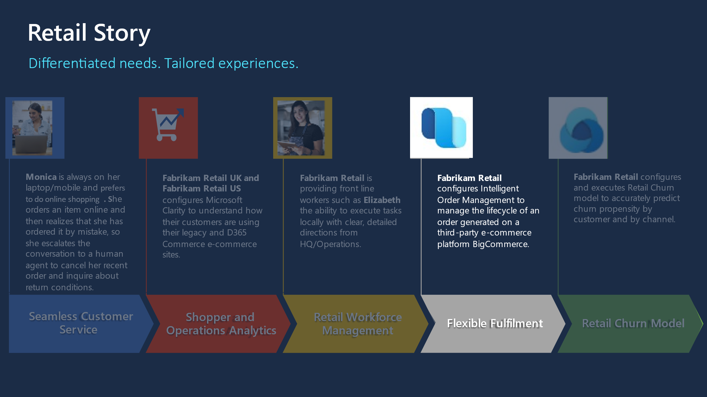
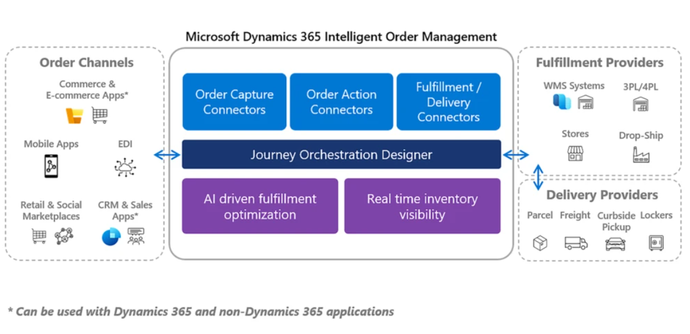

Flexible fulfillment delivers on enhanced customer experience capabilities such as streamlining curbside pickup and 'buy-online-pickup-in-store' operations, while providing customers with real-time inventory and order status, and greater control of the entire order lifecycle.

To expand, the following are some of the ways Flexible fulfillment delivers on **enhanced customer experiences**:

- Streamline returns management and enable flexible return scenarios

- Use AI and anomaly detection models to identify and address fulfillment constraints and improve delivery times while reducing costs

- Give customers ordering flexibility such as home delivery, curbside pickup, and pick up in-store with connected ordering and fulfillment tools

- Offer real-time inventory availability and order status with AI, providing a single solution to order-fulfillment orchestration

> [!div class="mx-imgBorder"]
> 

## Retail story

> [!div class="mx-imgBorder"]
> 

This lab will focus on the retail story of Fabrikam Retail. In the following exercise, you'll play the role of a System Administrator, Developer, and a Retail customer.

    - In Exercise 1, you'll be configuring and deploying a BigCommerce e-commerce site.

    - In Exercise 2, you'll be configuring the Dynamics 365 Intelligent Order Management environment.

    - In Exercise 3, you'll configure BigCommerce Provider in addition to configuring the internal-external mappings.

    - In Exercise 4 - Task 1, you'll be configuring the frequency of power automate flow.

    - In Exercise 4 - Task 2, you'll assume the role of a Retail customer, sign up for an account in the e-commerce portal and place an order. Later you'll see how the order flows from BigCommerce to Dynamics 365 Intelligent Order Management.

    - In Exercise 5, you'll assume the role of a system administrator and configure the orchestration flows and policies to validate the location of the sales orders and later you'll be testing the orchestration flow.

    - Exercises 6 and 7 detail the information on Administrative operations and Reporting respectively.

## Prerequisites

To complete these exercises, you'll need the following:

- Dynamics 365 Intelligent Order Management

  > [!Note]
  > The [trial version](https://dynamics.microsoft.com/intelligent-order-management/overview/?azure-portal=true) of Intelligent Order Management includes the underlying dependencies (Power Platform, Dataverse capacity etc.). However, you need to consider these for production deployments. Further guidance is available [here](https://github.com/microsoft/industry/tree/main/foundations/powerPlatform/?azure-portal=true).)

- BigCommerce trial subscription

- Postman or CLI such as CURL for troubleshooting APIs (optional)

Dynamics 365 Intelligent Order Management (IOM) is built on a modern open platform and provides the flexibility companies need today to capture orders from any order source such as online e-commerce, marketplace, mobile apps, or traditional sources like EDI (Electronic Data Interchange) and fulfill them from their own warehouse, 3PL (Third-party Logistics), stores, or drop-ship with vendors or other delivery fulfillment partners.

It's a common scenario for enterprises to have disparate systems for e-commerce, fulfillment, and shipping/delivery. IOM bridges these disparities and provides a single pane of glass to manage end to end lifecycle of an Order. [Extensibility features](/dynamics365/intelligent-order-management/extensibility/?azure-portal=true) allow customers to integrate IOM with their existing ecosystem of applications.

The system also helps organizations streamline the return processes. Whether returns are collected at a retail store, fulfillment center, or service center, returns can be initiated through an app, online, or at the store.

With low-code, no-code experience, IOM's orchestration designer tools allow users to model and automate the response to fulfillment constraints and use machine learning to influence & optimize the flow of the orders.

> [!div class="mx-imgBorder"]
> 

## Lifecycle of an order

The lifecycle of an order in Order Management can be described as a series of states and actions. Some of these might be optional or might occur in different sequences, based on the system configuration. In addition, some actions might be configured to occur automatically or to be performed manually. The main stages of an order are:

- Order intake or creation

- Fulfillment

- Delivery

Intelligent Order Management helps you make order fulfillment a competitive advantage. By orchestrating and automating fulfillment using real-time omnichannel stock data, AI, and machine learning, Dynamics 365 Intelligent Order Management lets you adapt quickly, fulfill efficiently, and deliver on your order promise.

## Architecture of Intelligent Order Management

Intelligent Order Management, built on Power Platform, seamlessly integrates with existing systems through the provider connector framework, providing order orchestration capabilities to help you deliver on your business strategy through order, orchestration, fulfillment, optimization, inventory visibility and fulfillment insights.

IOM shares the Common Data Model with Dynamics 365 applications to facilitate back-office application support for your customer service & sales representatives.

The core architecture of IOM has three main components:

- Data pipeline

- Orchestration engine

- Insights

> [!div class="mx-imgBorder"]
> 

[**Data pipeline**](/dynamics365/intelligent-order-management/architecture?azure-portal=true#data-pipeline) consists of integration services and Microsoft Power Query online, which is a transformation engine for the connectors and the orchestration engine. The data pipeline in Intelligent Order Management provides the foundation for the providers to move data in and out of the app.

A **pipeline** is composed of:

- Provider

- Connectors

- Connection

- Data transformations

- Business events

- Provider action

[**Orchestration engine**](/dynamics365/intelligent-order-management/architecture?azure-portal=true#orchestration-engine) orchestrates a business process flow. Order-to-fulfillment flow is complex to model in a single business app, but when combined with other cloud services and supply chain partner systems, the complexity grows. To help business users in the organization to visualize and manage this complexity, Intelligent Order Management ships with a business orchestration designer. Business process flows designed with the orchestration designer are compiled into Power Automate flows when the flow is published.

Components of the orchestration engine:

- Designer

- Orchestration flow types

  - Order Flow

  - Inventory Flow

- Policies

- Step

The orchestration engine's components uses an orchestration compiler to compile the business process flows into Power Automate. The orchestration builder offers low code, no code experience for building pipelines.

Under **fulfillment optimization** capabilities, you can construct unlimited fulfillment nodes, bring your own, configure the native distribution order management engine. You can set up flexible order validation rules for easy order routing. With the provider connector capabilities, you can work with warehouse management systems, 3PLs, or other fulfillment systems you've chosen for your supply chain needs, based on the connectors we'll provide and also partners will provide.

In inventory **visibility**, we have a highly scalable microservice that enables real-time, on-hand inventory tracking with a global view of inventory visibility, external system access through restful APIs. And you can use it as a foundation to build available to promise processing for your business processes.

In fulfillment insights, analytics monitor order through to fulfillment supply chain, out-of-the-box, customizable dashboards to monitor key metrics. AI-based anomaly detection models provide the visibility the order from fulfillment through to delivery and communicate that to the people and the systems that need that visibility in your organization.

**[Insights](/dynamics365/intelligent-order-management/architecture#insights)** is built on Power BI and AI Builder. Intelligent Order Management provides several dashboards to help the business user understand key order and fulfillment metrics. Machine learning is used to analyze data using models and uses advanced algorithms to find or predict patterns in data. Customers can build models using AI builder that use data from Intelligent Order Management, so that results are updated on entities used during the order and fulfillments flows. This will help decision making in orchestration flows.
