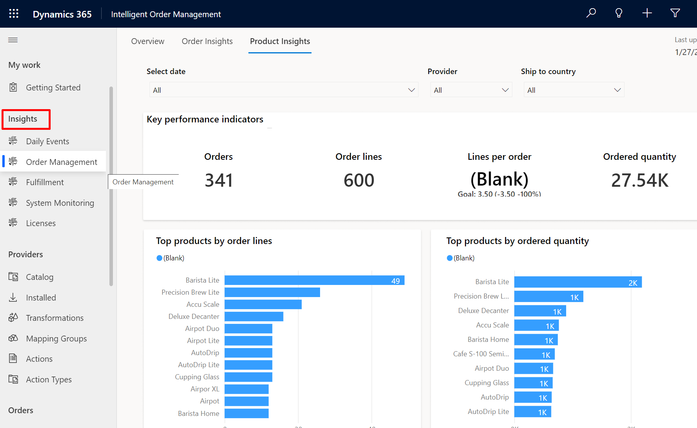
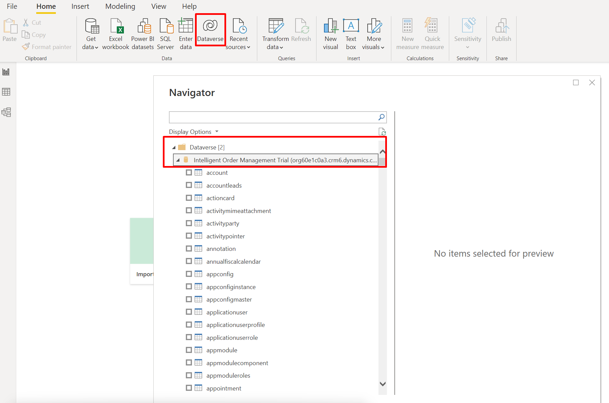

In this exercise, you'll learn about the following:

- Power BI integration

- How to create new dashboards in IOM

- Accessing IOM data using Power BI

There are two types of dashboard technologies available in Intelligent Order Management.

- Microsoft Unified Client Interface (UCI) dashboards: UCI dashboards can be used to visualize app data stored in Microsoft Dataverse. IOM ships with a dashboard called **Daily Events** that can be used to monitor common data required by the business user on a typical workday.

- Microsoft Power BI dashboards: Power BI dashboards can be used to visualize app data stored in Dataverse or other data sources that Power BI can work with.

## Task 1: Access and create new dashboards

1. IOM dashboards can be accessed via IOM portal.

    > [!div class="mx-imgBorder"]
    > 

1. From within IOM portal, one can also create new dashboards. Go to Insights > New > Dynamics 365 Dashboard.

    > [!div class="mx-imgBorder"]
    > 

1. Choose a pre-canned layout and select Create.

    > [!div class="mx-imgBorder"]
    > 

1. In the Power Apps portal, you can then create a dashboard that could reference Power BI Chart, list, Iframe, and Web Resource. Once ready, the dashboard can then be published and accessed via IOM portal. In this demo, we'll name the dashboard **Demo Dashboard**.

    > [!div class="mx-imgBorder"]
    > 

1. To access the dashboard, select the dropdown and select Demo Dashboard.

    > [!div class="mx-imgBorder"]
    > 

IOM ships with a set of default dashboards as part of Insights. These are:

> [!div class="mx-imgBorder"]
> 

## Task 2: Accessing IOM data using Power BI

Intelligent Order Management ships with a dashboard called Order Management and is based on Power BI technology. This dashboard provides longer-range insights into the order and fulfillment data moving through the app. Power BI dashboards can be used to visualize app data stored in Dataverse or other data sources that Power BI can work with.

1. In the Power BI Desktop, select **New** and use **Dataverse** source. We can then select one of the Dataverse tables as a source.

    > [!div class="mx-imgBorder"]
    > 

1. Once tables have been selected, you can use DirectQuery mode for querying data in Dataverse.

    > [!div class="mx-imgBorder"]
    > 

Power BI enables complex data analysis scenarios where one can join data across multiple data sources to build insights. Once a report has been built, it can then be published as a dashboard for consumption by a wider audience across an enterprise.

**Congratulations!** You've learned about accessing pre-canned dashboards and how to build new reports or dashboards to address complex analytics scenarios.
