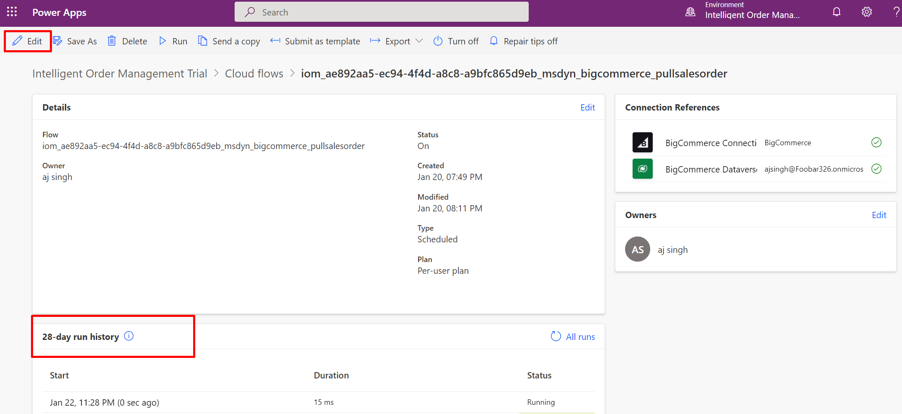
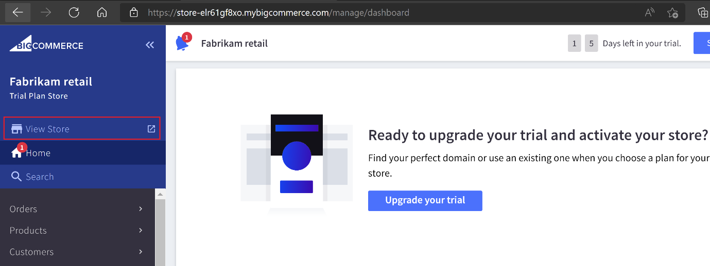
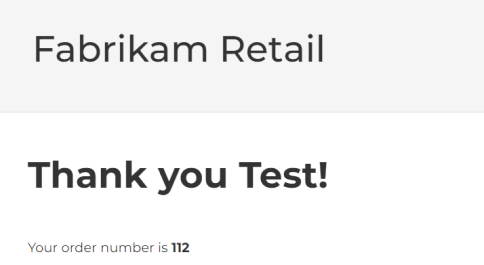

In this exercise, you'll complete the following:

- Configure recurrence frequency of BigCommerce pull sales order flow

- Generate orders in BigCommerce and validate flow of orders to IOM

## Task 1: Configure the frequency of the flow

1. By default, the flow that pulls the sales orders from BigCommerce is configured to run at 10-minute intervals. This can be changed to suit business requirements. To configure the interval, go to [Power Apps](https://make.powerapps.com/?azure-portal=true) and ensure that the right environment is selected.

    > [!div class="mx-imgBorder"]
    > 

1. Select **Solutions** and then scroll down and select **Default Solution**.

    > [!div class="mx-imgBorder"]
    > 

1. Filter the list of flows based on **Type**. In this case, we select filter records where type is **Cloud Flow**.

    > [!div class="mx-imgBorder"]
    > 

1. The flow that pulls sales order from BigCommerce has suffix _bigcommerce_pullsalesorder. Select this flow to view the details.

    > [!div class="mx-imgBorder"]
    > 

1. Selecting Edit opens up the editor that can be used to change configuration including schedule for this flow.

    > [!Note]
    > You can also view history of previous runs. This can be used for troubleshooting purposes. For example, selecting a given run gives you access to JSON output of data which was pulled back from BigCommerce. Similarly, output also gives you BigCommerce API statistics such as rate limits, quotas, etc.
    >
    > [!div class="mx-imgBorder"]
    > 

    > [!div class="mx-imgBorder"]
    > 

1. Select Recurrence task to change this flow to run every minute instead of default of 10 minutes and then select Save.

    > [!div class="mx-imgBorder"]
    > 

## Task 2: Create an order in BigCommerce

You can either create an order on BigCommerce store portal or their e-Commerce portal. In this task, you'll follow the below steps to create an order via BigCommerce e-commerce portal.

1. Navigate to BigCommerce e-commerce portal store. The store link can be found in the BigCommerce environment as shown below.

    > [!div class="mx-imgBorder"]
    > 

1. Select **Register** on the top right edge of the portal.

    > [!div class="mx-imgBorder"]
    > 

1. Fill the required fields to create your account. You can enter a dummy value on the fields Email Address, First Name, Last Name and Address Line 1 however for other address fields, enter as mentioned below because the shipping zone in BigCommerce is configured to be United states:

    - **Suburb/City**: Redmond

    - **Country**: United States

    - **State/Province**: Washington

    - **Zip/Postcode**: 98052

    > [!div class="mx-imgBorder"]
    > 

1. Remember the email address and password values entered on this form and then Select **Create Account**.

1. Select **Continue Shopping**.

    > [!div class="mx-imgBorder"]
    > 

1. Select **Able Brewing System** in the homepage because this is the only product mapped in Dynamics 365 IOM as part of Exercise 2 - Task 2 - Step 1. Once the product has been selected, select **Add to Cart**.

    > [!div class="mx-imgBorder"]
    > 

1. Select **Checkout** button.

    > [!div class="mx-imgBorder"]
    > 

1. Select **Continue**.

    > [!div class="mx-imgBorder"]
    > 

1. Select **Test Payment Provider** and enter **credit card number** as 4111 1111 1111 1111, **Name on card** as Success, any future expiration date and any value on CVV field and select **Place order** button to confirm the order. The test payment provider validates the test credit card number and name on the card fields.

    > [!div class="mx-imgBorder"]
    > 

1. Once the order has been successfully placed, BigCommerce will provide the order number for your order as per the screenshot below.

    > [!div class="mx-imgBorder"]
    > 

1. The order will be waiting for fulfillment and the order data will be flowing to Dynamics 365 IOM for fulfillment process within the pull frequency set in Power Automate in earlier exercise. If the frequency is updated to 1 minute, then the sales order will be created when the next poll happens.

1. Navigate to Dynamics 365 IOM and on the left navigation pane, select **Sales orders**.

    > [!div class="mx-imgBorder"]
    > 

1. You'll notice the order on the Sales orders screen with BigCommerce order number in the Name field. In this case, the BigCommerce order number is 112.

    > [!div class="mx-imgBorder"]
    > 

**Congratulations!** You have validated successful flow of an order and configured the pull frequency of the flow to pull orders from BigCommerce platform.
