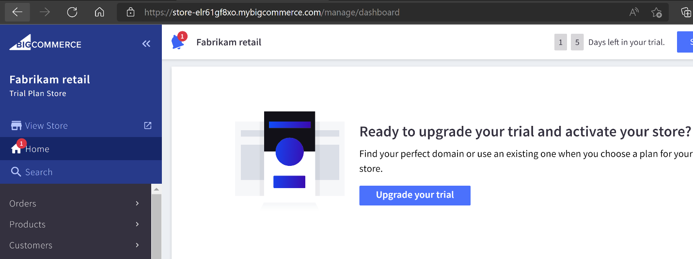
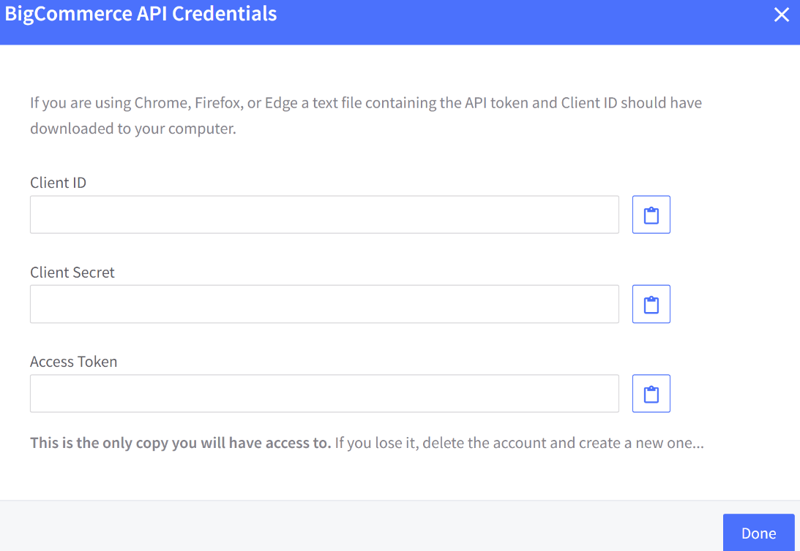

In this task, you'll complete the following tasks:

1. Set up a [BigCommerce](https://www.bigcommerce.com/dm/innovate-ecommerce-v1/?azure-portal=true) demo store.

1. Create a BigCommerce API key to use for configuring IOM provider.

> [!Note]
> In this lab, we are using 3P e-commerce platform (BigCommerce) to showcase integration with external e-commerce platform.

## Task 1: Create and provision BigCommerce platform

1. As part of this exercise, we'll deploy [BigCommerce](https://www.bigcommerce.com/?azure-portal=true) e-commerce trial subscription, and configure bare minimum required for us to generate orders and integrate BigCommerce with Dynamics 365 Intelligent Order Management via Provider.

1. Navigate to [BigCommerce](https://www.bigcommerce.com/dm/innovate-ecommerce-v1/?azure-portal=true) in an in-private browser session and sign up for a trial.

    > [!div class="mx-imgBorder"]
    > 

1. Enter your email address. This will only be used for demo purposes only.

    > [!div class="mx-imgBorder"]
    > 

1. Enter the details. You're free to choose any name for your store. Once details have been entered, select "Create your store" button.

    > [!div class="mx-imgBorder"]
    > 

1. You should see the following splash screen while BigCommerce creates your demo store. It usually takes 2-3 mins for this step to complete.

    > [!div class="mx-imgBorder"]
    > 

1. For this demo, Select **Finish** and then continue.

    > [!div class="mx-imgBorder"]
    > 

After your online store is ready, you'll be welcomed by a store summary screen. In this case, we've named our demo store "Fabrikam Retail." You can choose a different name. This is a pre-populated demo environment and ships with sample data, that is, product master data.

> [!div class="mx-imgBorder"]
> 

## Task 2: Create BigCommerce API key

1. Navigate to **advanced settings** in the left pane.

    > [!div class="mx-imgBorder"]
    > 

1. Select **Create API Account** and choose **Create V2/V3 API token**.

    > [!div class="mx-imgBorder"]
    > 

1. Enter a name for the **API Account** and grant access to all of the scopes. In a production setting, one would follow the principle of least privilege and only provide access to a set of scopes that are required to complete a function. Choose the maximum scope either as "Modify" or as "Manage" as applicable in the OAuth scopes as below.

    > [!div class="mx-imgBorder"]
    > 

1. Select the Save button to generate the **Client ID**, **Secret** and **Access Token**. **Copy and save it as these are displayed only once**. You'll need these values when you configure IOM Provider at a later stage of this exercise.

    > [!div class="mx-imgBorder"]
    > 

1. Next, set up **shipping address** and **shipping zone** as these are required to place an **Order**. Navigate to **Store setup** in the navigation pane on the left to add shipping address.

    > [!div class="mx-imgBorder"]
    > 

1. Under Store setup, select **Shipping** to view **Shipping manager** and select **Add shipping address**.

    > [!div class="mx-imgBorder"]
    > 

1. The Configure shipping address screen pops up where you enter the shipping address. Enter these values as below and select **Submit**.

    **Address**: *Enter your own address*

    **City**: Seattle

    **Postcode**: 98052

    **Country**: United States

    **State**: Washington

    > [!div class="mx-imgBorder"]
    > 

1. The shipping address appears below.

    > [!div class="mx-imgBorder"]
    > 

1. Scroll down further to **Checkout Shipping Options** > **Configure your shipping rules** and **add shipping zone**.

1. Choose **Add a country zone**.

    > [!div class="mx-imgBorder"]
    > 

1. Choose **United States** and select **Submit**. (If you see a different country auto populated based on your local country, remove it.)

    > [!div class="mx-imgBorder"]
    > 

1. The country zone is shown below.

    > [!div class="mx-imgBorder"]
    > 

> [!Note]
> To troubleshoot and check if an API key is valid, one can use command line tools such as CLI tools such as CURL to test/call BigCommerce API. This step is there for validation/troubleshooting purposes.
>
> Using CLI such as Git Bash, set the variable value for access_token.
>
> [!div class="mx-imgBorder"]
> 
>
> Using the access token published by BigCommerce, we will call Products API. This following command will print the output in JSON format. If you see a list of products, it means that the APIs and the access token are working properly.
>
> [!div class="mx-imgBorder"]
> 
>
> Similarly, one can use [[Postman]](https://www.postman.com/?azure-portal=true) which supports GUI experience to troubleshoot API issues.

**Congratulations!** You have successfully set up a BigCommerce demo store. You've also created an API key and noted it down which you would use when configuring the IOM provider in the upcoming exercise.
