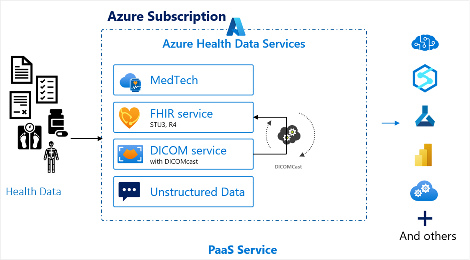
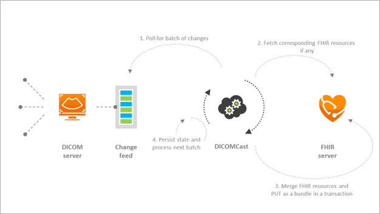
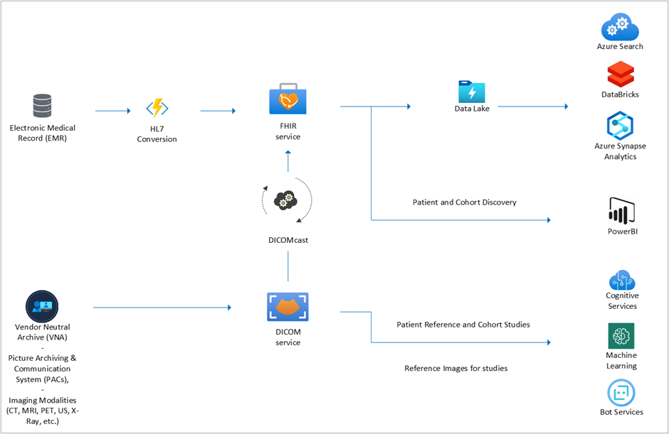

DICOM service within Azure Health Data Services enables imaging data to securely persist in the Microsoft cloud. DICOM service is a managed Azure service that allows standards-based communication with any DICOMweb™ enabled systems.

> [!div class="mx-imgBorder"]
> 

The service ingests and persists DICOM objects from VNA (vendor neutral archives), PACS (picture archiving and communications system) and other medical imaging systems at multiple thousands of images per second. Azure Health Data Services DICOM service enables storing DICOM images in the cloud where you can query, retrieve, and share medical images with ease.

## Medical Imaging Server for DICOM

Additionally, there's also an open-source version, [Medical Imaging Server for DICOM](https://github.com/microsoft/dicom-server/?azure-portal=true).

## DICOMcast

DICOMcast allows synchronizing the data from DICOM service to a FHIR service, which enables healthcare organizations to merge clinical and imaging data together into a unified database. DICOMcast opens new clinical and research possibilities by integrating textual-based health data with medical imaging data. 

DICOMcast is the first cloud technology to bring DICOM metadata and healthcare data together in FHIR. The technology works by enabling communication across clinical and imaging datasets. For example, for a given patient, DICOMcast makes it possible to view the patient’s FHIR records and medical images together as though they are from the same data store. DICOMcast also enables new interoperability in medical studies, such as radiological queries using labeled attributes combined with patients’ health histories in FHIR. 

> [!div class="mx-imgBorder"]
> 

### DICOMcast operation

1. **Poll for batch of changes**: DICOMcast polls for any changes via the [Change Feed](/azure/healthcare-apis/dicom/dicom-change-feed-overview/?azure-portal=true), which captures any changes that occur in your Medical Imaging Server for DICOM.

1. **Fetch corresponding FHIR resources, if any**: If any DICOM service changes correspond to FHIR resources, DICOMcast will fetch the related FHIR resources. DICOMcast synchronizes DICOM tags to the FHIR resource types *Patient* and *ImagingStudy*.

1. **Merge FHIR resources and 'PUT' as a bundle in a transaction**: The FHIR resources corresponding to the DICOMcast captured changes will be merged. The FHIR resources will be 'PUT' as a bundle in a transaction into your FHIR service.

1. **Persist state and process next batch**: DICOMcast will then persist the current state to prepare for the next batch of changes.

    > [!div class="mx-imgBorder"]
    > 

## DICOM service features

**PHI compliant**: Protect your PHI with unparalleled security intelligence. Your data is isolated to a unique database per API instance and protected with multi-region failover. The DICOM service implements a layered, in-depth defense and advanced threat protection for your data.

**Extended query tags**: Additionally index DICOM studies, series, and instances on both standard and private DICOM tags by expanding the list of tags that are already specified within the [DICOM Conformance Statement](/azure/healthcare-apis/dicom/dicom-services-conformance-statement/?azure-portal=true).

**Change feed**: Access ordered, guaranteed, immutable, read-only logs of all the changes that occur in DICOM service. Client applications can read these logs at any time independently, in parallel and at their own pace.

**DICOMcast**: Via DICOMcast, DICOM service can inject DICOM metadata into a FHIR service, or FHIR server, as an imaging study resource allowing a single source of truth for both clinical data and imaging metadata. This feature is available on demand. To enable DICOMcast for your Azure subscription, you must request access for DICOMcast by opening an [Azure Technical Support](https://azure.microsoft.com/support/create-ticket/?azure-portal=true) ticket.

**Region availability**: DICOM service has a wide-range of [availability across many regions](https://azure.microsoft.com/global-infrastructure/services/?azure-portal=true&products=health-data-services&regions=all) with multi-region failover protection.

**Scalability**: DICOM service is designed as out-of-the-box to support different workload levels at a hospital, region, country and global scale without sacrificing any performance spec by using autoscaling features.

**Role-based access**: You control your data. Role-based access control (RBAC) enables you to manage how your data is stored and accessed. Providing increased security and reducing administrative workload, you determine who has access to the datasets you create, based on role definitions you create for your environment.

## Connect DICOM service with other tools, services, and products

**DICOM data anonymization** [Anonymize DICOM metadata](https://github.com/microsoft/Tools-for-Health-Data-Anonymization/blob/master/docs/DICOM-anonymization.md/?azure-portal=true): A DICOM file not only contains a viewable image but also a header with a large variety of data elements. These metadata elements include identifiable information about the patient, the study, and the institution. Sharing such sensitive data demands proper protection to ensure data safety and maintain patient privacy. DICOM Anonymization Tool helps anonymize metadata in DICOM files for this purpose.

**Access imaging study resources on Power BI, Power Apps, and Dynamics 365 Customer Insights** [Connect to a FHIR service from Power Query Desktop](/power-query/connectors/fhir/fhir/?azure-portal=true): After provisioning DICOM service, FHIR service, and synchronizing imaging study for a given patient via DICOMcast, you can use the Power Query connector for FHIR to import and shape data from the FHIR server including imaging study resource.

**Convert imaging study data to hierarchical parquet files.** [FHIR to Synapse Sync Agent](https://github.com/microsoft/FHIR-Analytics-Pipelines/blob/main/FhirToDataLake/docs/Deployment.md/?azure-portal=true): After you provision a DICOM service, FHIR service, and synchronizing imaging study for a given patient via DICOMcast, you can use FHIR to Synapse Sync Agent to perform Analytics and Machine Learning on imaging study data. Use it by moving FHIR data to Azure Data Lake in near real time and making it available to a Synapse workspace.
