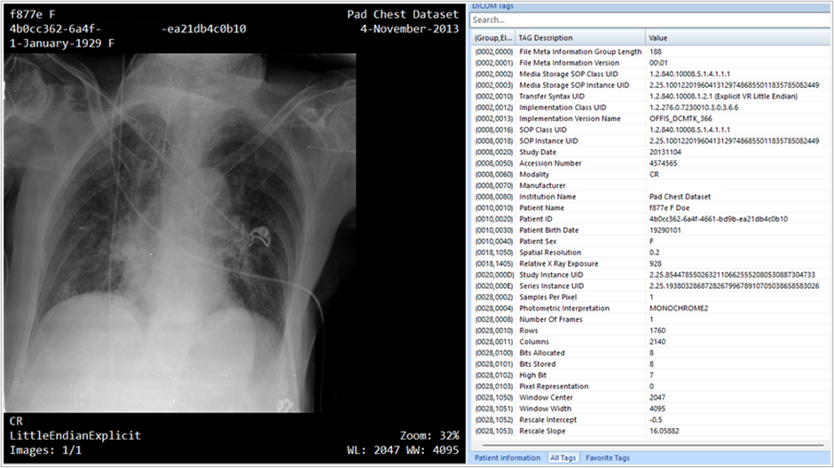

DICOM® (Digital Imaging and Communications in Medicine) is the international standard for medical images, imaging formats, and related information. It's the ISO 12052 standard that defines the data quality and exchange specifications for images to meet clinical use requirements. Digitization of medical imaging data using the DICOM standard enables health data interoperability, and the Microsoft cloud is equipped to ingest, persist, and connect DICOM imaging data to help improve patient outcomes.

After completing this module, you will:

- Learn why DICOM standards are important

- Explore the DICOM standards and DICOM service

- Review the use case for radiology data in cancer treatment with examples such as a DICOM imaging query for cohort identification and an AI/ML model for cancer prediction.

## Why DICOM is important

In the DICOM standard, images can be stored and transmitted between DICOM-compatible devices, PACS (picture archiving and communications systems), VNAs (vendor neutral archives), and other systems. DICOM data, also referred to as a DICOM object, contains two types of data:

- Image data

- Metadata

DICOM makes medical imaging data into useable structured data, opening data silos and allowing interoperability between different DICOM-compatible systems. The imaging data shown below is collected as a DICOM study. A DICOM "study" is the general term for the imaging procedure being performed. This study happened at a certain location (such as a hospital) at a certain date and time. All of the structured text-based information for the study is stored in the study's metadata.

> [!div class="mx-imgBorder"]
> 

DICOM has revolutionized the way radiologists and practitioners collect and share medical images through digitization of:

- X-rays

- CT scans

- Ultrasound

- MRI

- Mammography

- PET scans

- Digital pathology

- And more...

Metadata in DICOM is organized as a standardized series of tags. By extracting data from these tags, providers can access important information regarding patient demographics, study parameters, and more. Custom query tags can be set up in DICOM service in Azure Health Data Services for advanced image search and classification. DICOM service can also be connected with FHIR service via Microsoft's DICOMcast technology. As an image enters the DICOM service, DICOMcast detects changes in the image and extracts patient ID information for matching with records in the FHIR service. If a match is found, DICOMcast registers a connection between the image and the patient in FHIR. If no patient match is found, a new patient resource can be created in the FHIR service and connected to the DICOM image.

## The DICOM data model

In the following video, we'll learn about the DICOM data model and the sharing of DICOM images.

> [!VIDEO https://www.microsoft.com/videoplayer/embed/RE50yw2]
