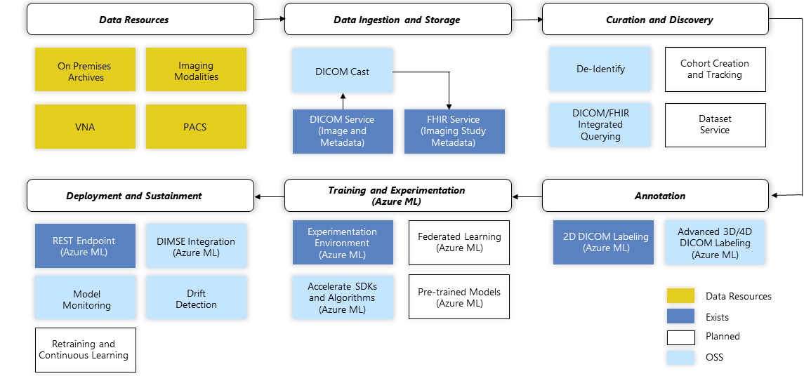

There are various building blocks within Microsoft that can be coupled with DICOM service to enable end-to-end solutions in medical imaging. This reference architecture diagram demonstrates how to enable AI/ML model consumption in the field via Microsoft cloud capabilities.

> [!div class="mx-imgBorder"]
> 

These capabilities enable scenarios such as:

- A physician requesting: "Bring me all images with similar tumors" or "Pull all related digital pathology images for those studies where they were found positive for the digital pathology result"

- Joining FHIR records and imaging (radiology and digital pathology)

- Creating a model as a classifier and training the classifier to predict the outcome by looking at previous radiology images (to look at first as they would be more likely to have cancer)

## Radiology use cases

Cancer treatment is costly, both financially and psychologically. Even with this expensive and tiring process, half of the patients aren't getting successful results from their treatments. There are important roles of intelligent care in cancer detection, treatment, and proactive studies. These include finding similar patient records for clinical decision support, prioritizing cases based on cancer detection and growth cycles, and closing the feedback loop on false positives or model predictions.

The DICOM service in the Microsoft cloud plays a vital role in finding similar patient diagnostic images and treatment results that provide clinical decision support. DICOM service prioritizes image review that reduces time wasted so that practitioners can act fast and connect initial diagnostic images to digital pathology images - streamlining the process between abnormality detection and identifying the reality behind it.

Let's explore two scenarios:

**USE CASE #1** - Medical imaging query and cohort

"How can I select the best path of treatment for cancer patients by leveraging longitudinal datasets?"

**USE CASE #2** - Create a model as a classifier for cancer prediction

"How can I prioritize the review of radiology and digital pathology images in the clinical workflow that have a higher likelihood of showing evidence for cancer?"

Let's dive into each of these use cases.
