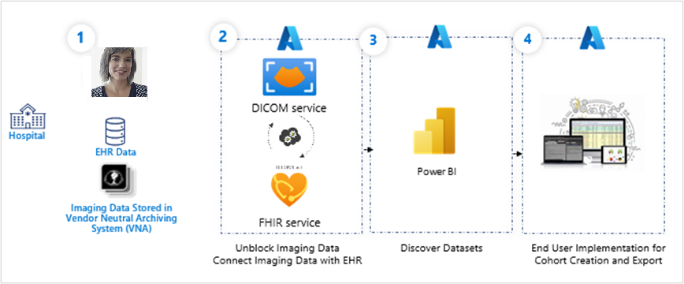
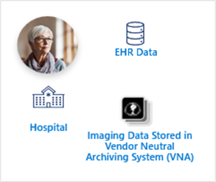
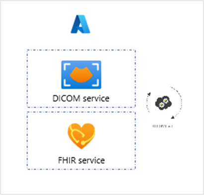
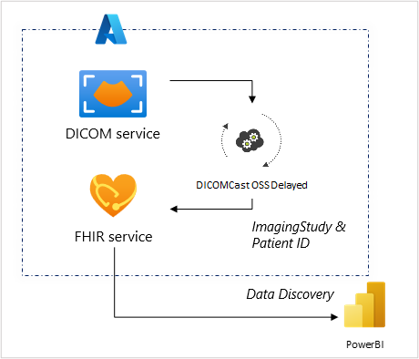
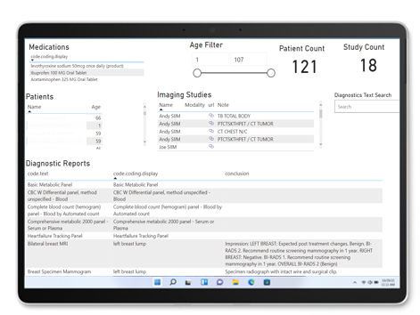

Imagine a scenario for a patient named Mary. They've just had their cancer diagnosis confirmed from a biopsy following a CT scan. Their caregivers are reviewing treatment options and struggling to agree on the best approach. To aid in Mary's treatment protocol, the lead clinical informaticist at the hospital works with the team to use thousands of medical images and associated patient records to create a true picture of Mary's health journey and develop the best care plan for them.

By intersecting FHIR and DICOM data for query and cohort creation and tracking, and by finding similarly diagnosed patients' imaging and treatment data who had successful (or failed) outcomes on the treatment type chosen, Mary's care team can provide more viable options.

Mary's imaging and electronic health record data and the data of thousands of other patients is ingested into the DICOM service and FHIR service. Digital pathology imaging data is converted and stored as DICOM instance files and ingested into the DICOM service along with the patients' medical records in the FHIR service.

The following information is ingested:

- Mary's imaging and electronic health record data (EHR) and the data of thousands of other patients is ingested into the DICOM service and FHIR service.

- Digital pathology image data is converted and stored as DICOM files and ingested into the DICOM service and FHIR service.

The following diagram illustrates the process.

> [!div class="mx-imgBorder"]
> 

1. Hospital uses electronic health record data and imaging data.

1. Process unblocks imaging data and connects imaging data with electronic health records.

1. Power BI helps discover datasets.

1. End User implements cohort creation and export.

Let's explore these in more detail.

The first step is importing electronic health records with related medical imaging of the patient in the Azure Health Data Services workspace. In this case, Mary's medical history is connected with her latest medical imaging data via DICOMcast and ready for search and retrieval. Additionally, the de-identified records of all patients who had similar diagnosis (or were "false positive") and received cancer treatment, are ingested and ready for search and retrieval.

> [!div class="mx-imgBorder"]
> 

Second, when a new DICOM object is uploaded to DICOM service, DICOMcast will synchronize metadata within FHIR service to achieve end-to-end connected patient data within an Azure Health Data Services workspace (imaging data and text-based health data).

> [!div class="mx-imgBorder"]
> 

Third, once the data (imaging data and text-based health data) merge is complete, FHIR service can be connected to Power BI to discover available datasets for a specific cohort request.

> [!div class="mx-imgBorder"]
> 

Fourth, providers use applications that can quickly identify cohorts and suggest real-world action based on real-world data.

> [!div class="mx-imgBorder"]
> 

Mary is able to benefit from the entire collection of available data as her team seeks to improve her cancer treatment outcome.
