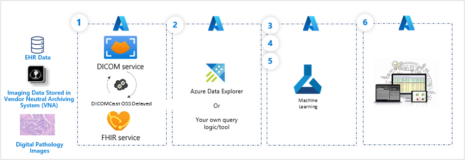
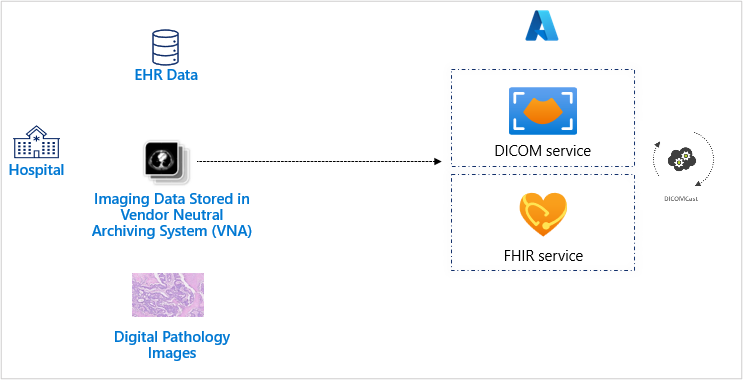
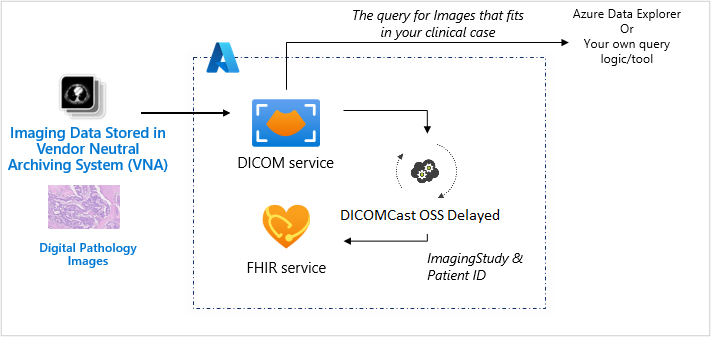
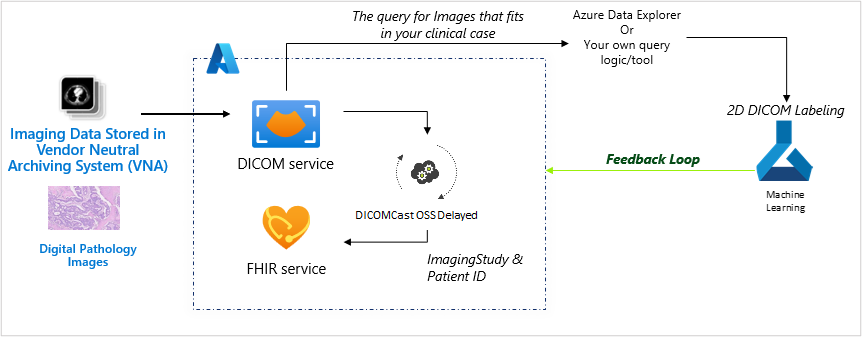
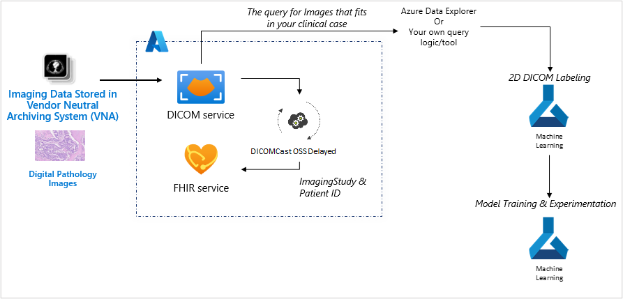
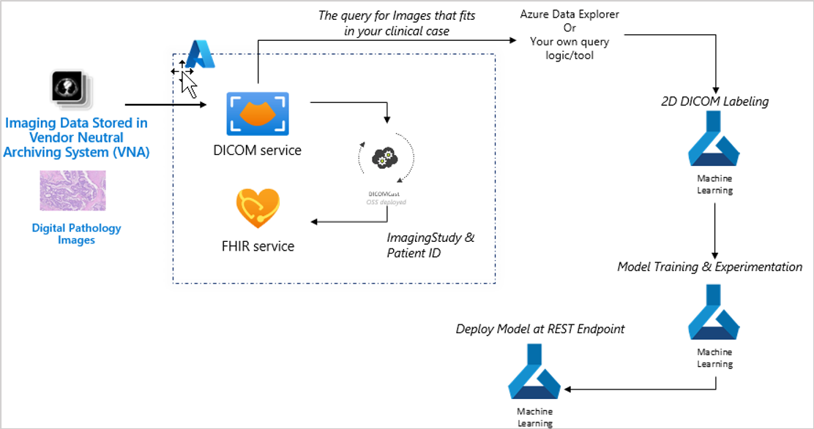
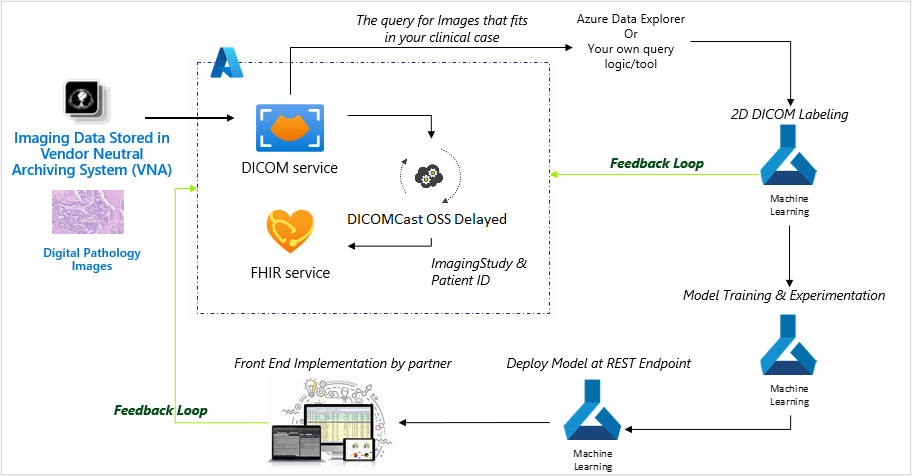

Using the clinical data from incoming radiology and digital pathology images, you can create an AI model for predicting cancer. By creating and training a classifier based on similarly diagnosed patients' imaging and treatment data who had positive or negative test results, you can predict outcomes.

This can be done if you have access to:

- Images with similar tumors

- Connected datasets for each patient (FHIR records + radiology images + digital pathology images)

- Related radiology and digital pathology images for those studies

You can then create a model as a classifier and train the classifier to predict the outcome by looking at the previous radiology images.

## Build the model

Machine learning models do best when real-world feedback can be used to improve these models. Let's have a look at the pipeline to build and train a radiology model.

> [!div class="mx-imgBorder"]
> 

1. Text-based PHI health records in FHIR

1. Query image data sets that fit the clinical criteria

1. 2D DICOM labeling

1. Model training and experimentation

1. Deploy the model at REST endpoint

1. End user implementation

In the example above, steps one, two, and three are an ongoing process, sending data to Azure Machine Learning for training the model so it can continuously be improved. In step six, the implementation to end users might be for things such as clinical workflows, operational workflow, and patient workflows.

Now, let's evaluate the steps above in greater detail. The series of diagrams build upon one another and show us how these steps become actions.

The first step involves unblocking imaging data and connecting the imaging data to text-based PHI. Imaging and electronic health records data and the data of thousands of other patients is ingested to the DICOM service and FHIR service. Digital pathology image data is converted and stored as a DICOM file and ingested to the DICOM service and FHIR service. When a new DICOM object is uploaded to DICOM service, DICOMcast will synchronize the metadata within FHIR service to achieve end-to-end connected patient data within the Azure Health Data Services workspace.

> [!div class="mx-imgBorder"]
> 

The second step is centered on identifying similar imaging studies to create a pool of data that can be used on model training. Once all radiology images and digital pathology images are ingested, you can query and feed images into Azure Machine Learning to train your clinical models or to run through existing models for predictive outcomes.

> [!div class="mx-imgBorder"]
> 

Next, step three is to perform annotation via 2D DICOM labeling for images with similar tumors. This is done to prep the images as model training data.

> [!div class="mx-imgBorder"]
> 

The fourth step uses 2D labeled images with a complete set of text-based PHI data to train a prediction model in an Azure Machine Learning experimentation environment (for both radiology images and digital pathology images) that will be used as a classifier on high probable cancer images.

> [!div class="mx-imgBorder"]
> 

In step five, the classifier is deployed to triage images for their cancer probability (for providers to look at first as these images would be more likely to show evidence of cancer).

> [!div class="mx-imgBorder"]
> 

Step six, we can highlight images in the clinical workflow based on their urgency.

> [!div class="mx-imgBorder"]
> 

This is just one example of a flow of data that can transform real world evidence to improve real world outcomes.
