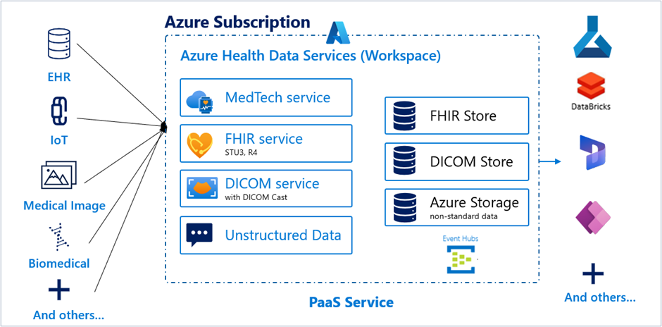
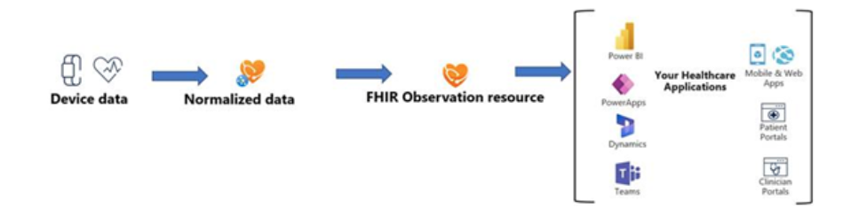

With all of this data being collected, where does the data go? How can medical staff interact with the data? Learn from the data? Plan patient care using the data? Will practitioners be able to ingest and use unstructured data and structured data?

Today, there are no clear standards for IoT data models, so it's difficult to achieve uniformity and standardization of IoT data without the tools available from MedTech service. Azure Health Data Services enables the ingestion and normalization of this data to ensure interoperability.

> [!div class="mx-imgBorder"]
> 

## MedTech and Azure Event Hubs

Azure Health Data Services enables the optional use of Logic Apps and Event Hubs to ensure data received from IoT devices is appropriately stored or connected across the cloud. Example use cases using the Event Hubs include:

-   An analytics expert can analyze patient records to build machine-learning driven rules into workflows.

-   An insurance claims manager may monitor patient activity and wellness trends following a major health event

## IoT data normalization and transformation

Transforming data from any device (medical device, wearables, sensors) to FHIR is possible with Azure Health Data Services MedTech Service. In the example below, we can observe the typical steps for data transfer from an IoT device to healthcare applications.

> [!div class="mx-imgBorder"]
> 

Starting from the left we start with messages that might be generated by an IoT device such as a smart watch or heart monitor. 

The organization requesting this IoT data requires only the HeartRate measurement from the first message; but Systolic and Diastolic blood pressure information is requested from the second message.

The MedTech service transforms device data into a normalized schema. Using the example above, the role of the service would be to streamline data originally found written as "Heart Rate" (vs written as "HR") with associated values and associated with other clinical measures such as Systolic and Diastolic blood pressure information in the normalization process.

Normalized data is then grouped and transformed into a set of FHIR "observation" resources, as shown in the third column. The first observation resource contains HeartRate information, and the second observation contains two different components: one for Systolic measurement and the other for Diastolic measurement.

The MedTech service can be configured to work with any IoT device by building appropriate device and FHIR mapping templates for them. Some examples of devices that have been used with this IoT Connector solution include Fitbit, Apple Watch, Garmin, blood pressure cuffs, scales, glucometers, inhalers, pulse oximeters, etc.

## Sample reference architecture

The sample reference architecture below demonstrates the ingress and egress of data from an IoT device (like a smart watch or scale) into Azure Health Data Services via MedTech service. Once ingested, the data can be normalized in FHIR and transformed for a wide range of uses across the broader Microsoft cloud from scheduling, eventing and analytics to machine learning and beyond. As shown below, the IoT data from multiple device types egresses from Azure Health Data Services through connectors to these first and third party services. 

> [!div class="mx-imgBorder"]
> 
