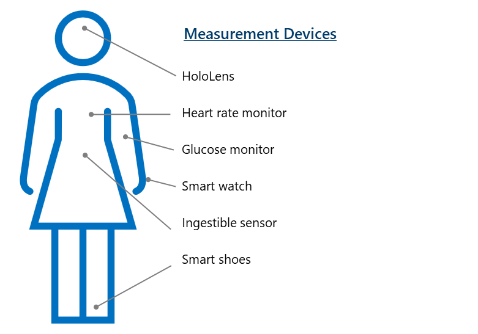

Microsoft enables the ingestion of IoT device data for various health use cases in the cloud spanning analytics, use in applications, wellness trend indication, and more.

Wearable devices can help monitor key metrics that enable health entities to better monitor and plan patient care. Interoperability facilitates personalized, distributed care through IoT devices by allowing organizations to convert data into action. The proliferation of connected IoT devices enables unprecedented volumes of data to be captured. To make meaning of that data and incorporate it into workflows for health, interoperable systems must separate the signal from the noise.

Some devices produce high velocity data, while others will share low velocity data. High velocity data such as continuous near real-time vitals produces data at such a rapid pace, it likely needs special processing to allow it to be useable. Low velocity data, such as weekly weigh-ins, still needs to be processed, but the lower volume is easier to work with.

Numerous systems and devices can exchange messaging in near real-time and enable:

-   Proactive patient care management with analytics

-   Patient feedback through mobile devices

-   Changes to payor risk structures

-   Prevention of critical equipment downtime

> [!div class="mx-imgBorder"]
> 

Other IoT measurement devices might include:

-   Handheld devices

-   Wearables

-   Pacemakers

-   Connected inhalers

-   Ventilators

-   Electrocardiogram

-   Ultrasound

-   Thermometers

-   Other connected devices

With IoT devices, patients may see improved outcomes, especially with managing chronic conditions. While the best way to remediate most chronic conditions is often with activity, diet, and medications, it's evident that the top categories can also all benefit from the utilization of a wide range of IoT devices.

Proactive monitoring and (near) real-time analytics can be utilized to improve patient care for the most common of health conditions. Given the average cost of doctor visits, inpatient stays and outpatient emergency visits, IoT device utilization may yield improved health outcomes at scale.

> [!div class="mx-imgBorder"]
> 

