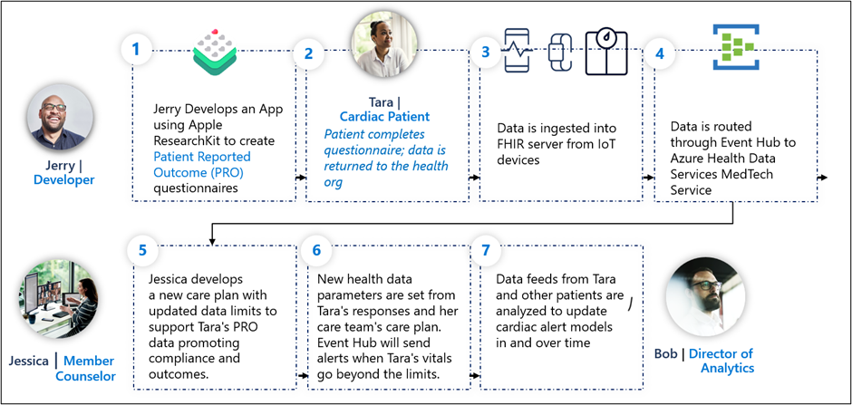
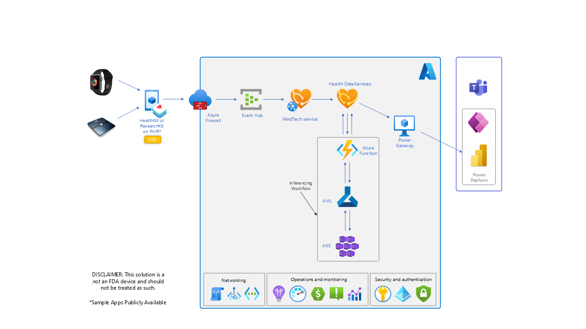

Another IoT (internet of things) use case involves the utilization of open-source frameworks like Apple ResearchKit to easily create visual consent flows, real-time dynamic active tasks, and surveys using customizable modules.

Partners and customers can build a patient-facing interface created and customized for Tara based on self-reported outcomes, enabling Jessica to capture patient sentiment in a structured and near real-time way. The frequency and accuracy of the data enables Jessica to provide proactive vs. reactive intervention and support the aim of reducing the chance of another cardiac patient admission for Tara. The information is shared in compliance with HIPAA regulations, and once de-identified, the data becomes part of larger, centralized datasets that can be used for clinical research.

The process flow is as follows:

> [!div class="mx-imgBorder"]
> 

## Reference architecture

The sample reference architecture below demonstrates the flow of data specific to the Apple ResearchKit and HealthKit integration.

> [!div class="mx-imgBorder"]
> 