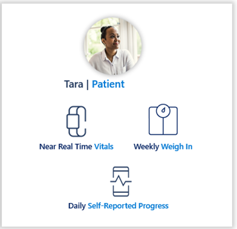
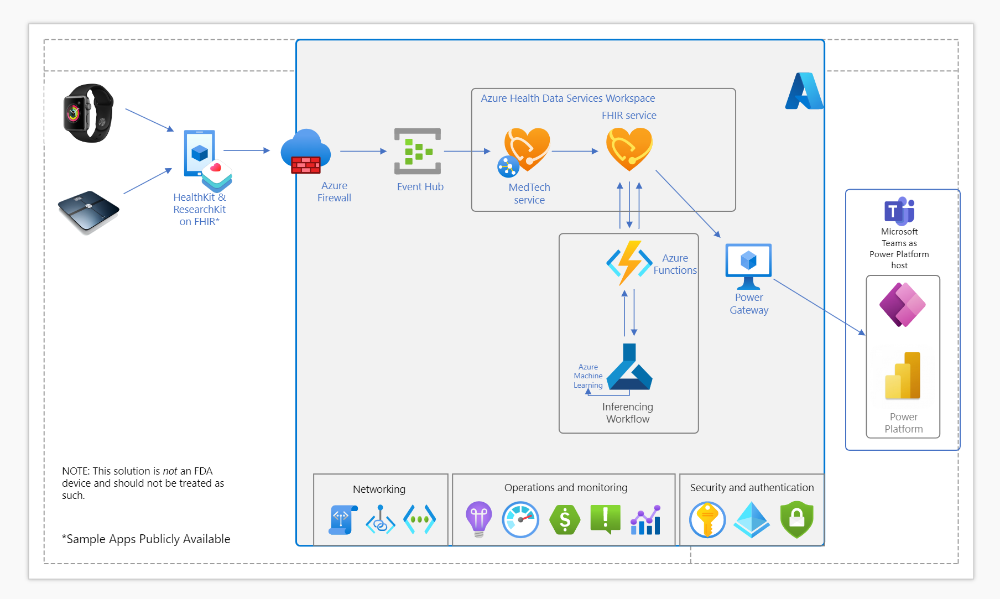

Imagine a scenario where a patient with a chronic condition requires monitoring of contributing factors that influence her well-being while managing this chronic condition. Prior to IoT devices, the patient would be inconvenienced with multiple visits with an overworked provider, take their own vitals (which is prone to human error), or manage their condition without the benefit of regular monitoring.

With devices such as smart scales, smart watches and more, the patient can wear a device or step on a scale, and the data will be reported to whatever provider has been configured. Eventing, made possible by Azure Health Data Services, can enable the patient and her provider as they work to spot trends early on or look for abnormalities and respond appropriately. By focusing on creating the tools that enable such reminders, or "nudges," Azure Health Data Services can empower providers to improve patient outcomes.

> [!div class="mx-imgBorder"]
> 

In the DICOM section, we highlighted medical image querying and cohort identification to improve the case for a patient named Mary. Here, our scenario is focused on creating reminders or "nudges" for a cardiac patient, Tara. In this use case, the nudges are directed to a member counselor for Fabrikam Insurance, Jessica.

Microsoft provides the infrastructure for partners to build solutioning on our stack. To enable sending reminders or nudges to Jessica regarding Tara's wellness, the care team would determine the type of health information that should be monitored (that is, heart rate, weight), allowing the payor's team to decide what data from the FHIR record will be pulled into the model.

| Data Architect  | Director of Analytics  | Chief Clinical Officer  |
|---|---|---|
| Decide what data from the FHIR record will be pulled into the model  | Analyze patient records to build an ML-driven alert rule into Dr. Jerry’s workflow | Ensures the appropriate alert thresholds are configured   |
| Structure and map data from IoT devices to FHIR resources to enable data analytics in the MS cloud  |   | Monitor metrics to reduce alert fatigue  |

Once the IoT device data feed is established and Microsoft Teams is set up for notifications, Jessica can receive a nudge if Tara's wellness recovery trend changes, and reach out to Tara for follow-up, or better understand disparities from FHIR records. Tara knows that her recovery journey is being supported with advanced models looking for patterns in the monitored data.

The sample reference architecture below demonstrates the steps involved in taking data from IoT devices and disseminating the nudges described above.

> [!div class="mx-imgBorder"]
> 
