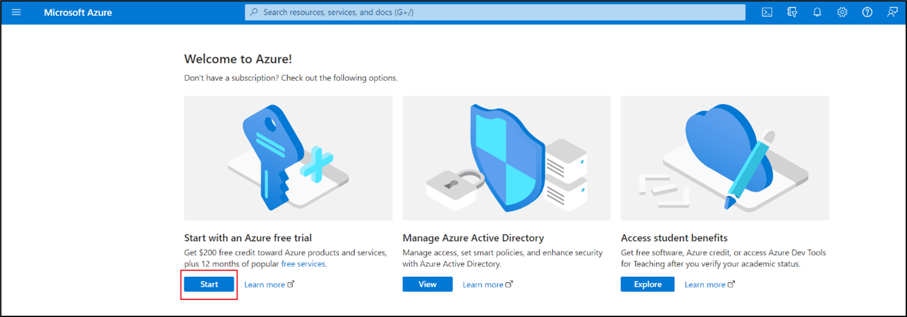
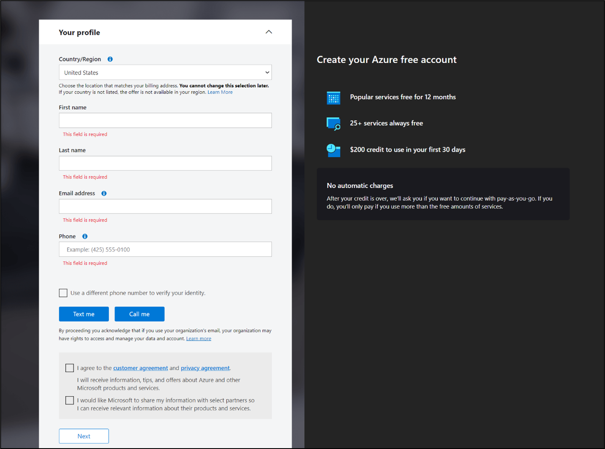
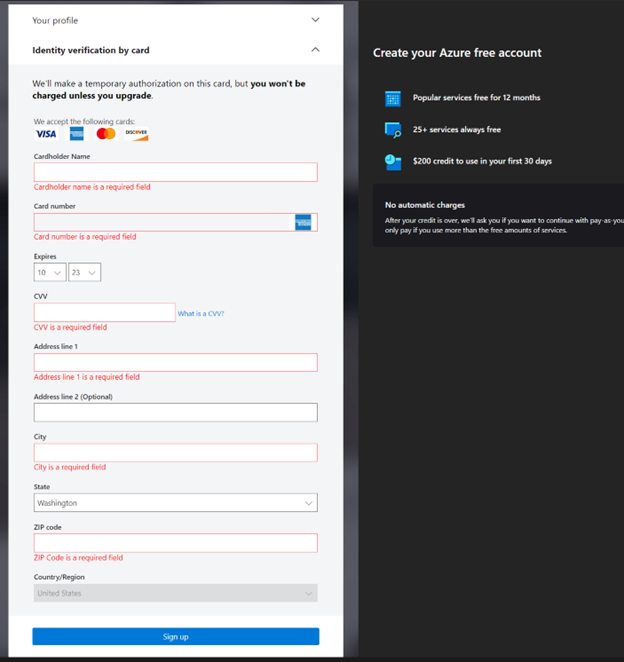
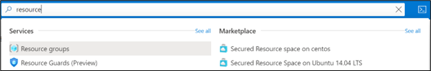
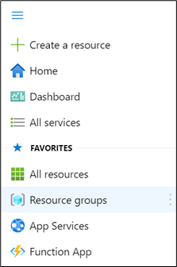
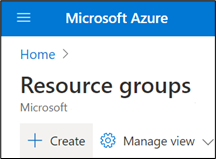
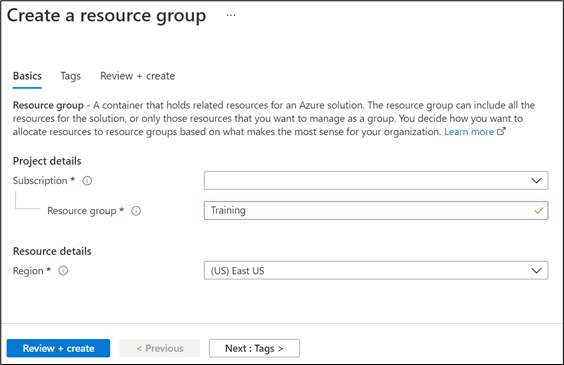
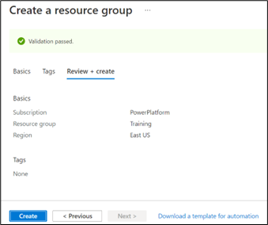
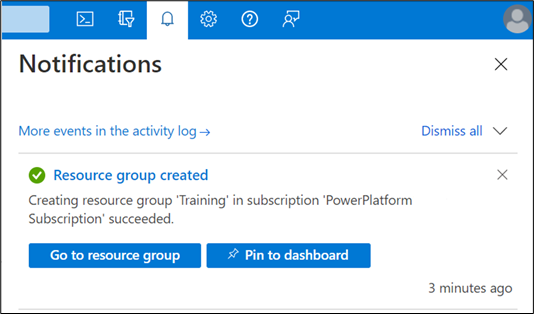

An active Azure subscription is required in your Microsoft 365 tenant to activate certain Microsoft Cloud for Retail components. This module explains the steps to obtain a free trial Azure subscription and create a resource group that you'll use in subsequent labs.

> [!NOTE]
> The Azure Terms of Use agreement limits free trial activation only for a user who's new to Azure. If you've already had any other type of Azure subscription, you won't be able to activate a free trial.

## Task 1: Obtain a trial Azure subscription

In this task, you'll obtain a trial Azure subscription.

1. Sign in to [Microsoft Azure](https://portal.azure.com/?azure-portal=true) with the new credentials that you obtained while creating a new tenant in the previous tasks. Then, select the **Start** button.

    > [!div class="mx-imgBorder"]
    > 

1. A sign-up page will open in a new tab page in the browser. The details that you entered while creating the new tenant in the previous tasks will be auto populated on the sign-up screen. Verify the profile details, provide the phone number, and then validate it by text or call. Accept the customer agreement and then select the **Next** button.

    > [!div class="mx-imgBorder"]
    > 

1. Provide your credit card details and then select **Sign up**.

    > [!Note]
    > A credit card is only required to verify your identity. You won't be charged unless you upgrade your subscription. For more information, see [Avoid charges with your Azure free account](/azure/cost-management-billing/manage/avoid-charges-free-account/?azure-portal=true).
    >
    > [!div class="mx-imgBorder"]
    > 

Congratulations, you have successfully set up your trial Azure subscription.

## Task 2: Create a resource group

In this task, you'll create a resource group to use in subsequent labs.

> [!NOTE]
> It might take one to two hours for the Azure subscription to appear after creation.

1. In [Microsoft Azure](https://portal.azure.com/?azure-portal=true), search for **Resource groups**.

    > [!div class="mx-imgBorder"]
    > 

1. You can also find Resource groups in the upper-left flyout menu.

    > [!div class="mx-imgBorder"]
    > 

1. Select **Create**.

    > [!div class="mx-imgBorder"]
    > 

1. Enter the following values for your new resource group:

    - **Subscription** - Select your Azure subscription.

    - **Resource group** - Enter a new resource group name (for example, Training).

    - **Region** - Select an Azure location.

1. Select **Review + create**.

    > [!div class="mx-imgBorder"]
    > 

1. Select **Create** when validation has passed.

1. Select **Create**. It will take a few seconds to create a resource group.

    > [!div class="mx-imgBorder"]
    > 

1. Select **Refresh** from the top menu to refresh the resource group list, and then select the newly created resource group to open it. Or select **Notification** (the bell icon) from the top and then select **Go to resource group** to open the newly created resource group.

    > [!div class="mx-imgBorder"]
    > 

Congratulations! You've successfully created a resource group in your Azure subscription. You'll use this resource group when creating Azure resources, such as the Azure Blob storage.
