Seamless Customer Service capability relies on various components from Dynamics 361. To use this capability, we'll need to obtain the following trial licenses:

- Omnichannel Customer Service Messaging

- Power Virtual Agent

- Dynamics 365 Commerce with e-Commerce

## Task 1: Obtain Dynamics 365 e-Commerce sandbox environment

In this task, we'll provide the steps for your organization to request a Dynamics 365 e-commerce Sandbox environment that would be required to be used as part of Seamless Customer Service Lab. There's a cost associated for this environment and the details are in [Discounted SKUs](https://isv360.blob.core.windows.net/public/Discounted%20SKUs.pdf/?azure-portal=true).

1. Navigate to [Partner Sandbox License Request](https://experience.dynamics.com/requestlicense/?azure-portal=true).

1. Fill in the required details and select **Dynamics 365 eCommerce and Cloud Scale Unit Partner Sandbox** for license.

    > [!div class="mx-imgBorder"]
    > [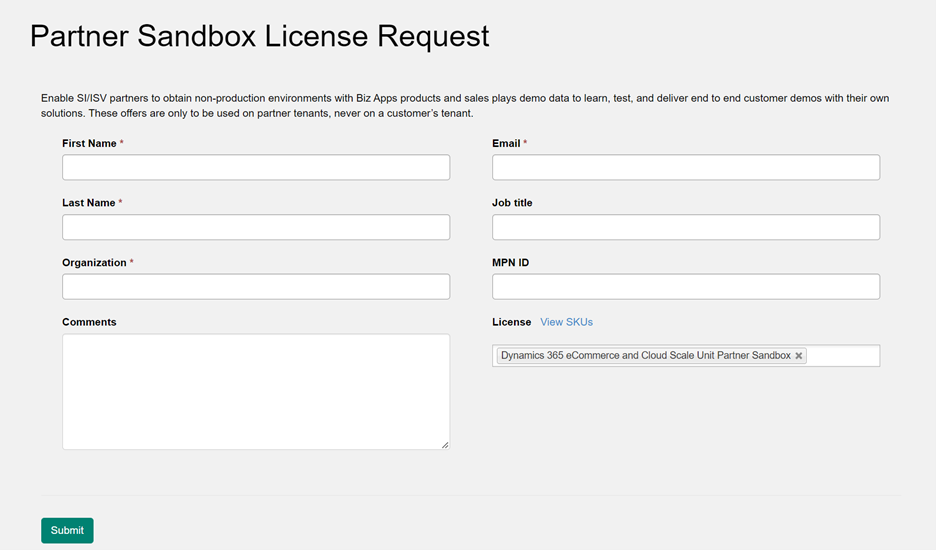](../media/partner.png#lightbox)

1. Select **Submit**.

## Task 2: Obtain Dynamics 365 Customer Service Digital Messaging add-on trial

In this task, we'll add the necessary add-on to deploy and use the Omnichannel Administration App as part of Seamless Customer Service Lab.

1. Go to the [Microsoft 365 Admin Center](https://admin.microsoft.com/?azure-portal=true).

1. Go to **Billing** > **Purchase Services** and select **Add-ons** under "View by category". You may also use the search box. Find the Customer Service Digital Messaging add-on and select **Details**.

    > [!div class="mx-imgBorder"]
    > [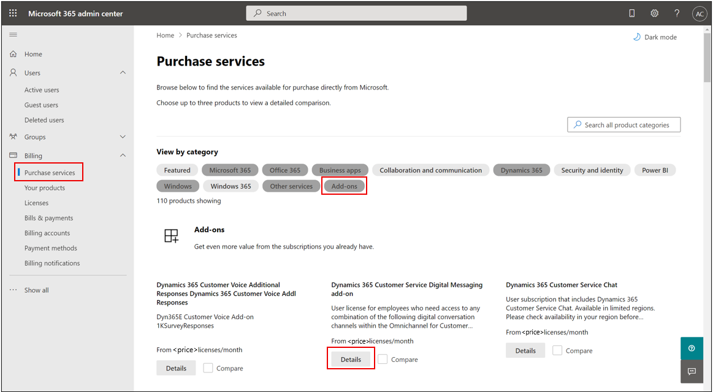](../media/purchase.png#lightbox)

1. Select **Start free trial**.

    > [!div class="mx-imgBorder"]
    > 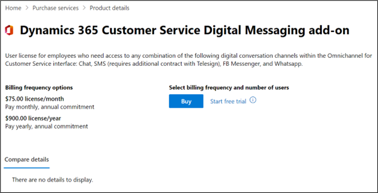

1. Select **Try now**.

    > [!div class="mx-imgBorder"]
    > 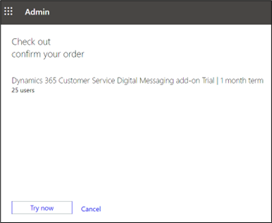

1. Select **Continue** to return to the admin center.

    > [!div class="mx-imgBorder"]
    > 

1. Assign the newly acquired Customer Service Digital Messaging add-on trial license to your user by going to **Users** > **Active Users**, select your user and select **Manage product licenses**.

    > [!div class="mx-imgBorder"]
    > 

1. Check the box for **Dynamics 365 Customer Service Digital Messaging add-on** license and select **Save changes**.

    > [!div class="mx-imgBorder"]
    > 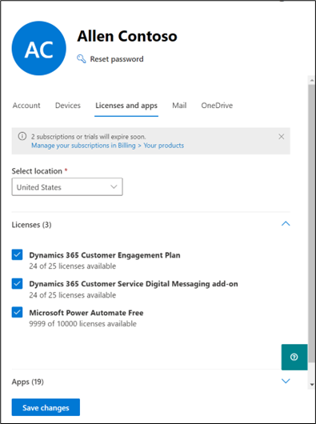

    > [!Important]
    > It may take up to **24 hours** for Omnichannel for Customer Service to become available in your Dynamics 365 apps after you obtain the trial license.

## Task 3: Obtain Dynamics 365 Intelligent Order Management trial

In this task, we'll add the necessary add-on to deploy and use the Intelligent Order Management App as part of Intelligent Order Management Lab.

1. Go to the [Microsoft 365 admin center](https://admin.microsoft.com/?azure-portal=true).

1. Go to **Billing** > **Purchase Services** and search for "Intelligent Order Management Trial" in the search box, then select **Details**.

    > [!div class="mx-imgBorder"]
    > 

1. Select **Start free trial**.

    > [!div class="mx-imgBorder"]
    > 

1. Select **Try now**.

    > [!div class="mx-imgBorder"]
    > 

1. Select **Continue** to return to the admin center.

    > [!div class="mx-imgBorder"]
    > 

1. Assign the newly acquired Dynamics 365 Intelligent Order Management trial license to your user by going to **Users** > **Active Users**, select your user and select **Manage product licenses**.

    > [!div class="mx-imgBorder"]
    > 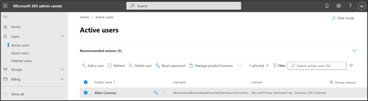

1. Check the box for **Dynamics 365 Intelligent Order Management vTrial** license and select **Save changes**.

    > [!div class="mx-imgBorder"]
    > 

    > [!Important]
    > It may take up to **24 hours** for Dynamics 365 Intelligent Order Management to become available in your Dynamics 365 apps after you obtain the trial license.

## Task 4: Obtain Microsoft Office E5 trial

In this task, we'll add the necessary Office 365 trial to use Outlook and Microsoft Teams in the later labs.

1. Go to the [Microsoft 365 Admin Center](https://admin.microsoft.com/?azure-portal=true).

1. Go to **Billing** > **Purchase Services** and select Office 361. Scroll down to Office 365 E5 and select **Details**. You may also use the upper right search box.

    > [!div class="mx-imgBorder"]
    > ](../media/purchase-2.png#lightbox)

1. Select **Start free trial**.

    > [!div class="mx-imgBorder"]
    > 

1. Enter a **valid phone number** to prove you're not a robot.

    > [!div class="mx-imgBorder"]
    > 

1. Select **Try now** to start your free trial.

    > [!div class="mx-imgBorder"]
    > 

1. Select **Continue** to return to the admin center.

    > [!div class="mx-imgBorder"]
    > 

1. Assign the newly acquired Office 365 E5 trial license to your user by going to **Users** > **Active Users**, select your user and select **Manage product licenses**.

    > [!div class="mx-imgBorder"]
    > 

1. Select the **Office 365 E5** license and select **Save changes**.

    > [!div class="mx-imgBorder"]
    > 

## Task 5: Obtain Microsoft Cloud for Retail trial license

In this task, we'll request and add the Microsoft Cloud for Retail add-on to deploy and use the capabilities it provides.

1. To obtain a trial license for Microsoft Cloud for Retail, navigate to the following Microsoft Form and fill out the required information: [Trial Request for Microsoft Cloud for Retail](https://aka.ms/MCRTrial/?azure-portal=true).

    > [!div class="mx-imgBorder"]
    > 

1. You'll then receive an email with a URL that contains an offer code that you can use to claim a 30-day trial license for Microsoft Cloud for Retail. Once you receive that email, copy the URL, open a new tab while logged into your tenant, and paste the URL.

    > [!div class="mx-imgBorder"]
    > 

1. Enter the **email address** associated with your tenant and select **Next**.

    > [!div class="mx-imgBorder"]
    > 

1. Select **Sign In**.

1. Select **Try now**.

    > [!div class="mx-imgBorder"]
    > 

1. Select **Continue**.

    > [!div class="mx-imgBorder"]
    > 

## Task 6: Deploy Dynamics 365 eCommerce Sandbox environment and enable power platform integration

Once you've procured the Dynamics 365 e-Commerce Partner sandbox SKU, follow the below steps. The steps detail how to deploy a Dynamics 365 Commerce Sandbox environment and enable Power Platform integration:

1. To deploy a new environment, follow the steps mentioned in [Deploy a new environment - Finance & Operations](/dynamics365/fin-ops-core/dev-itpro/deployment/deployenvironment-newinfrastructure/?azure-portal=true).

    - Select demo data. We'll use it in later modules.

    - Enable Power platform integration during the deployment as mentioned in [Enable the Microsoft Power Platform integration - Finance & Operations](/dynamics365/fin-ops-core/dev-itpro/power-platform/enable-power-platform-integration/?azure-portal=true). This will create a new power platform environment to use in the next task.

1. Once the environment is deployed, initialize the commerce scale unit as mentioned in [Initialize Commerce Scale Unit (cloud) - Finance & Operations](/dynamics365/fin-ops-core/dev-itpro/deployment/initialize-retail-channels?azure-portal=true#initialize-commerce-scale-unit-as-part-of-a-new-environment-deployment).

## Task 7: Deploy Dynamics 365 apps

In this task, we'll install Microsoft Dynamics 365 Intelligent Order Management on the newly created environment. These apps are required to do the Intelligent Order Management lab.

1. In the [Power Platform admin center](https://admin.powerplatform.com/?azure-portal=true), expand **Resources** and go to **Dynamics 365 apps** to search for available apps at the tenant level.

    > [!div class="mx-imgBorder"]
    > 

1. In the upper right search bar, search for Dynamics 365 Intelligent Order Management Trial and select **Install**.

    > [!div class="mx-imgBorder"]
    > 

1. Select your newly created trial environment from the drop-down menu, agree to the terms, and select **Install**.

    > [!div class="mx-imgBorder"]
    > 

1. Go back to **Dynamics 365 apps** under Resources and search for **Customer Service**.

    > [!div class="mx-imgBorder"]
    > 

1. Select your newly created trial environment from the drop-down menu, agree to the terms, and select **Install**.

    > [!div class="mx-imgBorder"]
    > 

1. Track your installs on your environment's Dynamics 365 apps page. These installs will take several hours to complete.

## Task 8: Configure Omnichannel for Customer Service

In this task, you'll configure Omnichannel for Customer Service to deploy and use the Omnichannel for Customer Service application in Seamless Customer Service lab.

1. Go to the [Power Platform admin center](https://admin.powerplatform.microsoft.com/?azure-portal=true).

1. Expand **Resources** on the left navigation bar and select **Dynamics 365 apps**.

    > [!div class="mx-imgBorder"]
    > 

1. Search for **Omni**, select **Omnichannel for Customer Service**, and select **Manage**.

    > [!Note]
    > If you do not see the application available, it may not yet be reflected after adding the digital messaging add-on trial license in the previous exercise. It may take up to 24 hours to become available in the Dynamics 365 apps list.

    > [!div class="mx-imgBorder"]
    > 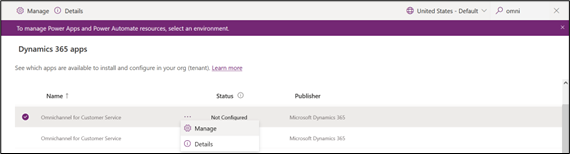

1. Select **OK** to navigate to the Omnichannel for Customer Service administration center.

    > [!div class="mx-imgBorder"]
    > 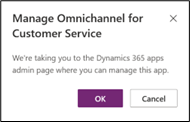

1. In the new window, select **+ Add** environment.

    > [!div class="mx-imgBorder"]
    > 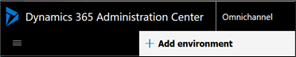

1. Select your environment from the drop-down menu and select **Next**.

1. Under Chat, toggle **Yes** to add Chat.

    > [!div class="mx-imgBorder"]
    > 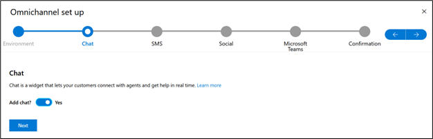

1. Select **Next** all the way to **Confirmation** and then select **Finish**. You only need to enable the chat channel for setup.

    > [!div class="mx-imgBorder"]
    > 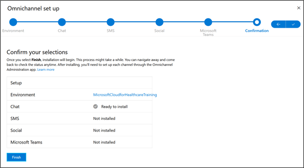

1. Select **Finish** to kick off the installation. The installation will take several hours to complete. Once finished, you may proceed to the next task.

You successfully added the necessary trial licenses to your training environment. Once they have finished installing, you may proceed to the next exercise to configure the remaining prerequisite applications and deploy Microsoft Cloud for Retail.
