In this exercise, you'll create a trial Azure tenant and configure a trial Dynamics 365 Customer Insights environment in order to deploy the Retail Churn Model.

[Dynamics 365 Customer Insights](/ai/customer-insights/?azure-portal=true) is a part of Microsoft's customer data platform (CDP) that helps deliver personalized customer experiences. The platform's capabilities provide insights into who your customers are and how they engage with your platform. Unify customer data across multiple sources to get a single view of customers.

-   [Audience insights](/dynamics365/customer-insights/audience-insights/overview/?azure-portal=true) helps you transform your business into a customer-centric organization. Marketing, sales, and service professionals have the insights they need to personalize experiences. Connect data from transactional, behavioral, and observational sources to create a 360-degree customer view. See results faster with a CDP designed to deliver insights that can be acted upon.

-   [Retail channel churn predictive model:](/dynamics365/industry/retail/retail-use-churn-prediction/?azure-portal=true) Retail channel churn predictive model, a key feature of Unified customer profile, uses an AI-based model to help omnichannel retailers use cross-channel data to assess the chance that a customer will churn---stop actively buying.

## Task 1: Create Customer Insights environment

In this task, you'll create a new trial Customer Insights sandbox environment. To set **Customer intelligence** up correctly, you must first create a Customer Insights sandbox environment and connect it to your Dataverse environment with no Data Sources specified. Once connected, you'll go through [Solution Center](https://solutions.microsoft.com/?azure-portal=true) and deploy **Customer intelligence** from **Unified customer profile**, specifying the Customer Insights environment that you create in this task.

1.  Using an In-Private or Incognito window, navigate to [Customer Insights](https://dynamics.microsoft.com/ai/customer-insights/?azure-portal=true) and select try for free.

	> [!div class="mx-imgBorder"]
	> 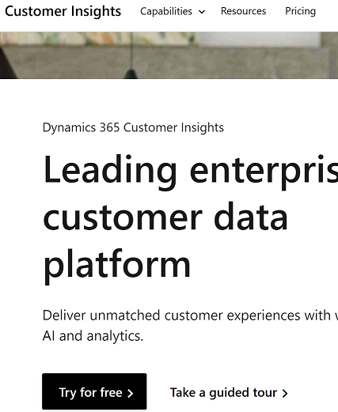

1.  Sign in with the account created as part of Lab 1: Seamless customer experience -Training environment preparation, Task 1.

1.  Select **Audience insights** as your focus.

	> [!div class="mx-imgBorder"]
	> 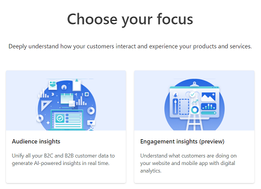

1.  Your screen would look like this with Audience Insights selected:

	> [!div class="mx-imgBorder"]
	> 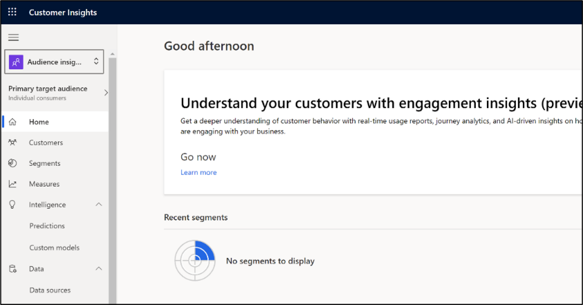

1.  In the top right corner of the screen, select the environment name and then select **+ New** to create a new environment.

	> [!div class="mx-imgBorder"]
	> 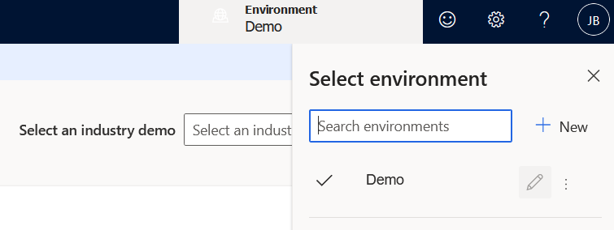

1.  Fill out the appropriate fields and select **Next**.

    1.  **Name**: <<UserName\>\> Retail Churn

    1.  **Choose your business**: Individual consumers (B-to-C)

    1.  **Region**: West US

	> [!div class="mx-imgBorder"]
	> 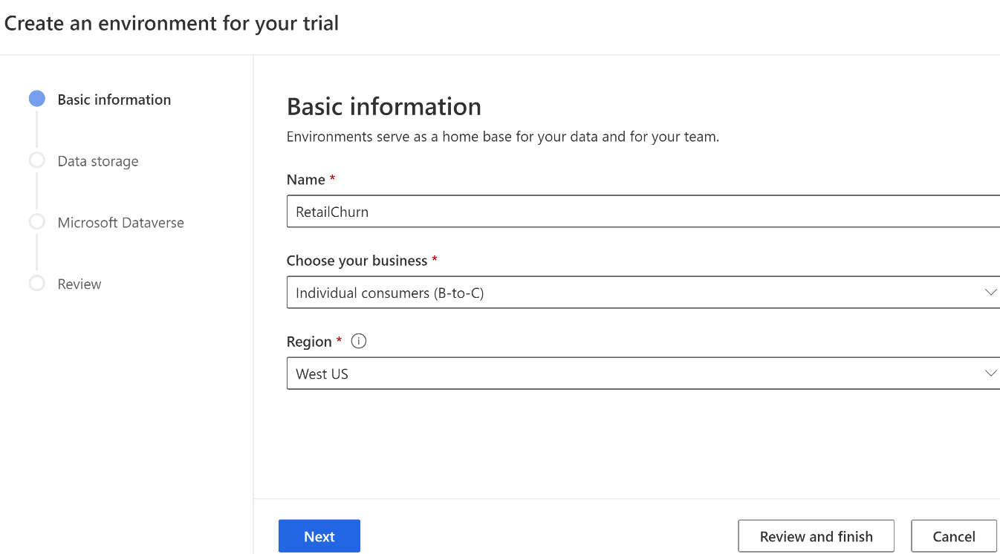

1.  Select **Review and finish**.

	> [!div class="mx-imgBorder"]
	> 

1.  Wait for the environment to be created.

	> [!div class="mx-imgBorder"]
	> 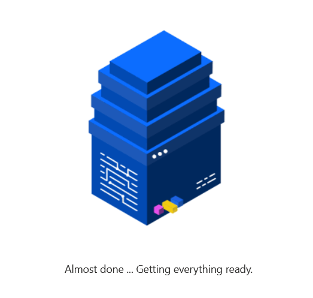

**Congratulations!** You've successfully created a Customer Insights environment.

## Task 2: Deploy Retail Churn Model

1.  Open a **new tab** in our internet browser and navigate to the [Microsoft Cloud Solution Center](https://solutions.microsoft.com/?azure-portal=true).

1.  Expand **Retail** and navigate to **Unified customer profile**. Check **Add** next to Unified customer profile and then select **Deploy**.

	> [!div class="mx-imgBorder"]
	> 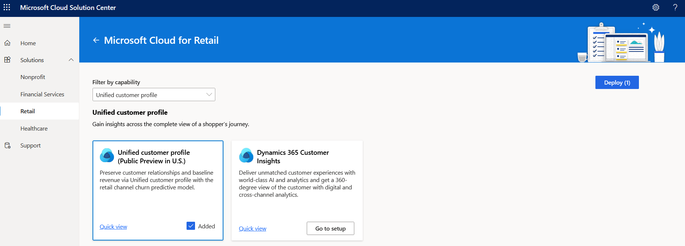

1.  Select the **Customer Insights Environment** that you created in the previous task, **provide a name** for your deployment, **agree** to the terms and conditions, and select **Next**.

	> [!div class="mx-imgBorder"]
	> 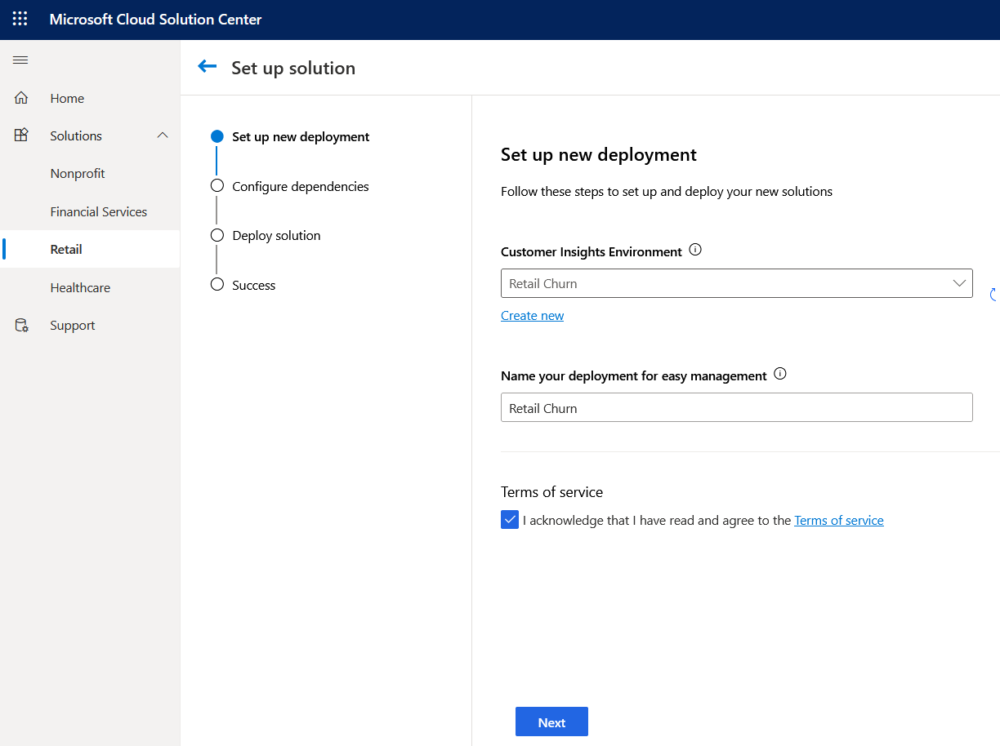

1.  Select Deploy to deploy the Retail Churn model to your Customer Insights environment.

	> [!div class="mx-imgBorder"]
	> 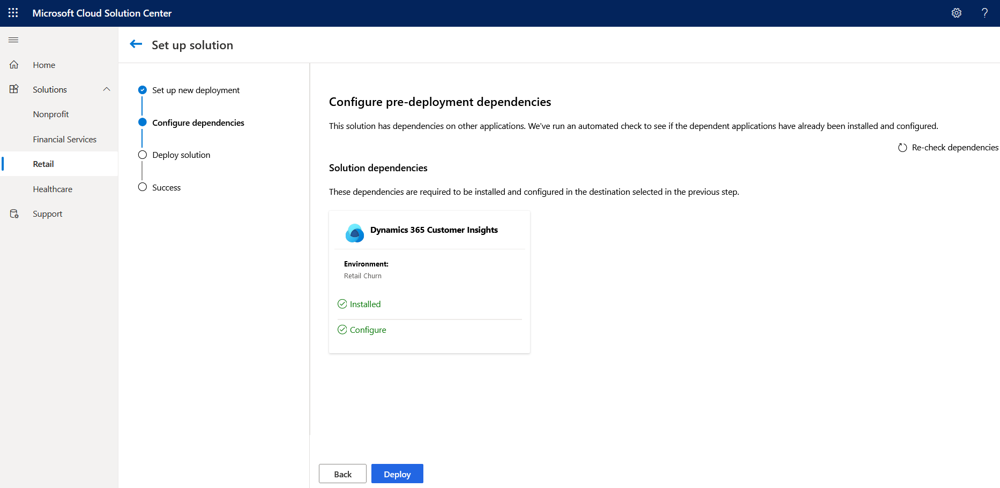

1.  Deployment will take several minutes to complete.

	> [!div class="mx-imgBorder"]
	> 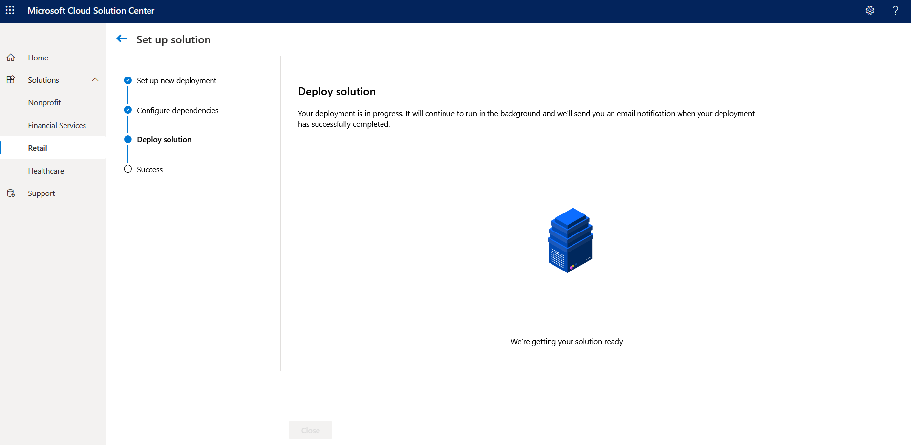

1.  Once the deployment has completed, select **Close**.

	> [!div class="mx-imgBorder"]
	> 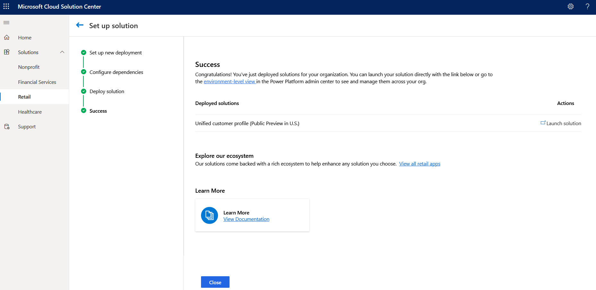

**Congratulations!** You've successfully deployed the Retail Churn Model.
