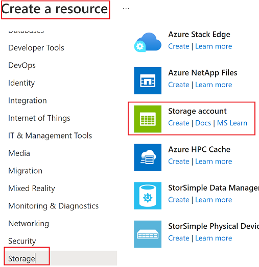
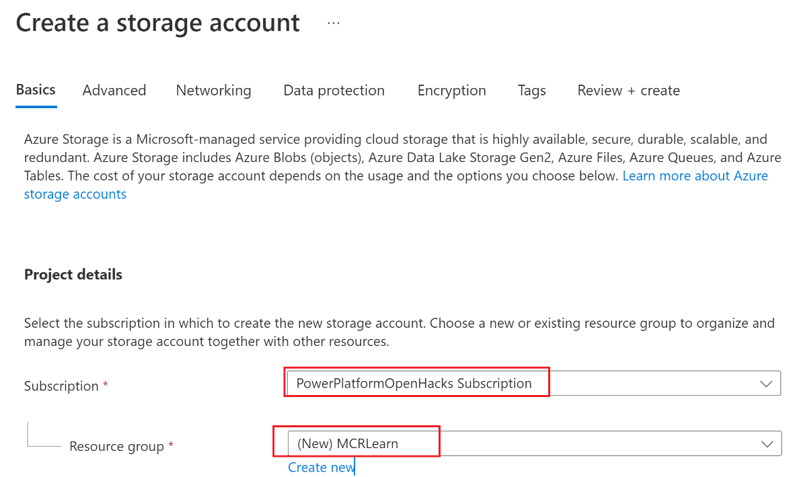
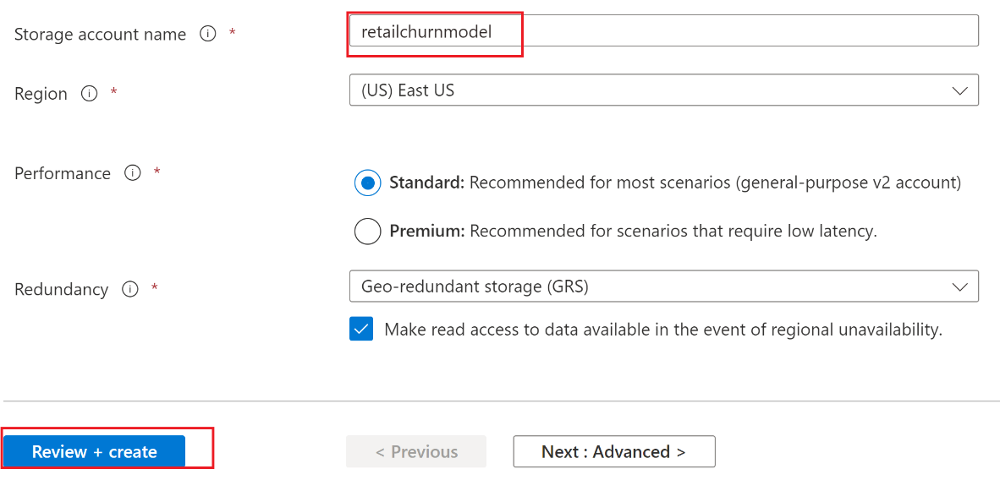
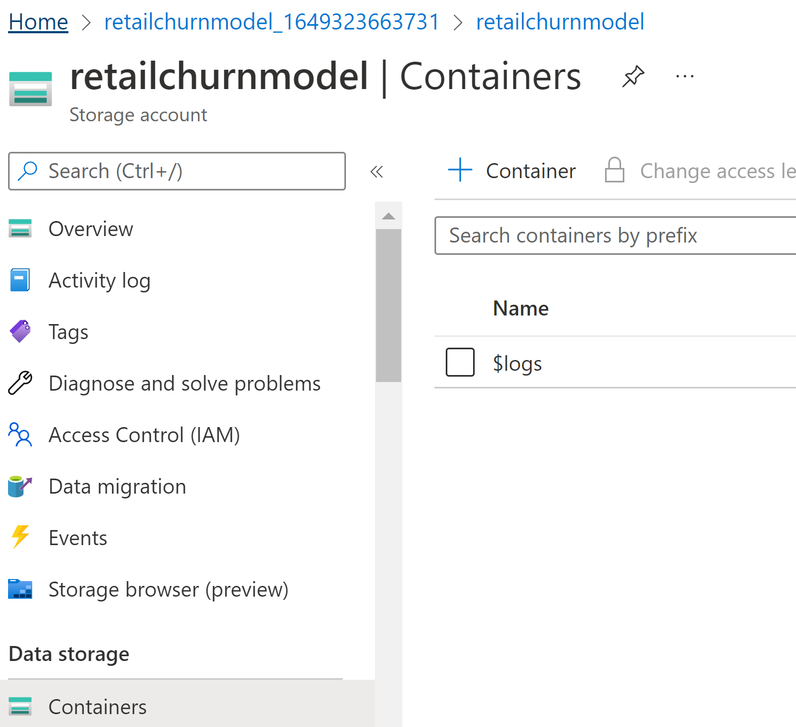
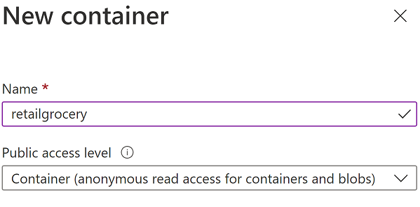
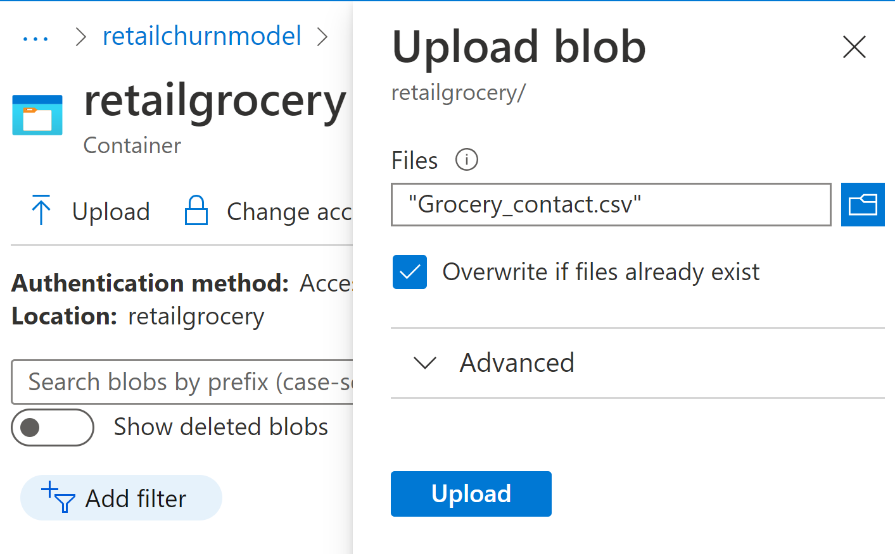
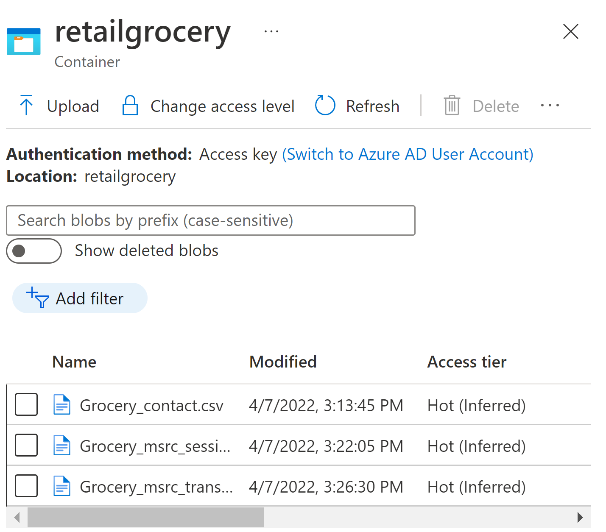

In this exercise, you'll create a storage account and a container. Further, you'll upload the sample data input files (stored in MS learn repository for this exercise) that will be used to generate data insights for the customer using the retail churn model

## Task 1: Create storage account

1.  Navigate to [Azure portal](https://ms.portal.azure.com/?azure-portal=true) and sign in with the credentials you're using for the lab.

1.  Select **Create a resource** and create a **Storage account**.

	> [!div class="mx-imgBorder"]
	> 

1.  Select the subscription you would use for this lab. For the resource group, select **Create New** to create a new resource group.

	> [!div class="mx-imgBorder"]
	> 

1.  Provide a storage account name, for example "retailchurnmodel" and then select **Review and create**. (Make a note of this storage account name as this will be needed later in the exercise)

	> [!div class="mx-imgBorder"]
	> 

## Task 2: Uploaded sample data input files to a container in storage account

1.  Once storage account is created, create container in the storage account by selecting **+Container**.

	> [!div class="mx-imgBorder"]
	> 

1.  Choose name as **"retailgrocery"** and public access level as **Container (anonymous read access for containers and blobs)**.

	> [!div class="mx-imgBorder"]
	> ]

1.  Upload all the three files from MS learn repository to container: Grocery\_contact.csv, Grocery\_msrc\_session.csv, Grocery\_msrc\_session.csv.

	> [!div class="mx-imgBorder"]
	> 

1.  Once files are uploaded to blob, it will appear as below:

	> [!div class="mx-imgBorder"]
	> 

**Congratulations**! You've successfully created a storage account and uploaded the sample data input files to the storage account.