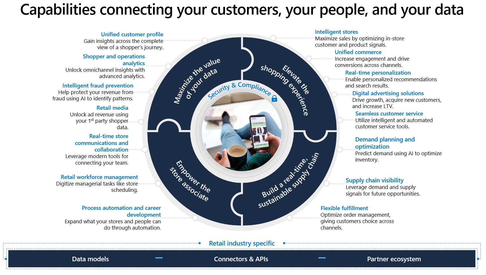
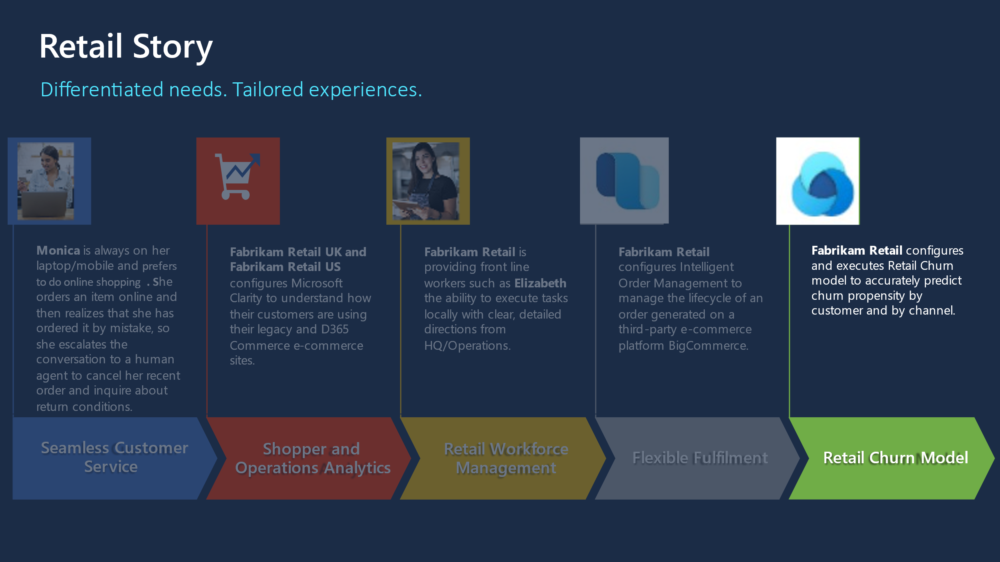

Unified customer profile is a key capability of Microsoft Cloud for Retail. In some ways, it's where the data story comes together. Unified customer profile can help you gain insights across the complete view of a shopper's journey.

With Unified customer profile, you can gain a 360-degree perspective of the customer in a clear and intuitive way. With this feature, you can provide personalized experiences, reveal important opportunities, prevent potential loss or churn, and improve customer satisfaction.

Unified customer profile bolsters unification and allows you to:

-   Bring multiple identities together to create a 360-degree view of the customer through AI-powered identity resolution.

-   Ingest multiple types of data, behaviors, and customer sentiment in real time through more than 500 built-in connectors.

It also fosters unique enrichment, where you can:

-   Gain a 360-degree view of the customer with proprietary audience intelligence from Microsoft Graph.

-   Apply cross-channel behavior to complete the picture of your customer.

Furthermore, Unified customer profile gives you better access to customer insights so that you can:

-   Gain more nuanced insights by combining digital analytics with customer profiles to create richer segments. Additionally, you can use churn models to understand churn risk at a glance.

-   Observe customer progress through each defined step of the journey, quickly identifying obstacles and opportunities.

-   Create custom reports and views based on real-time customer behavior data. You can also use built-in web and mobile analytics to predict customer needs.

> [!div class="mx-imgBorder"]
> 

## Learning objectives 

This module will focus on the retail story of Fabrikam Retail.

> [!div class="mx-imgBorder"]
> 

In the following exercises, you'll be playing the role of a system administrator and a developer.

In **Exercise 1**, you'll create a Microsoft Dynamics 365 Customer Insights environment, and then you’ll deploy **Unified customer profile** through the Solution Center. In **Exercise 2**, you'll import Fabrikam Retail's customer data from Microsoft Azure Blob Storage, generate a retail churn model, and then analyze the churn predictions.

### Prerequisites

To complete the exercises in this module, you’ll need to install  Dynamics 365 Customer Insights in your environment.
You’ll also need to ensure that you have at least Contributor permissions in Dynamics 365 Customer Insights. For more information, see [User permissions](/dynamics365/customer-insights/audience-insights/permissions/?azure-portal=true).

## Customer intelligence

Customer intelligence unifies important, relevant, and accurate customer information across multiple sources through Dynamics 365 Customer Insights. This solution empowers the agent to engage with customers based on relevant insights. Customer intelligence combines demographic information, financial measures, and attitudes to form financial segments and AI models. These insights help agents quickly understand the customer.
