In this exercise, you'll first create your Clarity project and configure the Clarity project and your website to complete the integration.

## Task 1: Sign into Microsoft Clarity and create your project

1.  Go to [Microsoft Clarity](https://clarity.microsoft.com/?azure-portal=true) and if you have a [Microsoft Account](https://account.microsoft.com/account/?azure-portal=true) either work or personal, Select **Sign in** or **Sign up**. If you don't have any, you can select [Microsoft Account](https://account.microsoft.com/account/?azure-portal=true) and create one for free. For the lab purposes you can use your work account since it's a free service.

	> [!div class="mx-imgBorder"]
	> 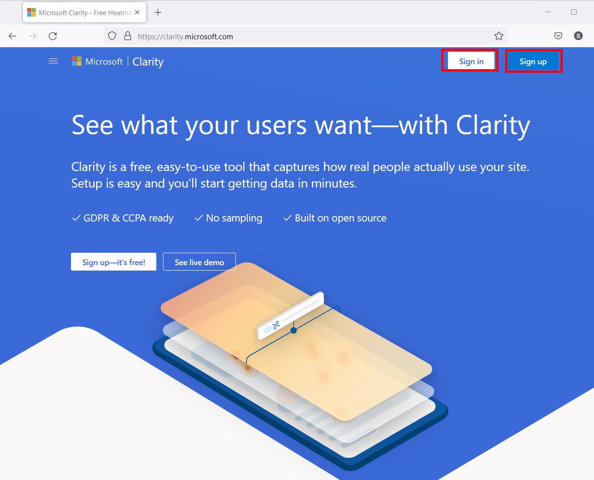

1.  Select **Sign in to Microsoft**.

	> [!div class="mx-imgBorder"]
	> 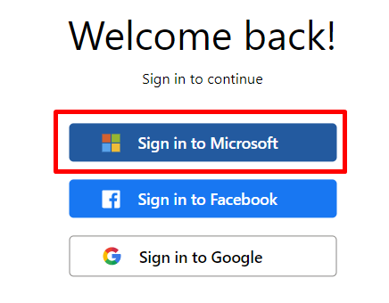

1.  You'll be welcomed with below pop up to **Add new project**. You can either use this one.

	> [!div class="mx-imgBorder"]
	> 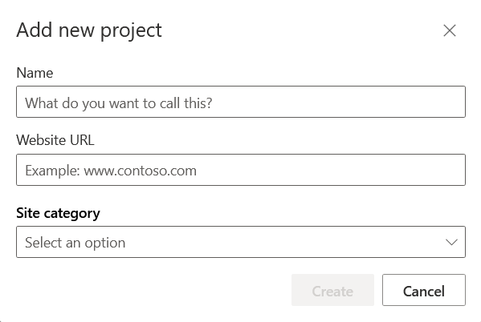

	Or select **Cancel** or **X** and use any **+Add new project** buttons marked below:

	> [!div class="mx-imgBorder"]
	> 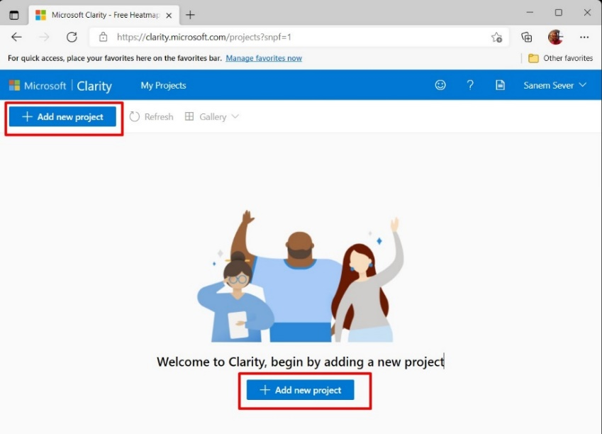

	The same pop-up window to **Add new project** will come from all options above.

1.  Start filling in the form on the pop-up window:

    1.  Pick a name for your Clarity project and type it to the **Name**.

    1.  Paste the **website URL** you already saved on Exercise 1, Task 2, Item 15.

    1.  Pick a website **category**. You can pick other for this sample application, but there are various other categories that you can pick from like, E-Commerce, SaaS, Blog, Marketing, Consulting, Media, Education, Community, Non-profit, Other.

    1.  Select **Create**.

	> [!div class="mx-imgBorder"]
	> 

1.  After you select **Create** you'll be forwarded to the **Setup** section. Copy the **Clarity tracking code** provided to you. We'll be using the code shared in the **Install tracking code manually** section to integrate clarity into our custom website.

	> [!div class="mx-imgBorder"]
	> 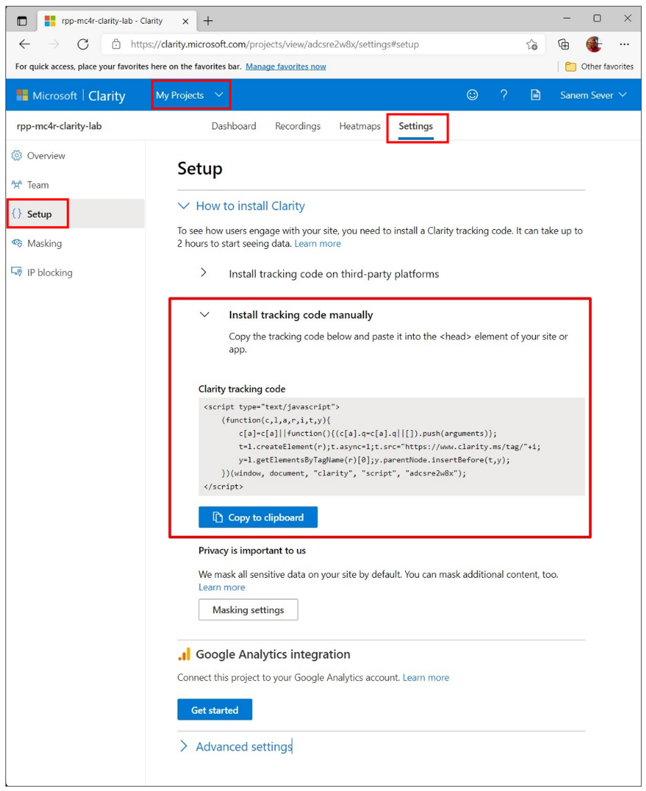

    *If you forget to copy the tracking code that is perfectly fine. You can go to **My Projects**, pick the project that you want to integrate with your website select **Settings** then from there select **Setup**. In the **How to install Clarity** expendable section you'll find the **tracking code** in **the Install tracking code manually** section.*

	> [!IMPORTANT]
	> Read the **warning** under the Install tracking code manually section, it states that the **data flow from your application to Clarity Portal** can take **up to 2 hours**. Therefore after performing all the steps in Exercise 2 we will continue with other labs and come back to Exercise 2 later by the time the data from your application is synced to Microsoft Clarity.

## Task 2: Embed/Install the Clarity tracking code to the custom website and redeploy the website

1.  Go back to VS Code and expand the **>Pages** sub directory and **>Shared** sub directory under it respectively and select **_Layout.cshtml**. Locate the **<HEAD\></HEAD\>** section. This is where you'll integrate the tracking code. Paste the tracking code as the last item in the **<HEAD\></HEAD\>** section as shown with the blue box on the below snapshot and save with **CTRL+S**.

	> [!div class="mx-imgBorder"]
	> 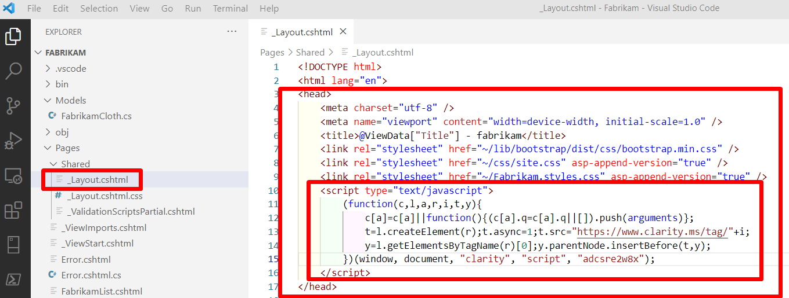

1.  Check locally whether the web application still works properly using **Terminal** section of VS Code. If you can't see the Terminal window, you can go to **View Menu** and select the **Terminal Menu item** to enable it.

	> [!div class="mx-imgBorder"]
	> 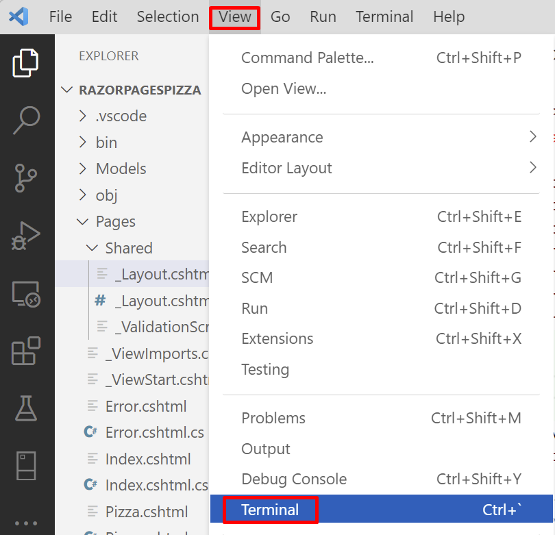

1.  Type `dotnet run` in the terminal screen and press enter to see the website building without an error after our change. The result will list local host URLs. You can select one and reach your website from local installation. You can press Ctrl+C to shut down the local instance.

	> [!div class="mx-imgBorder"]
	> 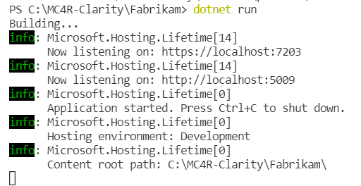

1.  To build and create the Clarity integrated website executables type `dotnet publish -c Release -o ./publish` and press enter.

	> [!div class="mx-imgBorder"]
	> 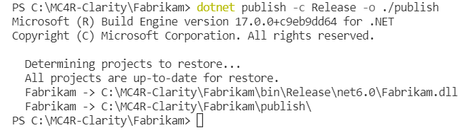

1.  To redeploy new version of the website, again go to **>publish** in the **EXPLORER** blade and right click, find **Deploy to Web App...** menu item and select.

	> [!div class="mx-imgBorder"]
	> 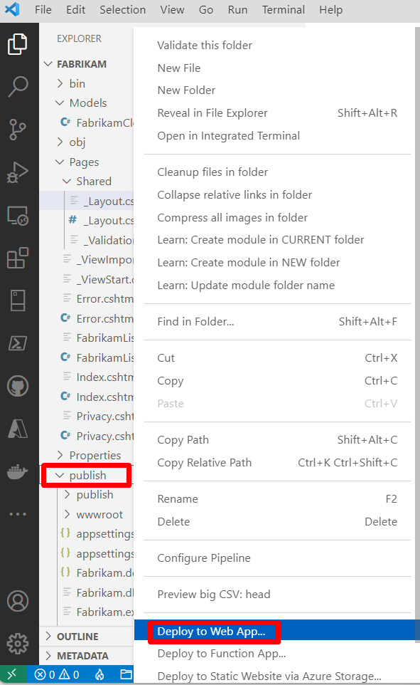

1.  If you did say **Yes** when VSCode asked "Always deploy same webapp" below window will pop up. Select **Deploy**, if you don't see this pop-up, continue from item **e**.

	> [!div class="mx-imgBorder"]
	> 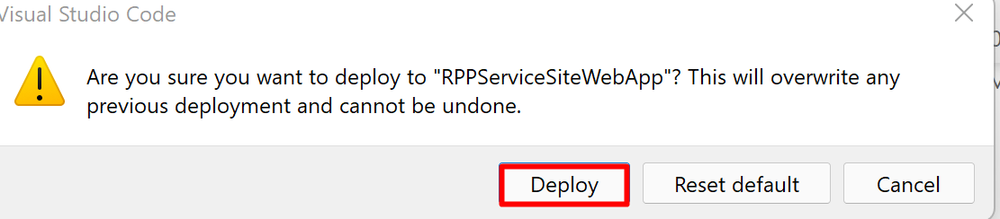

1.  If you didn't sign out from the Azure Account that you used previously VS Code will ask you to select your **subscription** again, pick the subscription that you used before.

	> [!div class="mx-imgBorder"]
	> 

1.  Next VS Code will ask you to select the Web App to redeploy. Choose the one you previously deployed to.

	> [!div class="mx-imgBorder"]
	> 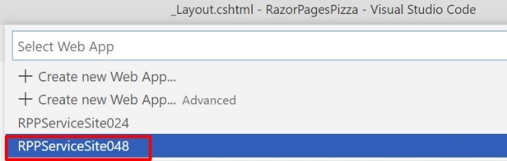

1.  Now browse to your website both from your mobile devices and your computer multiple times, select the URLS, play with the form on the Cloth Stocks page and add & delete some cloths. This will create the usage logs and recordings which Clarity will sniff to build its Dashboards, Heatmaps and Recordings. You can ask your friends to play with your website as well.

> [!IMPORTANT]
> As you have read in the Exercise 2 notes for Task 1 and Task 5 ,to sync the application logs with Microsoft Clarity can take from 30 minutes to 2 hours. Therefore, after completing this exercise, you will start the remaining labs, and after completing them you will come back to this lab and continue with Exercise 3.

**Congratulations!** You've integrated your custom website with Microsoft Clarity.