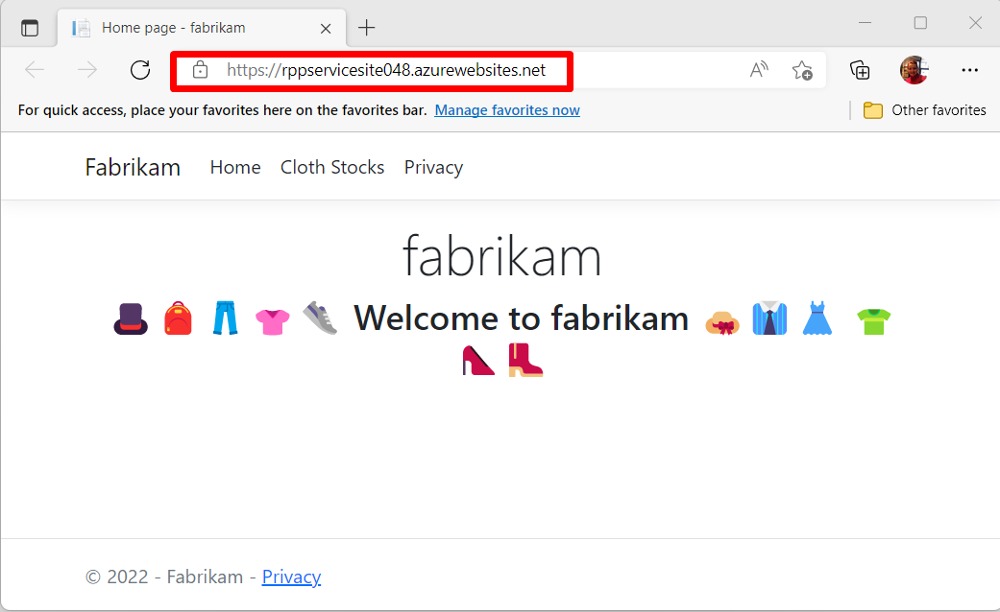

In this exercise, you'll deploy a multipage ASP.NET website to a free tier Azure App Service on Microsoft Azure by using Visual Studio Code and its extensions.

Make sure that all prerequisites from the previous unit are met before you start the exercise.

## Task 1: Open and inspect the provided website code with Visual Studio Code

In this task, you’ll open the provided website code and inspect its CSS and HTML code. Additionally, you’ll find where the **<HEAD\></HEAD\>** and the **<HEADER\></HEADER\>** blocks of the HTML code are stored.

1.  Download the code for the sample [Fabrikam Application website](https://github.com/MicrosoftDocs/mslearn-developer-tools-power-platform/raw/master/retail-cloud/MC4R-Clarity.zip).

1.  Create a directory called **MC4R-Clarity** under your **C:\\** drive and then extract the project zip file to that path. The following folder structure should display when you expand the folder in your File Explorer navigation pane tree view.

	> [!div class="mx-imgBorder"]
	> 

1.  Open the **Fabrikam** directory under your **C:\MC4R-Clarity** directory with Visual Studio Code, for which you’ve already installed the required extensions and .NET SDK, as listed in the previous prerequisites section. To accomplish this task:

    1.  Launch Visual Studio Code.

    1.  Select the **File** menu.

    1.  Select the **Open Folder** menu item.

		> [!div class="mx-imgBorder"]
		> 

    1.  Select **C:\MC4R-Clarity\Fabrikam** from the file browser and then select the **Select Folder** button.

		> [!div class="mx-imgBorder"]
		> 

    1.  Select the **Yes, I trust the authors** button on the trust notification pop-up window. 

		> [!div class="mx-imgBorder"]
		> 

        Your Visual Studio Code screen should resemble the following screenshot. 

		> [!div class="mx-imgBorder"]
		> 

1.  From the **Explorer** pane of Visual Studio Code, expand the **\>Pages** sub directory and the **\>Shared** sub directory beneath and then select **\_Layout.cshtml**. The **<HEAD\></HEAD\>** section should display, where you’ll change to integrate any website with Microsoft Clarity. 

The **\<HEAD\>** section is the Document Metadata (Header) element of HTML web development language, and it contains machine-readable information (metadata) about the document, such as its title, scripts, and style sheets. It shouldn't be confused with the **\<HEADER\>** section, which is a sub section of the **\<BODY\>** section.

> [!div class="mx-imgBorder"]
> 

## Task 2: Deploy the web application to Azure App Service

In this task, you'll deploy the sample application to Azure App Service by using the Visual Studio Code Azure App Service extension. To complete the deployment, follow these steps:

1.  From the **Explorer** blade, find and then right-click the **publish** folder,  and then select the **Deploy to Web App** menu item.

	> [!div class="mx-imgBorder"]
	> 

    The **Command Palette** will open in the upper section of Visual Studio Code and will ask you to sign in to your Azure account.

	> [!div class="mx-imgBorder"]
	> 

1.  After signing in, from the **Command Palette**, you'll be asked to select a subscription from a list of subscriptions. Select the subscription that you want to use for this exercise.

	> [!div class="mx-imgBorder"]
	> 

1.  The next prompt will ask you to select a web app. In the **Select Web App** menu, select **Create new Web App... Advanced**. If you select **Create new Web App**, you won't be able to specify in which Azure region that you want to create the service.

	> [!div class="mx-imgBorder"]
	> 

1.  Enter a unique name for your web app (such as your username). This name will be part of the URL that you’ll use to access your website; therefore, it must be unique. The name can only contain letters, numbers, or hyphens.

	> [!div class="mx-imgBorder"]
	> 

1.  Select your choice of Azure resource group that will contain the app service.

	> [!div class="mx-imgBorder"]
	> 

1.  Select the runtime stack. Because your application is a .NET 6 application, as stated in the previous prerequisites section, select **.NET 6(LTS)**.

	> [!div class="mx-imgBorder"]
	> 

1.  Choose your operating system. For this application, in the **Select an OS** menu, select **Windows**.

	> [!div class="mx-imgBorder"]
	> 

1.  Select an Azure region that will host the Azure App Service. Choose a region that’s geographically closest to you to have the maximum network performance.

	> [!div class="mx-imgBorder"]
	> 

1. Select **+ Create new App Service plan** to create the app service plan for your app hosting.

	> [!div class="mx-imgBorder"]
	> 

1. Choose a name for your Azure App Service plan, type it into the field, and then press the **Enter** key.

	> [!div class="mx-imgBorder"]
	> 

1. For this lab, you don't need a powerful hosting, so you can select **Free (F1)**.

	> [!div class="mx-imgBorder"]
	> 

1. Skip the **Create new Application Insights resource** step by selecting **Skip for now**.

	> [!div class="mx-imgBorder"]
	> 

1. When setup is complete, a notification will appear (resembling the one that’s shown in the following screenshot) in the lower-right corner of Visual Studio Code to monitor the process of your website's deployment.

	> [!div class="mx-imgBorder"]
	> 

1. When the deployment has finished, you can select **Browse Website** to access your deployment. Don't forget to save the URL information of the website.

	> [!div class="mx-imgBorder"]
	> 

	> [!div class="mx-imgBorder"]
	> 

1. If another pop-up window appears (similar to the one shown in the following image), asking whether you'll deploy this project always to the same web app, select **Yes**. This setting will help make it easier for you to deploy when you’re completing the necessary changes for the Clarity integration on the web app.

	> [!div class="mx-imgBorder"]
	> 

Congratulations, you’ve deployed your website. Make sure that you save the URL information of the website because you’ll need it in subsequent exercises.
