In this exercise, you'll deploy a multipage ASP.NET website to a free tier Azure App Service on Microsoft Azure, using Visual Studio Code (VS Code) and its extensions.

Make sure that all tasks in the previous step are completed before you start the exercise.

## Task 1: Open the provided web site code with Visual Studio Code and inspect

In this task, we're going to look open the provided Website code and inspect its CSS and HTML code. We'll find where the **<HEAD\></HEAD\>** and the **<HEADER\></HEADER\>** blocks of the HTML code are stored.

1.  Download the code for the sample Fabrikam Application website from the GitHub location provided in the previous prerequisites section

1.  Create a directory called **MC4R-Clarity** under your **C:\\** drive and extract the project zip file to that path. You should see below folder structure when you expand the folder in your File Explorer's Navigation Pane tree view.

	> [!div class="mx-imgBorder"]
	> 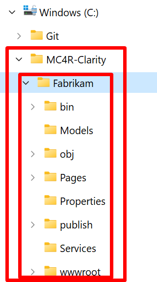

1.  Open the **Fabrikam** directory under your **C:\MC4R-Clarity** directory with VS Code, which you pre-installed already the required extensions and .NET SDK as listed in the previous prerequisites section. To accomplish this task:

    1.  Launch **VS Code**.

    1.  Select **File** menu.

    1.  Select **Open Folder...** menu item.

		> [!div class="mx-imgBorder"]
		> 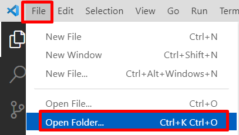

    1.  Select **C:\MC4R-Clarity\Fabrikam** from the file browser and select **Select Folder**.

		> [!div class="mx-imgBorder"]
		> 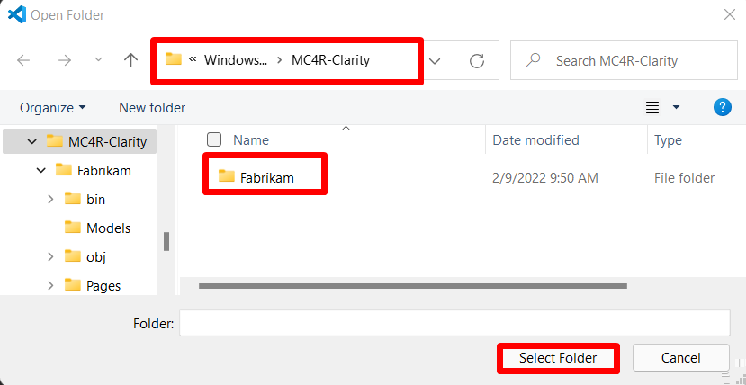

    1.  Select the **Yes, I trust the authors** button on the popped-up trust notification. 

		> [!div class="mx-imgBorder"]
		> 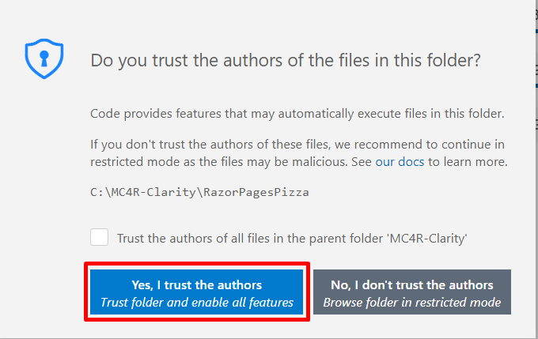

    1.  Your VS Code screen should look similar to below snapshot: 

		> [!div class="mx-imgBorder"]
		> [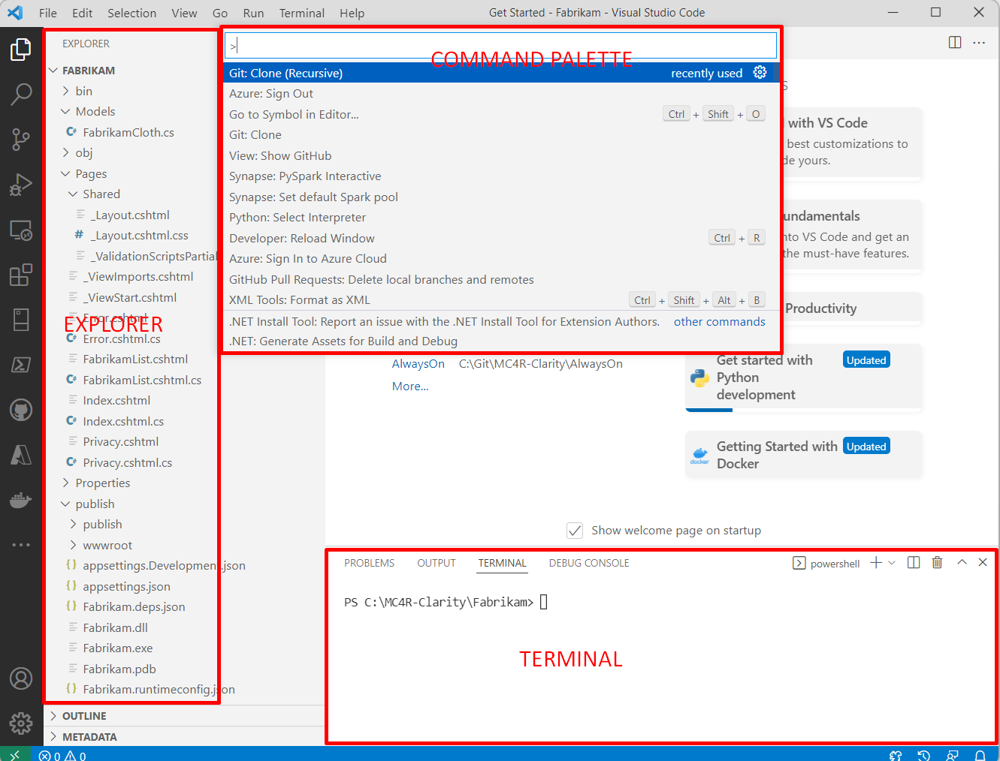](../media/visual-studio-code.png#lightbox)

1.  From the **EXPLORER** pane of VS Code expand the **\>Pages** sub directory and **\>Shared** sub directory under it respectively and select **\_Layout.cshtml**. This is where you should find the **<HEAD\></HEAD\>** section. This **<HEAD\></HEAD\>** section will be where we're changing to integrate any web site with Microsoft Clarity*. **\<HEAD\>** Section is the Document Metadata (Header) element of HTML Web development language, contains machine-readable information (metadata) about the document, like its title, scripts, and style sheets. It shouldn't be confused with the **\<HEADER\>** section, which is a sub section of **\<BODY\>** section.*

	> [!div class="mx-imgBorder"]
	> [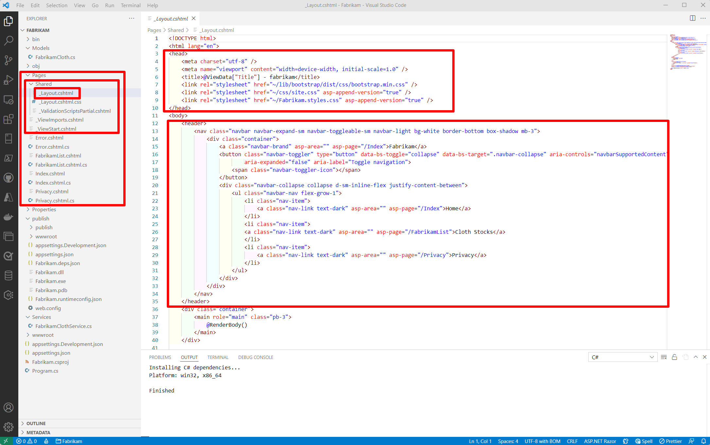](../media/explorer-pane.png#lightbox)

## Task 2: Deploy the web application as it is to Azure App Service

In this task, you'll deploy the sample application to Azure App Service using VS Code Azure App Service Extension. To do the deployment, follow the steps below:

1.  From the **EXPLORER** Blade, find the **publish** folder, right click **publish** and select the **Deploy to Web App\...** menu item.

	> [!div class="mx-imgBorder"]
	> [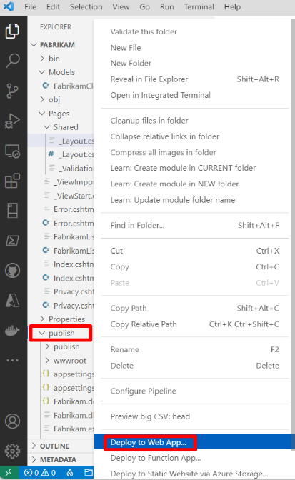](../media/web-app-deploy.png#lightbox)

1.  This will open the **Command Pallet** on the top mid-section of the VS Code and ask you to **sign in to your Azure Account**.

	> [!div class="mx-imgBorder"]
	> 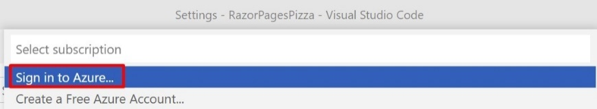

1.  After signing in, from the **Command Pallet** you'll be asked to select a **Subscription** from a list of subscriptions, select the subscription you would use for this exercise

	> [!div class="mx-imgBorder"]
	> 

1.  Next you'll be asked to **Select Web App**. Select **Create new Web App... Advanced**. *If you chose **Create new Web App...** you won't be able to specify which Azure region you want to create the service.*

	> [!div class="mx-imgBorder"]
	> 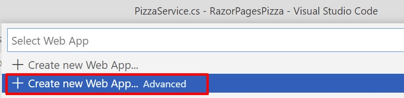

1.  Enter a unique name for your web app(For Example: Your UserName). This name will be part of the URL that will be used to access your website, therefore it has to be unique. *The name can only contain letters, numbers or hyphens.*

	> [!div class="mx-imgBorder"]
	> 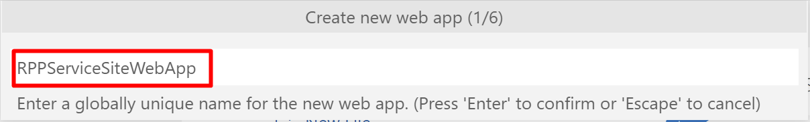

1.  Select your choice of **Azure Resource Group** which will contain the App Service.

	> [!div class="mx-imgBorder"]
	> 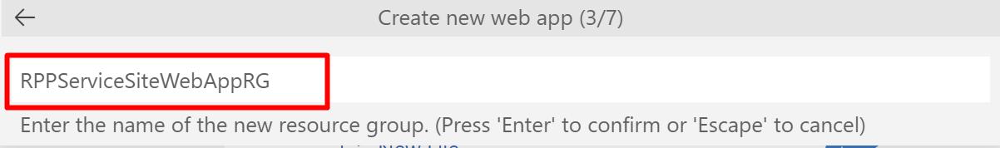

1.  Select the run time stack, since our application is a .NET 6 application as stated in the previous prerequisites section we'll pick **.NET 6(LTS)**.

	> [!div class="mx-imgBorder"]
	> 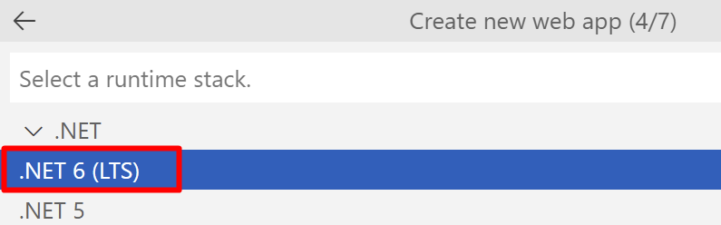

1.  Pick your choice of **OS (Operating System)**, for our application we'll be picking **Windows**.

	> [!div class="mx-imgBorder"]
	> 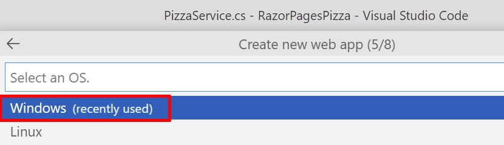

1.  Select an **Azure Region** which will host the **Azure App Service**. Pick a region that is geographically closest to you to have the maximum network performance.

	> [!div class="mx-imgBorder"]
	> 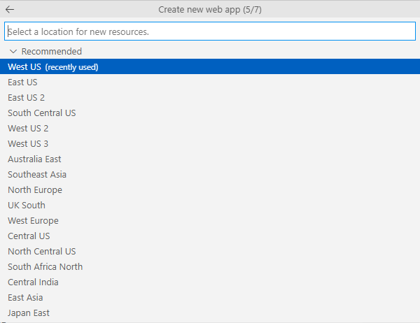

1. Select **+Create new App Service** plan to create the app service plan for your app hosting.

	> [!div class="mx-imgBorder"]
	> 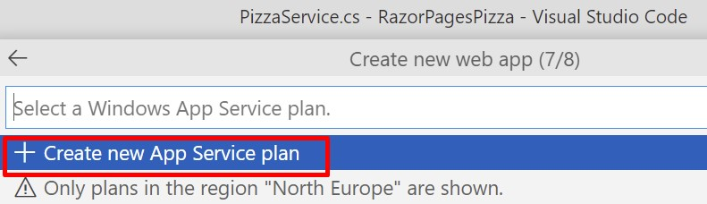

1. Pick a name for your Azure App Service plan type it and press enter.

	> [!div class="mx-imgBorder"]
	> 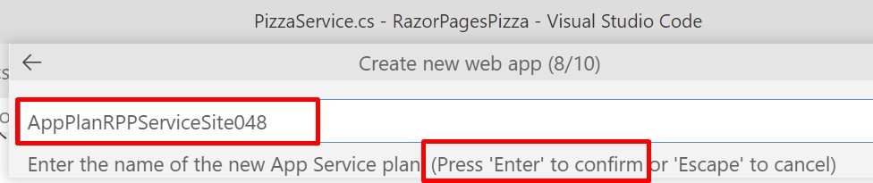

1. For this lab you don't need a powerful hosting, so you can pick the **Free(F1)**

	> [!div class="mx-imgBorder"]
	> 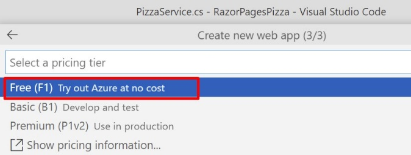

1. You'll **skip the Application Insights creation** by clicking **Skip for now**

	> [!div class="mx-imgBorder"]
	> 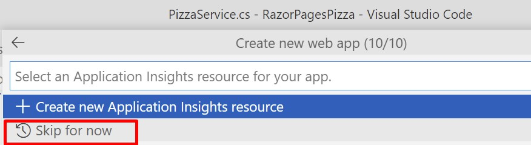

1. Once the setup is complete, you should see a notification similar to the one below at the bottom right corner of your VS Code to monitor the process of your website's deployment.

	> [!div class="mx-imgBorder"]
	> 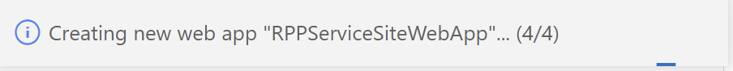

1. When the deployment is completed, you can select **Browse Website** to access your deployment. Don't forget to **save** **the URL** information of the website.

	> [!div class="mx-imgBorder"]
	> 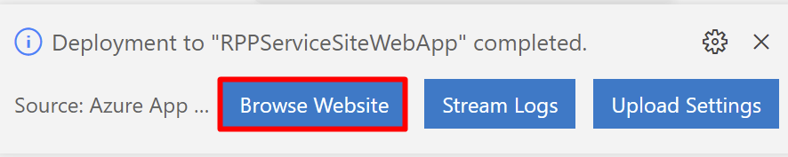

	> [!div class="mx-imgBorder"]
	> ![Screenshot of the URL to save.(../media/save-url.png)

1. If you see another pop-up window like below asking whether you'll **deploy** this project **always** to the **same web app**, select **Yes**, this will make it easier to deploy when we do the necessary changes for the Clarity integration on the web app.

	> [!div class="mx-imgBorder"]
	> 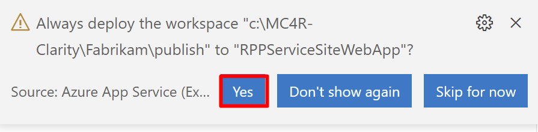

**Congratulations!** You've deployed your web site. Don't forget to **save the URL information of the website** as you would need this in the exercises later.