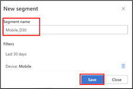

> [!NOTE]
> To start this exercise, you should have created some traffic on your website and waited around 30 mins minimum to reflect the data. If you do not have the prerequisites done, you can still follow the steps of Exercise 4 by using the publicly available [Microsoft Clarity Demo Project](https://clarity.microsoft.com/demo/projects/view/3t0wlogvdz/dashboard/?azure-portal=true).

In this final exercise, you'll wander around the Microsoft Clarity capabilities to monitor and understand the usage patterns of your own application.

## Task 1: Discover Clarity dashboard capabilities

In this task, you'll sign-in to the Microsoft Clarity and discover the main dashboard capabilities.

1.  Go to [Clarity](https://clarity.microsoft.com/?azure-portal=true) and sign in.

1.  Select your project.

	> [!div class="mx-imgBorder"]
	> 

1.  Select Dashboard view and observe the contents of the view.

	> [!div class="mx-imgBorder"]
	> 

    Here you can see:

	- Number of sessions, number of distinct users, pages browsed per session
	
	- Whether the pages are scrolled fully
	
	- How much time people spend on your page and how much of the time was active
	
	- Dead Clicks: ratio of sessions where user clicked or tapped with no effect/go nowhere
	
	- Rage Clicks: ratio of sessions where user rapidly clicked or tapped in the same small area
	
	- Quick Backs: ratio of sessions when user navigated to a page then quickly returned to the previous one
	
	- JavaScript errors: ratio of sessions, which had a JavaScript error
	
	- The ranked popularity of your application's sub pages
	
	- The main referrers to your site (which sites users are coming to your page from)
	
	- Device Type distribution
	
	- Operating Systems distribution
	
	- Browser distribution
	
	- Countries distribution

    You can interact with these Dashboard view contents(modules) and filter the data directly from them as well. You can also jump to other views like Recordings and/or Heatmaps by selecting camera and fire icons shown on the module. The detailed information on Recordings and Heatmaps that will be learned in future tasks. Clicking directly on the country itself allows you to filter your dashboard data to it as well, so you can see details like Referrer breakdown for sessions in a specific country.

	> [!div class="mx-imgBorder"]
	> 

1.  For select Clarity projects (see below), you can also see more e-commerce information:

	- % Sessions ended with purchase (all Shopify sites)

	- % Checkout sessions abandoned (all Shopify Pro sites)

	- Most viewed products (all sites using Product JSON.LD)

	> [!div class="mx-imgBorder"]
	> 

## Task 2: Discover Clarity filtering capabilities and segments

In this task, you'll learn how you can use Filters and how you can save Filters by creating Segments. Filters can be used in all Capability views of Clarity, like Dashboards that you just have seen or Recordings and Heatmaps that you'll see in subsequent tasks.

1.  **Use filters** to view data coming from specific interest groups and create **segments** to have specific views for specific purposes.

    1.  Click to Filters:

		> [!div class="mx-imgBorder"]
		> 

    1.  Change the time frame and pick **30 days** from **User Info>Time Frame**. From **User Info>Device** pick one of the existing options, for example,  **Mobile** *(If you have more clicks from any other options, you can pick that one as well)* and select **Apply**.

		> [!div class="mx-imgBorder"]
		> 

    1.  Select **Save as Segment**.

		> [!div class="mx-imgBorder"]
		> 

    1.  You'll receive a pop-up window asking whether you want to create a new segment or update an existing one. Select **Save as new**.

		> [!div class="mx-imgBorder"]
		> 

    1.  Pick a name for your segment and write that in the Segment **Name** text box then select **Save**. 

		> [!div class="mx-imgBorder"]
		> 

    1.  Do the same for **PC** Device option.

    1.  Select **Clear** to clean the remaining filters from the dashboard and return to default view.

		> [!div class="mx-imgBorder"]
		> 

    1.  Now you can see and change the segments from **Segments Drop Down list**.

		> [!div class="mx-imgBorder"]
		> 

1.  If you integrate with sites that use Product JSON-LD or are hosted on Shopify, you can view more Product filters:

	> [!div class="mx-imgBorder"]
	> 

	- **Price**: Select data for the price value of the product viewed based on the currency used on your site. Choose to view data based on the minimum and maximum values you input.

	- **Brand**: Select data that includes the product brand. This filter helps you to view more from the specific brand.

	- **Product name**: Select data based on a product name.

	- **Availability**: Select data that includes whether a viewed product was in stock or not. The dropdown list includes In stock, None, Out of stock.

	- **Rating**: Select data with average user rating. Enter the star min and max rating from 1 to 5.

	- **Number of ratings**: Select data with the total number of users rated. Enter a numeric input in min and max count.

	- **Purchases**: Select the sessions where site visitors did or didn't purchase a product. Choose to view sessions based on "Yes" or "No".

	- **Checkout abandonment**: Select the sessions where the user abandoned the checkout process at a specific step. Choose to view sessions based on the step in the checkout process that was abandoned.

> [!NOTE]
> **Filters a-f** are available for site instrumenting with Product JSON-LD. **Filter g** is available for Clarity projects of Shopify sites. **Filter h** is available for only Shopify plus sites.

## Task 3: Discover Clarity recording capabilities

Another important capability of Clarity is showing you recordings of user sessions.

1.  Go to [Clarity](https://clarity.microsoft.com/?azure-portal=true) and sign in if necessary.

1.  Select your project.

1.  Select Recordings view and observe the contents in the view. The recordings are tagged with information like the Originating **Country**, **OS**, **Device**, Num of **Clicks**, Num of **visited Pages** and Session **Duration**. You can also filter them manually or by creating Segments.

	> [!div class="mx-imgBorder"]
	> 

1.  Select the Mobile Segment and **view one of the recordings**. You can watch **clicks and scrolls** happening, along with **mouse movement and hover activity** on the page. Also, you can go directly to **click moments which are marked on the play bar**. This is a useful capability to understand how users perceive your web page and whether they struggle with some menus buttons or operations.

	> [!div class="mx-imgBorder"]
	> 

	> [!div class="mx-imgBorder"]
	> 

	> [!div class="mx-imgBorder"]
	> 

1.  You can also click "More Details" to view more details about the recording. It will show a timeline view of all the user clicks on the page and allows you to label the recordings, in case you want to find it later.

	> [!div class="mx-imgBorder"]
	> 

	> [!div class="mx-imgBorder"]
	> 

> [!NOTE]
> Clarity provides a **Masking** option, which enables you to mask out certain elements/data on the page that you do not want to collect from them. Please see Task 4 for more info.

## Task 4: Discover Clarity heatmap capabilities

**Clarity Heatmaps** capability lets you observe **where** in your website **users engage the most or the least:** where they **click, tap, or scroll**. You can analyze this information by **device type** like **PC**, **Mobile**, **Tablet** and you can look at the details by **Segment** **filtering** and/or **custom** **filters**.

You can even **compare** two different **heatmaps**, for example to understand differences in user behavior after a change in the website UI.

	> [!div class="mx-imgBorder"]
	> 

1.  Go to [Clarity](https://clarity.microsoft.com/?azure-portal=true) and sign in if necessary.

1.  Select your project.

1.  Select the Heatmap view and observe the contents in the view.

1.  Switch between **PC**, **Tablet** and **Mobile** options to see the difference.

1.  Switch between **Click/Tap**, **Scroll** and **Area** options to see the difference.

	> [!div class="mx-imgBorder"]
	> 

	-   Click and tap maps help you see where users are clicking the most, or not at all.
	
	-   Scroll maps show you where users are scrolling to -what percent of users do and don't see parts of your site pages.
	
	-   Area maps are aggregate views of click/tap maps -they show you the click rate for a group of elements, instead of just one.

1.  To **compare** two different **heatmap** for a **different** filtering select **Compare**.

	> [!div class="mx-imgBorder"]
	> 

1.  You can target a specific **Segment**, **filter**, **device**, **URL** or **behavior** as your choice.

	> [!div class="mx-imgBorder"]
	> 

1.  You can see an example comparison below:

	> [!div class="mx-imgBorder"]
	> 

## Task 5: Discover other settings for Clarity

Clarity also provides you with more controls like **IP blocking** and **Team** creation.

1.  If you want to **eliminate specific IP's** usage from getting captured, you can use **IP blocking** feature. To do that:

    1.  From **Settings** go to **IP blocking** and select **+ Block IP address**.

    1.  Fill a descriptive **Name** for the **IP** you're blocking and select **Apply**.

		> [!div class="mx-imgBorder"]
		> 

1.  If you want a team of people to monitor and manage Clarity, you can use **Team** management feature.

    1.  From **Settings** go to **Team** and select **+ Add team member**.

    1.  Fill the **Email** for the **User** you're adding and select a role, options are **Member/Admin** and select **Apply**.

		> [!div class="mx-imgBorder"]
		> 

1.  You may want some information to **masked** in your **Recordings**. Clarity masks the information it perceives as confidential, **by default** with **Balanced** masking. You can change the masking mode by selecting from three provided options, **Strict**, **Balanced**, **Relax**. *Changes don't get reflected to previous recordings and can take an hour the changes to appear.*

	> [!div class="mx-imgBorder"]
	> 

	> [!div class="mx-imgBorder"]
	> 

> [!NOTE]
> You can also mask using specific **CSS elements** from your web site code. From **Mask by element** you can see above, you can enter the **CSS selector** for the element to be masked and click **Add**. For example, enter .class_name for a class, #id\_value for an ID, and element for a type. From here you can adjust whether you want to mask or unmask these specific CSS elements.

> [!div class="mx-imgBorder"]
> 

> [!div class="mx-imgBorder"]
> 

**Congratulations! You** completed the **Clarity** lab for **Microsoft Cloud for Retail**.